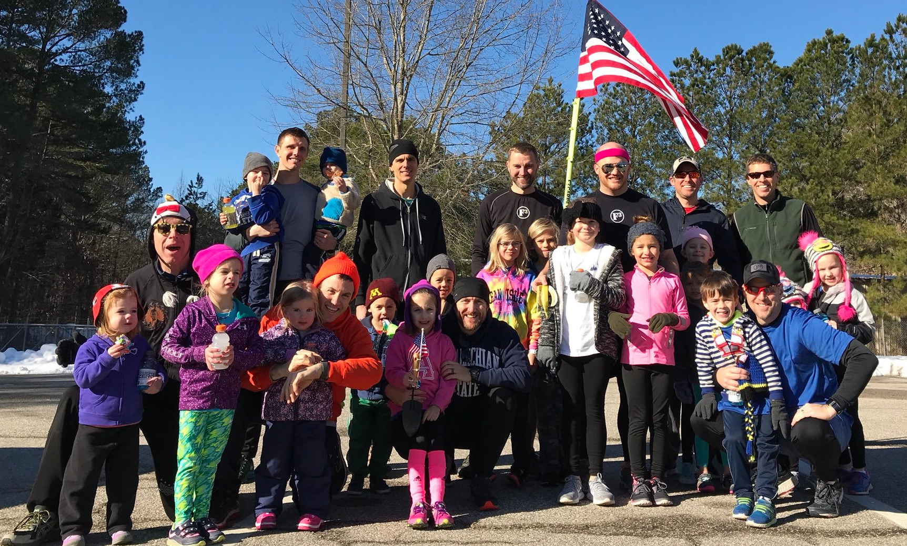

After barely one day of schooling since sometime in the fall, the 2.0s came out in force this morning for a makeup day care of Dr. Pierogi. And, as any good substitute teacher, I had a vague idea of a lesson plan in mind. Yup, that's right. This was going to be another classic Pierogi Q... except this time I had grand hopes of keeping the troops motivated with the promise of snacks and Gatorade!

Pulling up to the parking lot just as the first bell was ringing (and FiA was wrapping up) there wasn't much time to get nervous. Might as well jump right in!

### Homeroom

34F may be nothing for the HIM (and one High Impact Dumb Ass...) who regularly post in the gloom. But for the shorties wearing, in some cases, 3 pairs of socks for warmth, it's c-o-l-d! Better get that blood pumping. After all, knowledge retention has been demonstrated to be improved with exercise. You don't have to believe me... just as the big brains at Hah-vahd: [LINK](https://www.health.harvard.edu/blog/regular-exercise-changes-brain-improve-memory-thinking-skills-201404097110).

- 25x IC SSH
- 10x IC Sir Fazio arm circles
- 10x IC overhead claps

Slow mosey in the parking lot to get the legs warmed up. 10x IW and 10x HBs wrap it. Angelia gives me a 10-count and everyone jumps around cause... why not?

The bell rings. It's 9AM. School is in session. We're all in the hallway, though, so better hurry to get into class.

### Crafts

Slow mosey across the street for Arts-and-Crafts. The 2.0s try to make a snowman while the dad's jog up the hill, pull off 10x merkins and slide back down. Snow's not sticking? Daniel Boone offers to spit on it... Let's move on.

### Math

Jog up to the Community Center. Starting at the first post, 1x Squat and L/R Lunges. Bear Crawl to the next one and increase the count by 1. Repeato to the doors.

While the 2.0s try to figure out what the total count was, Dads give me some Burpees. "28" comes the cry. Who's the math whiz?? Get her a scholarship! Disregard... it's just @hermescarpex who isn't loving the burpees ever since the topped out a 2.1.

### Recess

Everyone loves a game of freeze tag. Dads hide while the 2.0s count to 10. Squat hold when you're found.

Flip-flop and the 2.0s hide, Dad's 5x StarJumps. Wonderbread finally catches Serena to end recess.

Make sure everyone is accounted for so we plank it out and count-a-rama. Yes Joe Smith... 2 comes after 1. 27 accounted for.

### English

Moseying over to the field we hit a STOP sign. With some reading help from Rocket Turbo (I think), we sound it out. Chanticleer looks confused. Must have been held back. It's ok... we support each out.

S: 5x Sit-ups T: 5x tuck jumps O: 5x Otter claps P: 5x partner merkins (most did this with a 2.0 on their back, shirt-style)

### Science

Down the hill... through the snow. Dr. P is losing track of the agenda and it shows. After some technobabble about the moon (Hi Coney!) we decide 28 2.0 Highkicks with Dad Wolverines (Science!) is good. After a bit of a sidebar with Hermes thinking he's Atlas (see below) and Beans showing us her best Tonya impression on the ice, Hello reminds YHC that Dismal can take a while...

### Study Hall

On our way back we pass another STOP. Making sure Chanticleer gets it this time, YHC thinks study hall is in session. Fantastic mentoring from Pegasus and IcyPop! Well done.

This one's a bit wetter so slight modification on the S.

S: 5x Squats T: 5x tuck jumps O: 5x Otter claps P: 5x partner merkins (most did this with a 2.0 on their back, shirt-style)

Final bell time...

### Detention

- 10x IC LBC
- 10x Flutterkicks

and... by request from Bengal:

- 10x Freddie Mercuries

### Dismissal

- Started with 27... end with 27. Success!
- Name-o-rama... in addition to the regulars tagged below, we had: Nothing & Daniel Boone c/o @f3pierogi; IcyPop & Bubblegum c/o @denalicarpex; Fraction & Tie-dye c/o @flipflopcarpex; Bengal c/o @f3wkrp; Boostershot & Rocket Turbo c/o @oofta; Rey c/o @brianjodice; Chickenpuff & Ducktale c/o @chanticleercarpex; Beans c/o @sfleder; Pegasus & Angelia c/o @hermescarpex
- and introducing FNG's Pink Rav and Serena c/o @wonderbread
- Snack time! .... oops. Bring it in real quick for praises that we as dads get to experience this fun with the best things to ever be associated with any of us

### NMS

- @riptidef3 had mentioned at one point that F3Dads was going to be one of those Q's unlike any other. Hats off to the man... he couldn't have been more right. Thanks for the encouragement brother
- Getting the skill level, such as it is, right is definitely the hardest part. You don't want to discourage but you don't want to bore either. The #shorties were awesome sports
- Dealing with your own 2.0s ain't easy either. How do you tell your little one to chill because you've got your hands full with @hermescarpex already??
- Speaking of the man... ain't no way he was going to move the 5' tall ball of ice/snow/muck. But if anyone present could have it was him
- Thanks for stopping by @coneyf3!
