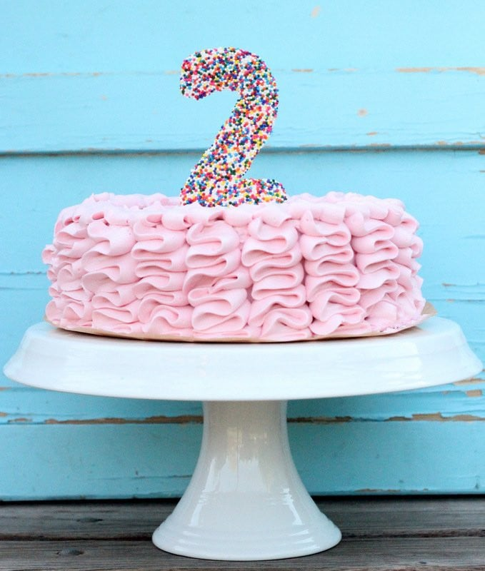

Wow. It's been 2 years (well on Sunday officially). Seemed only natural that YHC jumps on the Q sheet to celebrate. Here's what went down:

**Warmup**: No FNGs, so a pledge and a mission statement and off we go. Mosey up the hill and over to the basketball court. Circle up for:  
SSH x 15 IC  
Good Mornings x 5 IC  
Sir Fazio Arm Circles x 10 IC  
Seal Claps x 10 IC  
Imperial Walkers x 10 IC  
Plank Jacks x 10 IC  
Calf Stretch L/R x 10 silent count each side  
Good enough, now continue moseying back down Evans Rd to the upper parking lot at ANP and head down to the lake.

**Thang 1:** Partner up and both partners grab a rock. Dora time. Partner one works on 100 triceps extensions, 200 rock rows and 300 curls while partner 2 runs around the lake stopping at the pull-up bars for 5 on the way through. Flip flop until you've completed all reps. Once this is finished head back to the other side via and respecting the name of bear crawl bridge. Head to the shelter for...

**Thang 2:** 2 rounds of Derkins x 10, Dips, x 10, Irkins x 10 and L/R step ups x 20 IC. Mosey back to the flag.

**Mary:** Details are limited here, but some sort of LBCs, E2K, American Hammers, Leg Lifts maybe?

**COT:** Again, details escape me but Freed to Bleed May 1st at Cary YMCA. Pet Sounds for deets. Thank you to everyone for your support and encouragement over the last 2 years. YHC took us out.

**NMS**: What an interesting 2 years its been to say the least. I never thought I'd do half the things F3 has encouraged me too. Run a 1/2 marathon (and now training for a full!). Run a 200+ mile relay race with 11 other dudes (which has probably been the highlight over the last 2 years.) Leading countless men, picking up the 6, giving back, making new friends, opening up, the list goes on and on. I said it in COT but I really don't know if I would still be here without F3. There were a lot of times, where F3 was the only thing I had to look forward too and countless other times where I wouldn't have dragged my 6 out of the fartsack if it wasn't for the commitment I made to other guys. Thank you for the bottom of my heart to each and every one of you that I have lead, worked out with or haven't even met yet, just to keep this crazy weird thing we call F3 to keep accelerating and growing. Let's keep changing lives boys! MIAGD!
