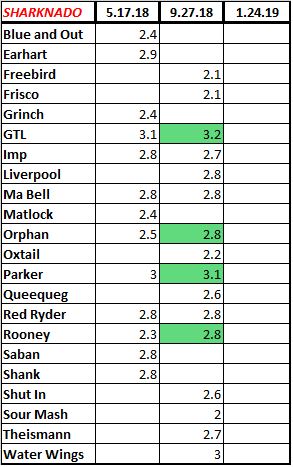

**The Sharknado** - it has become YHC's favorite circuit routine next to the Murph in recent years, and has become the official benchmark test of downtown Apex's finest AO, Bounty Hunters.  The idea is to test your endurance abilities 3 times per year to see if you are making incremental improvements, and also...because its Thursday.  (hopefully not infringing on any trademark laws surrounding The Maynard's slogan)

Warm-up run from the flag to the Apex Town Hall courtyard, circle up

 

**Warm up**

15 Side shuttle hops

15 Imperial Walkers

7 Good mornings

15 Mountain Climbers

_Intro to Sharknado and demo of exercises_

5 Burpees OYO

5 Diamond Merkins

5 WWII Sit-Ups

5 Merkins

5 Scorpion Dry Docks

 

**The Thang**

The Sharknado – 25 minutes on the clock, GO

- 15 Burpees (followed by a lap around the diamond) \*diamond is approx 740 feet, .14 miles
    
- 20 Diamond Merkins (followed by a lap around the diamond)
    
- 20 WWII Sit-Ups (followed by a lap around the diamond)
    
- 20 Merkins (followed by a lap around the diamond)
    
- 20 Scorpion Dry Docks (followed by a lap around the diamond)
    

REPEATO as many times as you can

Final stats: (each exercise worth .1, each lap worth .1)

 

_**HUGE T-Claps to Orphan and Rooney for major increases since May, and Parker for taking it to the next level - very impressive!! #Beastmode**_

 

**Bonus Round**

Mosey to the back of the building to Balls to the Wall Hall

Balls to the Wall Contest – now that your arms are gassed, let’s see how long we can hold

YHC drops at 1:36, but it should be noted Parker hit 1:58 back in May

**Mary**

15 American Hammers

20 Box Cutters

5 Peter Parker Merkins (thanks Parker)

 

**COT**

**Count-a-rama**

16

**Announcements**

Odyssey 10/20, sign up at Carpex web site

**BREAKING NEWS: Bounty Hunters will move to 5:30 a.m. start time next Thursday, October 4th** - this means that once the new Regency Park Thursday AO starts, there will be a 5:15, 5:30, and two 5:45 options on Thursday mornings across Carpex.

**Prayer Requests/Praises**

Liverpool's mom's recovery

Red Ryder's mom's recovery

Shut In's friend's child, praise for medical miracle

It was a pleasure to lead another Sharknado, and very cool to see everyone really getting after it!  This workout is a beast, avg heart rates probably in the 160's and 500+ calories burned easily.
