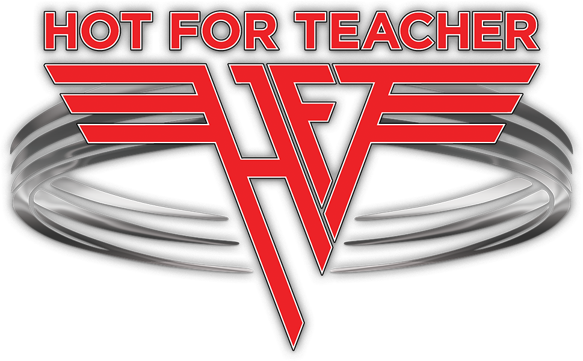

## YHC and @slappy are site Q’s for the new Thursday AO beginning 6/27 soft launch and 7/11 Hard Launch.

**But first we need to tell you a true story. In 1983 Van Halen with David Lee Roth recorded a new album entitled 1984 set to release... you guessed it in 1984. To this day 1984 along with their debut album was their best selling. Who can forget “Jump” running on MTV day and night (when MTV showed videos). “I’ll wait” “Panama” “Top Jimmy” , just a crazy great album. Eddie V cranking on Frankenstein his custom monster guitar and Alex with his signature double base drums. One song in particular or maybe it was the video caught my eye as a HS sophomore. It was that double-base drum followed by Eddie’s 1/16 note finger tap that got your blood pumping and seemed to make my 78 Camaro hit top speed. Nothing quite like the video and the sound of one of their biggest hits that began with “Sit down Waldo” Hot for the Teacher was an instant MTV favorite and sadly I never found that school in the video.**

## Therefore “Hot for Teacher” Our newest AO to join Carpex will be launched on 6/27 (soft) and 7/11 (Hard) and you can bet that double base drum will lead the way on launch dates.

**The setting for the new AO will sink the shovel flag at Olive Chapel Elementary School in Apex. This site offers so many options for so many beat downs. We have the school of course with all monkey bars, pickles and light posts. We can lead the PAX across the road and take advantage of the Publix Pointe GIGANTIC parking lot and to the left we can mosey down to Kelly Rd Park for Greenway hills, more. Jungle gym stuff, tennis courts and pickles. In August the Wake Zone Coffee house will open it’s second location walking distance from the flag. Who knows you may be able to order a Carpex Cappuccino if you are into that stuff . Hot for Teacher AKA H4T is conveniently located off of Rt 64 Kelly Rd coffateria will be bad-ass TO BOOT. Hope to see many out there in the coming weeks.**

 [https://youtu.be/6M4\_Ommfvv0](https://youtu.be/6M4_Ommfvv0) See VIDEO HERE
