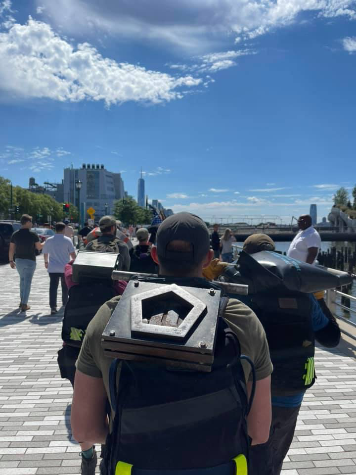

**AO:** M.A.S.H.  
**Workout Date:** 06/18/21  
I've spent way too much time trying to find some M.A.S.H.-related themes for this backblast, and sorry, boys, it ain't happening.  
  
This is my fourth Q of the week, and M.A.S.H.'s late start (on a Friday!) was right up my alley this morning. I set my alarm for thirty minutes later and still moved it another thirty minutes when I woke in the middle of the night. I still had plenty of time to get to the AO, and my prerun was a five minute mosey around the site that didn't even clock half a mile.

**Warm Up:**  
State the mission, check for FNGs (0), and give the disclaimer  
Mosey up to the entrance of the Residents' Club to split up our journey to Thang #1  
  
I even broke out the extended-length warmups I've recently been shortening:  
Side Straddle Hop x20 In Cadence (IC)  
Good Morning x5 IC  
Imperial Walker x20 IC  
Sir Fazio Arm Circles forward x10 IC, reverse x10 IC  
Monkey Humper x10 IC  
Standard Merkin x10 On My Down (OMD)  
Mountain Climber x10 IC  
Downward Dog with calf isolations  
World’s Greatest Stretch

**Main Event**  
**1)** Mosey across the street to the brick wall for **10-15-10 pyramid** of the standard shelter set: **Left-Right Step Ups, Irkins, Dips, Little Gyno Crunches, Derkins**. When I told the guys that Elevated Crunches got renamed LGCs at Danger Zone, the PAX immediately (and correctly) suspected Burt's involvement. It shall be noted we performed them today across the street from a primary care doctor.  
**2)** YHC called for **5 pull ups** OYO, but it was a mess for me. Everyone else did them well, I assume.  
**3)** Mosey across the street and back to start for ... umm... I got so caught up in chatting with Badlands that there was a hot minute with no direction from the Q. I quickly moved us back up to the middle of the lot for **Rack Em UnStack Em**:  
Corner 1: 5 Burpees  
Corner 2: 10 Merkins  
Corner 3: 15 American Hammers (two count)  
Corner 4: 20 Sumo Squats  
From start (AKA corner 4), run to corner 1, do five burpees, run back to start and squat hold for the six  
Run to corner 1, do burpees, run to corner 2, do merkins, back to corner 1, do burpees, run back to start and hold for the six  
Progress your way around the “square” , going further each round until the full square has been completed.  
As we had a couple of walkers, PAX suggested on audible on that holding for the six and I agreed.

<figure>

<figcaption>

[https://www.strava.com/activities/5489566731](https://www.strava.com/activities/5489566731)

</figcaption>

</figure>

**Mary:**  
(not sure of the order)  
Dolly x10 IC  
Rosalita x10 IC  
Homer to Marge x10 IC  
Freddie Mercury x10 IC  
Flutter Kick x10 IC  
Dying Cockroach x10 IC  
Box Cutters x10 IC

**COT:**  
7 PAX  
  
Announcements:  
Sawgrass/TPC Sunday  
F3 Raleigh Day of Service 6/19 (tomorrow) starting at Vatican City 0700  
F3 Carpex convergence is 7/3 at Bond Park for 1776 workout. This was news to some. Note to self to mention this on Slack.  
  
Prayers unspoken.  
YHC took us out.

**Naked Moleskin:**  
Nice, easy pace this morning. I felt I would've gotten much more "feedback" at other sites.  
Great Godfather was hands-down our War Daddy. 79 years young!  
This was my sixty-fourth #F3Q21 #2021Challenge Q (sixty-sixth overall). Next Q is Monday at Downtown Train (South Wake).  
\-Pigpen

**QIC:** Pigpen  
**PAX:** Goose, Dirty Bomb, Great Godfather, Doggy Paddle, Badlands, Garden Nomad, Pigpen  
**Workout Date:** 06/18/21
