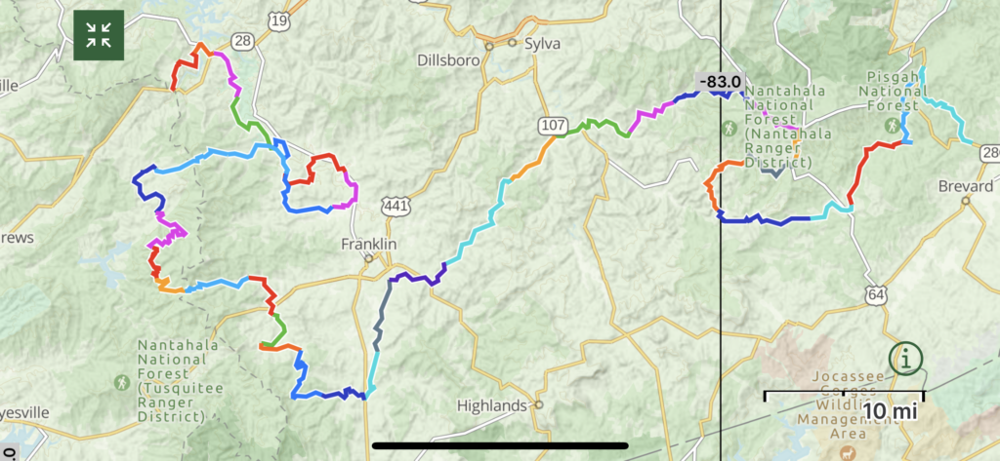
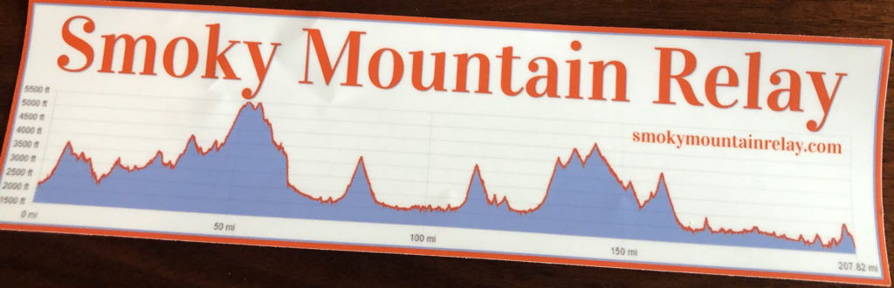

For the first time, Carpex sent two 9-man teams to the [Smoky Mountain Relay](https://smokymountainrelay.com/). Coincidentally, this was the first year that SMR had a 9-man division, and perhaps less coincidentally, the Carpex teams took 1st and 2nd place in that division. We're going to cover a lot of ground in this backblast, from the teams, their experiences, the course, to a comparison with the perennial favorite Blue Ridge Relay (BRR), so buckle up, because this is going to be a bumpier ride than the "100% paved" abandoned Nantahala wilderness road of [Leg 26](https://smokymountainrelay.com/race-maps/leg-26/)!

## F3 Carpex at SMR

Leading up to the SMR, we had gloriously cooler temps to train in. Ma Bell and Saban both concocted some interesting new routes around Cary to get some hills (e.g. [7 miler](https://www.strava.com/activities/7006230727) / [10 miler](https://www.strava.com/activities/6959497035), might have to be connected with me on Strava to view, sorry). Nothing, however, can quite prepare one for a mountain run, so I would say the energy going into the race was energetic both because of excitement but also slightly nervous curiosity at just exactly how much elevation we were about to have. Several HIMs on both teams had only recently gotten through IR, and BTDT unfortunately had one man drop in the last week due to a funeral. In other words, just your typical "opportunities for acceleration" in F3!

### The teams

**Been There, Dusted That (BTDT)**: One Direction, Track Star, Mr. Safety (captain), Saban, Ramsay (captain), Decal, Henny Penny, and Clockwork.

**Blue Collar Bag of 🍆 (BOD)**: Banjo, Biner, Gump, Ma Bell (captain), Mr. Wilson, One Four, PBX, Red Ryder, and Suck Up.

### Course details

A 208-mile long relay race across several national parks including Pisgah and Nantahala, ending in the Nantahala Outdoor Center (NOC). The legs are mostly paved along roads, but might also be trails, gravel, or somewhere in between, in the midst of the woods, over swinging bridges, and under forgotten crannies. For more information, see the [leg details](https://smokymountainrelay.com/race-maps/leg-details-full/).

<figure>

<figcaption>

Map overlay of the legs.

</figcaption>

</figure>

<figure>

<figcaption>

Elevation profile of the course...many peaks and many troughs.

</figcaption>

</figure>

### Results

Despite the last leg featuring a surprise labyrinth at the top of the mountain, that was unmarked and not mentioned on the map, we all got out alive! Everyone got a wooden medal, t-shirt, rubber cup, and free drink for participating. Additionally, winners get mugs and a discount on next year's race. For full results, see [webscorer](https://www.webscorer.com/race?raceid=275274).

- BTDT: 🥇first place nine-man team, sixth place overall, 30:42:00.0 total time, average 8:52 min/mi pace
- BOD: 🥈second place nine-man team, seventh place overall, 31:29:00.0 total time, average 9:05 min/mi pace

## Fun stuff

Most of the information in this section will be irrelevant and possibly irreverent to anyone who did not go on the trip. So feel free to skip ahead to the BRR comparison further down in this post. Otherwise, stroll down memory lane.

### Photo albums

Check out some photos from the cabins, race, and after party.

#### BOD

#### BTDT

#### Landscapes

Also check out this video reel of landscapes.

https://www.instagram.com/reel/CdE1HMJDxla/?igshid=MDJmNzVkMjY=

### Quotebook and story time

The most important motto of the BTDT team was not, "Just put one foot in front of the other," or some other such inspirational mush, but rather the very practical, "Keep the stank back there."

Speaking of the van, many of you may have heard of our vehicular woes, but hey, at least some of us drivers can now say, "I _did_ tap that," in all seriousness.

> IMPORTANT! Do not leave your keys in the van.
> 
> \-- Owner/operator manual

Or at least leave the windows fully unrolled when you do. What had happened was...it was early morning, so the remnants of the night chill found our unsuspecting vehicle with the windows rolled up. We left open the passenger door, but the van next to us pulled away and either advertently (never used that word before, is it real?) or inadvertently closed it on their way out. But aha! the door was not fully shut. The EMT onsite lent us a couple tools to try to pry the door open. When that failed, he used the machete to fell a sapling, which we attempted to jam through the opening to unlock the door. The young wood wasn't hard enough, so a kind stranger lent us a gnarly spoon which was fashioned into a hook and affixed to the stick with the engineer's best friend, duct tape. Finally the latch was clicked, the door was sprung, and we made it to the next exchange with approximately two minutes to spare! Of course, in the meantime, about 30 minutes had passed, and, oh yeah, a turkey buzzard swooped on the windshield and cracked it right as Decal triumphantly descended with the spoon-tipped spear in hand, such a shame.

#### New terms learnt or coined

- Vitamin G: It's 2am, and your run-down, weather-worn, dust-coated, cooped-in-a-van-with-leg-cramps body can only be resuscitated by the nutrient-rich grease of fried anything. It's Bo time.
- Elegation: Why say "elevation gain" when you can slur your words instead? Shakespeare liked to coin new words, too...I dare you to refudiate me.
- Pace booty: Somehow, a pax had been through many a run and race without knowing about this term 🤔🏃‍♀️💨
- RESOLVED, that as one passes a runner in the van, one should say, "Looking strong," in lieu of "Looking good." Exceptions can be made for ponytails.

#### Jokes

Because we are wicked clever, nearly all of our jokes revolved around things nearest us: bodies, landscapes, the cabin. Fortunately for us, the cabin was a LUXURY cabin, so it provided a uniquely luxurious sort of humor.

In particular, every toilet was equipped with a luxury bidet, complete with heated seats, heated jets both frontwards and back, and essential-oil diffused aromatherapy (well maybe not that last one). And so, presented by the slightly lesser well-known Chappell comedian, [here is a LUXURY bidet review](https://vm.tiktok.com/ZTdg5waqY/). I guess when you help the handyman fix the sump pump, you're ready for a dump, or something like that.

We were not the only inhabitants of this fair abode. Several critters graced the premises, and despite more than a third of us hailing from rural eastern NC, we had to rely on Google to help us distinguish amongst muskrat, gopher, or groundhog. Next mountain trip needs to be a remedial huntin', fishin' sort of trip.

Mountains and streams brought back memories, such as Track Star and his FIL having to fight the swift currents swirling around Wanda's Hole...even when you think you've slipped past, her suction might catch you unawares. If you thought that was slightly suggestive, rest assured that more overt recollections were recollected, such as the Dusty Grundle's essential packing list item from last year's BRR, the [Jog Strap](https://www.youtube.com/watch?v=Czssbj5fg2w).

> "Go somewhere different, and you'll meet someone different."
> 
> \-- Somebody somewhere somewhen

Some of the people we met along the way included the team from F3 Hickory that Peaches was supposed to run with, and a couple other F3 teams. BTDT got passed by the South Wake team along the drive up, but I think that was the last we saw of them.

The best-dressed team was the pirates (_...who don't do anything?_ for all my Veggietales peeps). Many of them dressed in full pirate regalia, including an eyepatch and dollar-bill earrings. They swash-buckled runners with a sword from their vanship as they passed by. And they cracked a beer after every run. Saban only wished they had found some way to incorporate lights and tinsel like his favorite Christmas team had done a couple years ago!

Two, yes TWO, separate 12-person teams were comprised entirely of cousins. When is the Waterwings clan going to take up that challenge?

Finally, it must be remarked that there was an extremely high ratio of the fairer sex at this race versus other ones. Mama's Boy realllly should have jumped on the open BTDT slot when he had the chance. In fact, in researching for this article, YHC discovered that in past years, there was, “An all-female team called the Pussyfooters ran clad in leopard-print gear.” ([source](https://www.blueridgeoutdoors.com/running/206-miles-teams-tackle-the-smoky-mountains-relay/#:~:text=An%20all%2Dfemale%20team%20called%20the%20Pussyfooters%20(featured%20image)%20ran%20clad%20in%20leopard%2Dprint%20gear.) / [image](https://www.blueridgeoutdoors.com/wp-content/uploads/2018/03/206-header-1.jpg))

## Comparison to BRR

With more than 90 Carpeckers having run the Blue Ridge Relay in 2021, you may be wondering how does Smoky Mountain Relay compare? They are both very similar: 200+ mile relays in the NC mountains with 6-, 9-, or 12-man options (or slightly different variations if you're crazy, desperate, or both). Both offer a lot in terms of all three Fs: fitness, fellowship, and faith.

- **Training**: If you don't like the heat, you'll be training for SMR through winter and early spring. The running can help you lose holiday weight (speaking hypothetically, of course). The downside is, you won't get a lot of practice with heat, and it certainly might heat up at the race. For BRR, almost all your training is during the hottest, humidest months of the year. Can be a nice way to keep your beachbod into fall, though!
- **Location**: BTDT team rented a cabin centrally located along the course, which kind of makes a U-shape. This was a game-changer in terms of being able to switch out items and return to the cabin during every break (despite those being much shorter than on a 12-man). Also, imho, the views and vistas were prettier on SMR, both while running and while driving.
- **Weather**: For SMR, we had pretty perfect weather. When the sun came out, it heated up quick. Generally, we felt underprepared for the heat, which topped out around 80, probably 90 real feel. The night temperature plunge was a bit drastic, too, I think it dipped to low 40s, maybe even upper 30s. For BRR, weather seems to vary a lot.
- **Running the legs:** The elevation is much steeper on both inclines and declines. The hardest SMR legs dwarf the BRR legs considerably; you might be climbing 1,000ft in ~3 miles. There is also a mix of trails, gravel, paved, and different types of roads. I walked several cumulative miles up gravel across the last two legs. The legs are harder at the beginning and end, it seems. One nice thing is that the legs seem to be more evenly divided across all 36 than BRR. And the views! Also, the signage was not as consistent as BRR. At one point in the middle of the night, the locals repeatedly were flipping signs to misdirect runners. At another point on the last leg, there simply weren't signs. Another thing, you get more kills at BRR, and you typically can see people while you run, unlike at SMR.
- **Driving the course**: Some of the SMR roads were dilapidated, with fallen trees, huge potholes, several-inch drops, narrow turns, and such. We wondered how on earth people would navigate this if it were raining. You also had to take alternate routes than the runners fairly often. On the plus side, the views were incredible. Also, parking seemed easier because there were fewer participants than BRR.
- **Exchange zones (EZ at BRR, XC at SMR)**: For SMR, it was really challenging to keep the spreadsheet updated, as we could go 4 or 5 legs in a row without cell service. This meant it was kinda hard to coordinate with the off van in terms of estimated arrival. For example, our pod ended up waking up about 30 min before we otherwise would have had to. The XCs had fewer port-a-johns than BRR, and were in remoter locations, it seemed...I don't really remember any being in a town. However, the SMR had really beautiful stops such as parks with lakes, trails, picnic tables, waterfalls, overlooks. The breakfast stop was glorious (for those who got to eat...that was during our locked-out-van drama, lol). The NOC river ending site was better than BRR. The biggest thing I missed was at BRR, each EZ seemed like a party, and particularly an F3 party. It was very motivating to run into ~30 guys from Carpex at every stop.
- **General vibe**: SMR limits the teams more, so there were way fewer people, I'd say maybe one-third as BRR. The volunteers seemed chattier, maybe because there were fewer people overall. They were less picky about "rules," it seemed. For instance, if you had to switch legs with someone because of exhaustion/injury, or they trusted you on the times if they missed seeing someone come in. One thing that was interesting, several of the 12-man teams would strategize positions because of that. For example, someone might have run all 3 at once if they were shorter, then never again. Or another person might have only run 1 leg, but it was the longest/hardest. One team split it up into 4 vans of 3 people, and they just ran their chunk and that was it.

### Detailed leg comparison

Just for fun, I broke out the details for my legs in the SMR and BRR. Both of these were my first times competing in the races (or any mountain relay race). For both, the projected pace was based on an 8 min/mile 10k time (which was already padded from ~7:30 in regular terrain). These legs highlight a few of the things discussed earlier, particularly the following:

- SMR has much more elevation and descent.
- SMR legs are typically more balanced in length (three 4's and two 6's vs. a 5, 3, 8).
- As Saban calculated, SMR averages about 400 more feet of elevation per leg and 36 feet of elevation more per mile.
- If you sandbag your time, projections might be closer on SMR, whereas BRR you'll probably run much faster than projected.
- The projected paces kinda fall apart in SMR when you get above a "hard" course rating, or as you get to later legs during the day. For example, my fourth Leg 27 pace was pretty close despite being a later, longer run but it was at 5:30 in the morning...the steeper last Leg 36 at 1 o'clock in the afternoon, however 🥵

<figure>

<table><tbody><tr><td><strong>#</strong></td><td><strong>Distance</strong></td><td><strong>Ascent</strong></td><td><strong>Descent</strong></td><td><strong>Course rating</strong></td><td><strong>Start time</strong></td><td><strong>Actual pace</strong></td><td><strong>Projected pace</strong></td></tr><tr><td>9</td><td>4.1mi</td><td>505ft</td><td>312ft</td><td>Moderate</td><td>15:02</td><td>8:02</td><td>8:27</td></tr><tr><td>13</td><td>4.25mi</td><td>742ft</td><td>36ft</td><td>Challenging</td><td>18:46</td><td>9:16</td><td>8:52</td></tr><tr><td>18</td><td>4.28mi</td><td>527ft</td><td>309ft</td><td>Easy</td><td>22:53</td><td>8:11</td><td>8:27</td></tr><tr><td>27</td><td>6.3mi</td><td>803ft</td><td>1008ft</td><td>Moderate</td><td>05:37</td><td>8:11</td><td>8:14</td></tr><tr><td>36</td><td>5.86mi</td><td>1114ft</td><td>1181ft</td><td>Hard</td><td>13:12</td><td>10:17</td><td>8:26</td></tr><tr><td></td><td><strong>24.79mi</strong></td><td><strong>3,691ft</strong></td><td><strong>2,846ft</strong></td><td></td><td></td><td></td><td></td></tr></tbody></table>

<figcaption>

SMR details of legs, Runner 9, 9-man (plus picked up one extra leg), projection based on 8:00 pace

</figcaption>

</figure>

<figure>

<table><tbody><tr><td><strong>#</strong></td><td><strong>Distance</strong></td><td><strong>Ascent</strong></td><td><strong>Descent</strong></td><td><strong>Course rating</strong></td><td><strong>Start time</strong></td><td><strong>Actual pace</strong></td><td><strong>Projected pace</strong></td></tr><tr><td>5</td><td>4.8mi</td><td>404ft</td><td>325ft</td><td>Moderate</td><td>09:08</td><td>8:14</td><td>8:16</td></tr><tr><td>17</td><td>2.9mi</td><td>247ft</td><td>225ft</td><td>Easy</td><td>19:50</td><td>7:14</td><td>8:15</td></tr><tr><td>29</td><td>7.7mi</td><td>340ft</td><td>350ft</td><td>Hard</td><td>05:21</td><td>7:36</td><td>8:07</td></tr><tr><td></td><td><strong>15.4mi</strong></td><td><strong>991ft</strong></td><td><strong>900ft</strong></td><td></td><td></td><td></td><td></td></tr></tbody></table>

<figcaption>

2021 BRR details of legs, Runner 5, 12-man, projection based on 8:00 pace

</figcaption>

</figure>

<figure>

<table><tbody><tr><td><strong>#</strong></td><td><strong>Distance</strong></td><td><strong>Ascent</strong></td><td><strong>Descent</strong></td><td><strong>Course rating</strong></td><td><strong>Start time</strong></td><td><strong>Actual pace</strong></td><td><strong>Projected pace</strong></td></tr><tr><td>4</td><td>6.9mi</td><td>755ft</td><td>379ft</td><td>Hard</td><td>07:50</td><td>8:07</td><td>8:55</td></tr><tr><td>16</td><td>10.5mi</td><td>1222ft</td><td>493ft</td><td>Very Hard</td><td>17:28</td><td>9:06</td><td>8:59</td></tr><tr><td>28</td><td>8.4mi</td><td>692ft</td><td>280ft</td><td>Hard</td><td>04:19</td><td>8:38</td><td>8:50</td></tr><tr><td></td><td><strong>25.8mi</strong></td><td><strong>2,669ft</strong></td><td><strong>1,152ft</strong></td><td></td><td></td><td></td><td></td></tr></tbody></table>

<figcaption>

2022 BRR details of legs, Runner 4, 12-man, projection based on 8:30 pace

</figcaption>

</figure>

## Signoff

In the words of Mr. Chappell, I think I'm done.
