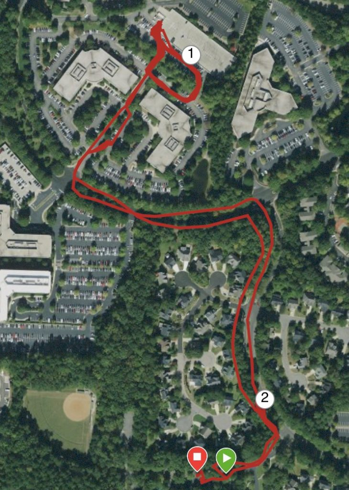

Fifteen PAX made it out Friday morning in the gloom to Slippery When Wet for a Snip-led workout. At 545 AM (and some change), we kicked it off with the Pledge, and off we went.

### Warm up

Warm up run to the Conduent parking lot.

- Good Mornings
- Sir Fazio Arm Circles (Forward + Reverse, Small + Large)
- Side Straddle Hops
- Calf Stretch (both sides)

### First >> DORA FLORA (DORA's older sister)

Mozy up the stairs to the parking deck, grab a partner, begin the following while running around the corner and back up the stairs:

- Burpees (50)
- Squats (100)
- Calf Raises (Twinkle Toes?) (150)
- Oblique Crunches (200) (100 on each side)

Upon completion, jump up and grab the ledge of the Parking Deck and do as many pullups as you can OYO, then...

### Second >> Catch Me If You Can back to the Flag

With your partner, head back to the flag with a little CMIYC executing Star Jumps x3 on the delay.

### Third >> PAX-led MARY (Mostly)

As we started MARY, Bagels and Captain Kirk showed up. They missed our start time and never found us. Better late than never. Close out with PAX-led MARY:

- WW2's
- American Hammers
- Box Cutters
- Chill Cut
- Merkins

### COT

F3 Dads + Kids Camping Trip, Opportunities for joining BRR teams, Prayers for our spouses, kids, patience, and leading well. There were murmurs of a future Q from Full House and a Fall Q School from Hermes to lead newer PAX.
