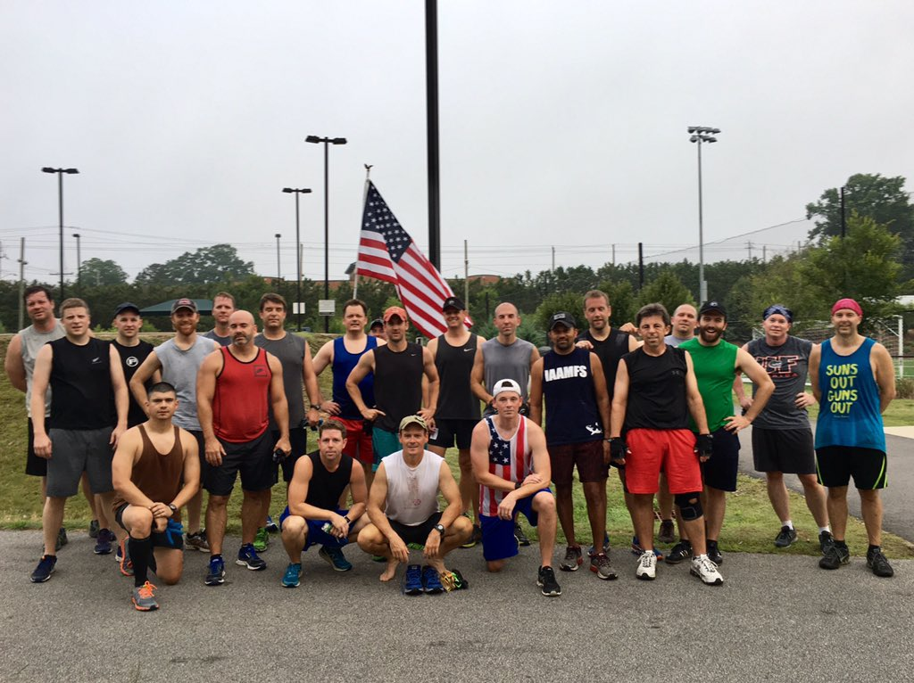

29 PAX from Carpex and South Wake joined me to celebrate my birthday at Bounty Hunters! This was my first Q and I've been thinking about how to deliver a solid showing for my 38th birthday.

We welcomed one FNG (Parker) and provided him with the standard disclosures. After giving my 1 minute warning we were off at 5:45 sharp, or so I thought! We had a visit from the Apex PD that got us off to a slow start. I wasn't sure who was in charge there for a minute when the PD showed up. All of the sudden I had 28 FNGs and one Q! Turns out there was a silver alert in the area and wanted us to be on the look out.

After we figured out that we were in any trouble we took a lap around the outside of soccer field and end up back at the scene of the crime at the skate park. We circled up for some warm up.

Warm up

- SSH x 38 (In honor of the birthday festivities)
- Good Morning x 12
- Hillbillies x 12
- Plank Jacks x 12
- Merkin x 20

Off to the baseball field for some BLIMSS!

Thang

Since the nice soccer field was locked up tight we moseyed over to the back of the baseball field for the Hindenburg BLIMPS! We did 5 rounds with using four oddly placed "corners" of the baseball field.

Round 1: 5 x Burpee at each stop

Round 2: Lunge walk to each stop and 10 x Imperial walkers. Audible to sprint the last segment, that is a lot of lunges!

Round 3: 15 x Merkins at each stop. Unless your the Na'tan then you get 20 x!

Round 4: 20 x Plank jacks with a Banjo audible to change to protect the wet field. Don't want the Apex PD coming back for us. So 20 x star jumps instead.

Round 5: 25 x squats or for extra credit sumo squats as some of the PAX showed their true grit!

We completed the Hindenburg BLIMSS (with some modifications so YHC could keep up!).

Next mosey to starting line of the walking trail. Since we were running short on time we transitioned from the Burpee Mile to the Burpee Half Mile. Start with 10 burpees, run to 1/4 mile marker, 10 more burpees, then run to the skate park and finish with 10 burpees. By the time YHC arrived at the end the group had started Mary. Called the group to circle up at the skate park again for some additional Mary.

Mary

- 15 x American Hammers
- 10 x Low slow flutters

Out of time and YHC was beat. Apple watch recorded 2.32 mi (without GPS, so we definitely broke 2 miles!).

Announcements

- Females in Action (FIAnation.com) starting in Cary at Bond Park on July 22.
- Durham Bulls game July 23, get with Burt to sign up!
- "Run for Dee Dee" 5K to support Levi Moore, more info on the events calendar.

Prayers

- Prayers for our brother Cheech from F3Lexington (SC) who passed away after getting hit by a car during a F3 workout yesterday morning. The nation is using the twitter tag **#sleevelesslikeCheech** to show support.
-  Praises from Crimson about the affect of our F3 community on A2 during his recent visit.

NMS

- Special shout out to Crimson for helping me plan my BH birthday party!
- If you Q a workout, you have to speak LOUD! I thought I was about yelling but turns out with a big crowd it is still hard to hear the Q.
- Very happy that Jameis joined us for my birthday celebration, hope to see him back regularly!
- Welcome Parker, FNG. Hope to see you soon!
- Fun story to have the PD interrupt your VQ! Also good to see how many PAX seem to not know who was in charge!
- Remembering everyone's name is harder than it seems, I think I have everyone, but if your name is missing or spelled wrong let me know!
- Thanks for coming out to BH to celebrate my birthday! It was a great way to start the morning!
