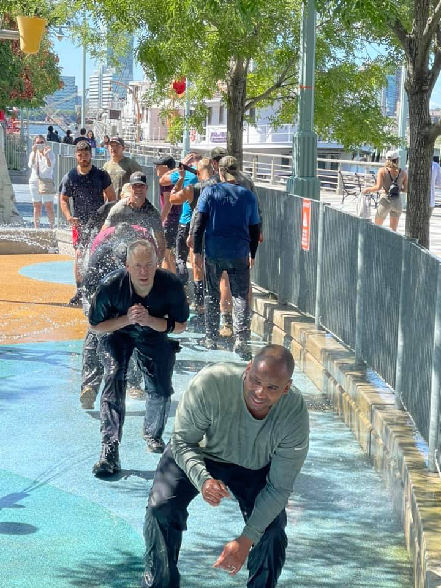

**AO:** Hot For Teacher  
**Workout Date:** 06/17/21  
YHC is starting to hit the Carpex and South Wake AOs pretty hard. I'm excited to make it to the wonderfully-named Hot For Teacher.

**Warm Up:**  
State the mission, check for FNGs (0), and give the disclaimer  
Pledge of Allegiance  
Mosey to entry traffic loop for warmups:  
Side Straddle Hop x20 In Cadence (IC)  
Good Morning x5 IC  
Imperial Walker x20 IC  
Sir Fazio Arm Circles forward x10 IC, reverse x10 IC  
Downward Dog with calf isolations  
World’s Greatest Stretch

**Main Event**  
**1)** Mosey to and through the park to the entrance parking lot. **Sevens** from the bottom of the lot up to the first island. Start with six Squats at the bottom and one Star Jump at the top. PAX took off and passed the first island and went to the second island. Based on their speed, follow their lead and let the second island be the new endpoint.  
**2) Rack Em UnStack Em** around the back lot:  
Corner 1: 5 Burpees  
Corner 2: 10 Merkins  
Corner 3: 15 American Hammers (two count)  
Corner 4: 20 Sumo Squats  
From start (AKA corner 4), run to corner 1, do five burpees, run back to start and squat hold for the six  
Run to corner 1, do burpees, run to corner 2, do merkins, back to corner 1, do burpees, run back to start and hold for the six  
Progress your way around the "square" , going further each round until the full square has been completed.  
Dodge the city parks truck coming through the lot. Say hi to the Dumbo guys giving us a fly by.  
**3)** Mosey to the soft playground surface for **Jack Webbs**. 10 counts after rounds 7, 8, and 9. 
**4)** Mosey back to start, pausing for **10 squats** for the six to catch up, and finishing with an **All You Got sprint** over the last stretch.

<figure>

<figcaption>

[https://www.strava.com/activities/5484305613](https://www.strava.com/activities/5484305613)

</figcaption>

</figure>

**Mary:**  
Dolly x10 IC  
Homer to Marge x10 IC  
Rosalita x10 IC  
Freddie Mercury x10 IC  
Flutter Kick x10 IC  
Dying Cockroach x10 IC  
Stretching: Downward Dog, calf stretch isolation, Up Dog that I tried to call Cobra at first, Pigeon Pose right and left

**COT:**  
11 PAX  
  
Announcements:  
Sawgrass Sunday  
F3 Raleigh Day of Service 6/19 starting at Vatican City 0700  
Hot For Teacher two year anniversary coming up (July 8?). Looking for a second site Q to take the reigns.  
  
Prayers unspoken.  
YHC took us out.

**Naked Moleskin:**  
The PAX were ready to get after it today. My initial impression of the group was confirmed when everybody took off to start the sevens. Great work, everyone!  
I left a few things on the table due to the group size. I really wanted to do something with that wall by the basketball court. Next time!  
This was my sixty-third #F3Q21 #2021Challenge Q (sixty-fifth overall). Next Q is Friday (tomorrow) at M.A.S.H.  
\-Pigpen

**QIC:** Pigpen  
**PAX:** Mumbles, Two Factor, Flenderson, Mandolin, Slim Shady, Zamboni, QWERTY, Bobby Boucher, Mr. Safety, Buzz Cut, Pigpen  
**Workout Date:** 06/17/21
