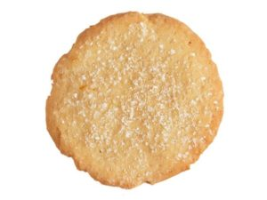

We got your back Suey! Get well soon. With little time to plan where's the best place to go for new and exciting ideas? The F3 Exicon. Oh the fun...

Shout out to 6 HIMs who arrived at 0515 for EC pull-ups! Committed to getting back to back!

As per Crimson’s watch, it's 0545- Pledge of Allegiance.

Warm up

- Side Straddle Hop
- Steve Earl
- Fluttering Superman
- Finkle Swing (another sweet Exicon find)
- Midget Squats (Earhart was giving me a hard time about something and YHC really likes these so we enjoyed them for a few extra reps)

Thang 1

The Sugar Cookie – Partnering up we completed the following in the sticky, thick, heavy but surprisingly comfortable sand of the volleyball pits

- 100 Hand release Merkins
- 100 Box cutters

Partner 1 performs the above while partner two trudges the length of the volleyball courts and back to relieve his partner. Guess what we looked like when this was over?

Forming up into two lines we Indian ran our way to the pond where we would continue the already high utilization rate of the newly installed pull up bars

Thang 2

-  7’s Pullups – run around the pond - Copperhead Squats (many called these prisoner squats)

With time ticking I did what all good quarterbacks, and those named after quarterbacks, do – I called an audible.

Ducking into the woods following one of the frisbee golf holes we came upon terrifically old dead tree to circle up on for mary.

- Hands of Time – 100 repetions

COT

Announcements- 4th of July Convergence at SWW

Prayers – WWW’s family is traveling this weekend, Ma Bell and his son is traveling as well, Disco Duck’s wife -Kelly, Water Wings’s M is less than a week from her due date.

NMS

Gentlemen, you rock! Thank you for your support and for humoring me with my quest to get to us back to back.
