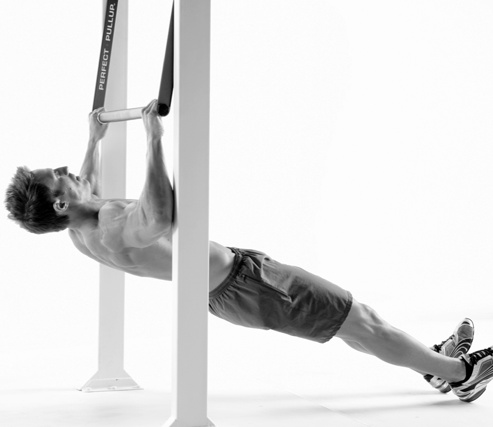
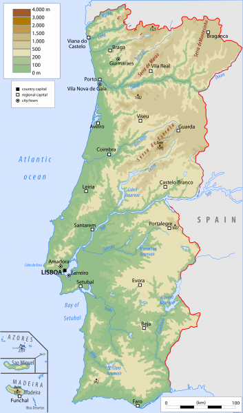

YHC woke up early on this Thursday morning, fine tuning the v-beatdown and concerned that there was not enough goodness on the agenda. The perfect weather and Burt's bag o tanks (which appeared to be a schmedium on YHC) put my mind at ease.

**Warm Up -**

Flacco took us through the Pledge, then on the scenic mosey to the bank where we indulged in Good Mornings, Side Straddle Hops, Standard Merkins, along with a lovely Runner's Stretch.

**The Thang -**

Mosey to the parking garage and circle up for instruction. 11's are the taste of the day, and we are serving Burpees and Super-Supermen. After much sweat and limited mumble chatter by Portugal's favorite son Burt, we lined up in one rank from lightest to heaviest. From there we broke into three and four man teams for Australian Pull-Ups. Some minor grumbling at the onset turned into shear excitement for this new and delicious exercise. This was followed by a mosey to the flag, which included two pick-up-the-sixes, keeping our tight group even tighter. An unofficial distance of over three miles for this beatdown made for a splendid morning!

**Mary -**

We took it home with Side Straddle Hops, WW2's, a Mosey around the lot, Flutter-Kicks, and the Atomic Luge. No Mary is complete without Have a Good Day.

**COT -**

Count-a-rama: 11

Name-a-rama: 4 Respect, 7 Meh

Prayers/Praises: Week 40 for Sosa's M, Prayer that no call was made during the Beatdown!

BOM: Callahan took us out.

I'm thankful for the opportunity to lead this group of HIM this morning, what a great VQ experience!
