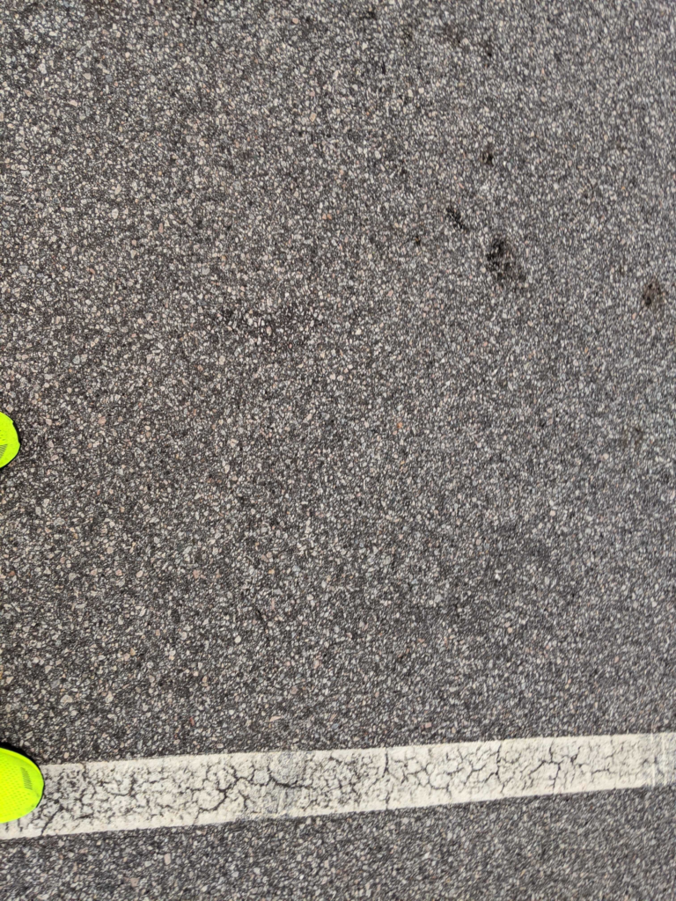

<figure>

<figcaption>

Thanks to Wrench for the attempt at a video of who was in attendance. Amazingly, I was able to pretty quickly remember 13 of 14 PAX. The one that took me the longest to remember was...YHC.

</figcaption>

</figure>

The Carpex Challenge quest continues this morning at Bradford's Ordinary. I had posted here an entire 2 times previously, but I knew there was a giant parking deck, and what else do you really need than a water fountain, which we have that too! It's BRR training season and earlier this week, Team Hung Jury shuffled some legs around and YHC now has the switch backs on leg 31. Well, running up a parking deck is essentially like running switch backs! Right? Here's what went down:

**Warmup:** Got to sleep in with the late 0545 start, Loom comes sailing in and slides into the adjacent parking lot (pro-move) and arrives just in time. No FNGs, so quick mission statement and pledge and off we head towards the water fountain. Circle up for:  
SSH x 15 IC  
Imperial Walkers x 10 IC  
GM x 5 IC- hold at the bottom and stretch each side  
Sir Fazio Arm Circles Fwd x 10 IC  
Seal Claps x 10 IC  
Plank Jacks x 10 IC  
Calf Stretch L/R x 10 sec silent count per side

**The Thang:** Mosey from the fountain all the way to the top of the parking deck. Starting at the top with  
Merkins x 2 IC  
Jump Squats x 2  
LBCs x 2 IC  
Head towards the bottom and add 1 rep at each level to get to 7 at level 2. Back to the top for:  
Burpees x 2  
Steve Earles x 2 IC  
Hello Dollys x 2 IC  
Same method as previous round.  
Once everyone is finished at the bottom, head back towards the flag.

**Mary:** Circle up for:  
Runners Stretch L/R  
Pigeon Stretch L/R  
Glute Stretch L/R  
Hip Stretch L/R  
Have a Nice Day!

**COT:** 14 Pax  
Announcements- Golf tournament in October. Details on Slack.  
Prayers/Praises- Chewy headed to the doctor for his back  
Disco Duck's M surgery next week  
Praises from Loom to the Pax for the being the reason he came out.  
YHC took us out.

**NMS:** Thanks again to everyone for coming out. Apologies to those not participating in the BRR but having to put up with hill running focused workouts for the next month and a half. MIAGD.
