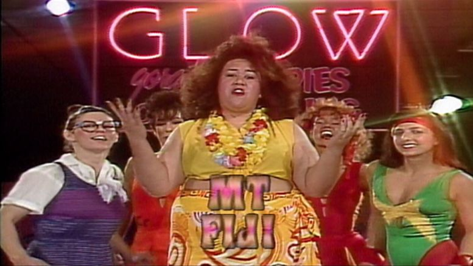

As advertised, YHC arrived for EC at 5:43 a.m., which consisted of 3 reps of fist-bumps with the fellow PAX, and a quad stretch.   After a flawless disclaimer delivered by YHC, including the oft omitted 'no assets' verbiage, we took off for two laps around Carpex's original Pickle™ with some painting of the lines sprinkled throughout.  It was during the Pickle™ run that YHC learned that my fellow three PAX all stayed up way too late last night.  
Flacco, and there should be no surprise here, went to three showings of the new Star Wars movie last night.  It was obvious he stayed up way too late; looking like Dexter Jettster:

  
  
Callahan also was up late, as evidenced by posting a message on Slack at 11:35 p.m.  I was certain he was probably working on his next Muggo™ prose, but no, he claims he was watching re-runs of GLOW Wrestling.  He also looked rough, like GLOW's Mt. Fiji:

Peeping Tom was up late for obvious reasons......he is after all, a peeping tom.  He's creepy: 

Well, we followed the jog and painting of the lines with several things.....all in perfect cadence from YHC:  Invisible Jump Rope, Moroccan Night Club-->GM-->Phelps, Merkins, PJs, and Saturday Nite Stretch (with sound effects from Flacco).

It was at that point that we jogged over to and down Cary Pkwy with stops at every light pole for x 5 Sumo Jump Squats.  Then sprinted across the Cary Pkwy bridge that is over the Black Creek Greenway.  We ended up at the top of SOB Hill, where we performed x 25 Freddie Mercs.  
Next Thang:   We run down SOB hill, then back up.  Perform x 25 LBCs and x 25 Wright Flyers.  Repeato the hill run, then x 25 LBCs and x 25 AirForce Ones.  Repeato run the hill, the x 25 LBCs and x 25 Supermans.  Repeato the hill run, then x 25 Freddie Mercs and x 25 Wright Flyers.  
Our next stop was Smurf Island™, but we had to run a long way through North Cary Park to get there.  So we did.  Along the way did some dips, merkins, Derkins, dips, sumo squat jumps, and other stuff.  
Next Thang:  From Smurf Island™, we ran to the World Famous Danger Zone T.GI.F Rock Wall™, where we gave Thanks.  Sprinted back to Smurf Island for x 10 Irkins.  Ran back to wall to go through the Good Intention portal, sprint back to Smurf Island for x 10 Derkins.  Ran back to the wall to give Forgiveness, sprint back to Smurf Island for x 10 pull ups.  
The team of 4 then jogged to the flag for a plank series to finish our 1st F.

**COT**  
Count-a-rama:  still 4  
Name-a-rama  
Announcements:  Oakwood 24.  Coffaterria convergence on the 23rd (i think the 23rd).  
Prayers/Praises:  Flacco's friend with cancer that has spread to lungs and brain, How-How and his family regarding the passing of his mother, and Callahan for guided and good decision making regarding a promotion.  
BOM:  Callahan took us out like a pro.

Nekkid Mole Skin:  
It was at this moment that we 4 bonded for life.  This is why:  we find a dark spot on the DZ grounds to look for the Starliner, the rocket that was to pass us to the east at 6:40 a.m.  While waiting for a couple of minutes, we all agreed that it would look like a shooting star and we all needed to be looking closely.  A minute of silence.  Then Holy Schnikies!!! From the east came this HUUUGE rocket with a HUUUGE stream of smoke from it's rear.  One PAX noted that it looked like it took off from Fuquay Varina as opposed to Cape Canaveral.   What a sight!!!  
Great having Peeing Tom....., I mean Peeping Tom out this morning in Carpex.  He's a class act.  (Flacco and Callahan are class acts too).  
So Callahan likes the left side of the bed (per The Muggo™).  But the question is this:  which side do you think is the left side of the bed.  When making this verbal reference, is this directionally from the head or foot of the bed?  Please somebody help me with this.  
Group of 4 PAX was a nice change of pace; really enjoyed it today.

luvyou,  
Flip Flop
