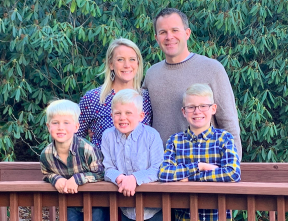
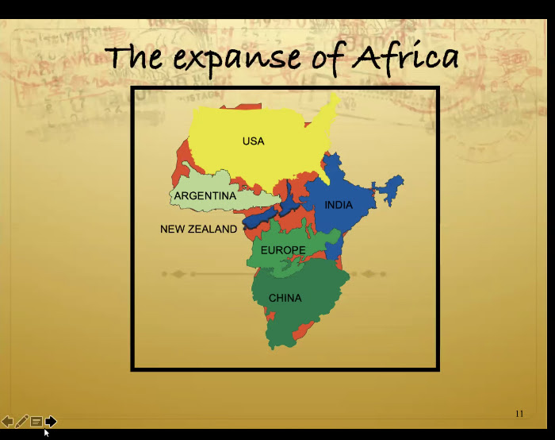

_The following email was sent out on December 14th updating us on Russ (Grease Monkey) Throckmorton's famlies' status on their move to South Africa that was scheduled for August_.

**Are we there yet?**

So are we there yet?  No, we aren't but we are getting closer.  **Since October 1st, (when the borders reopened in South Africa to foreigners) we have been hustling to gather and submit the necessary documents**.  We started the process for three different visas hoping one of them would get us in country.  Phone call after phone call and not getting through has made the process very difficult. 

We submitted our first round of documents three weeks ago and were initially told we should expect a response within three days. We were so excited to hear something... finally!   Well, it's been three-plus weeks and we haven't heard anything.  So we began to work towards a different visa only to find out we had to apply for a waiver to meet some of the requirements for this new visa application which could take up to six months. It felt like one step forward and three steps backward.    **Finally this week, we received some clarity on which visa we were eligible for and how to go about applying for this visa.**  We were so relieved and EXCITED just to speak with someone who was able to give us some direction!!! 

**So What's Next?**

**We went to NYC to officially apply for our visas on December 4th at 10:00 am EST.**  We have been gathering what seems like an endless number of required documents. Now we just wait to receive our visas via mail.  We are hoping to receive our visas within four weeks.  _Please lift us up when we come to mind in these areas:_

- For our **visas** to get processed smoothly and quickly
- **Moving** out of our house here in NC (this Sunday)
- Saying **goodbyes** to friends and family  
- For our hearts, minds, and bodies to stay **healthy** as we travel and transition into this **exciting new ministry adventure** overseas

**When Will We Leave?**

<table class="has-subtle-light-gray-background-color has-background"><tbody><tr><td>Our hope and goal is&nbsp;to fly out&nbsp;the<strong>&nbsp;last week of December or the first week of January.&nbsp;</strong>&nbsp;</td></tr></tbody></table>

* * *

**Connecting with the Ministry in Africa**

In the later part of October, **I (Russ) was able to join around 500 students from all over Africa in a two-day virtual conference.**  One of the speakers used the image below to charge and encourage the students to help reach "ALL of Africa" with the gospel.  **The national director from Ethiopia was one of the speakers and said "We have to think globally and act locally".**  We are eager to transition to the nations thinking globally but acting locally in South Africa!

Two weeks ago, I was also able to join the AIA staff team in Cape Town for their year-end planning for next year (being that the new school year starts for them in January).  This was a great time to hear what the Lord has been doing and to begin to connect with the team.  

* * *

**The Mission**

Our ministry will look similar to what we are currently doing advancing the gospel to the athletic world.  We will be working on **2-3 college campuses**, **leading the STINT team,** **helping give leadership to the [Lenses Institutes](https://athletesinaction.us7.list-manage.com/track/click?u=1b91f13f0c0fcb98770b22745&id=4568b53b51&e=4a14e1eb10)** (conferences that developed our staff and churches in and around the topics of race, power, culture, and ethnicity), **and staffing the Ultimate Training Camps in South Africa**.  Ryan and Morgan Mathews will be joining us.  Ryan was one of the first athletes Russ disciples when we starting working at NC State.  We are thrilled for the team God has formed. 

* * *

**Family Update**

We are still plugging away, both surviving and thriving most days.  After thinking we might be leaving in October after originally planning for August, to still be here has been extremely hard.  I (Mary)  think the worst part of it all is waiting and waiting with no real end date in sight.  I've not wanted to homeschool and work through certain needs that each son requires.  However, my attitude of mere survival until we depart has changed to one that is embracing this time.  We are thriving and so very blessed when I look back and see that we have gotten to all be around the table for lunch most days, had more time than ever to hangout, play games, watch movies, and to simply be home together.  As much as I want to be in South Africa, I don't want to waste this time He is using to draw us together as a family.  We know and trust that His timing is perfect and if we truly believe that then we can rest presently in the peace and joy that each day brings.  

In October, we had a 'moving away party' where the boys could each invite a few friends to hang out and say goodbye.  We are so blessed by the number of friendships God has provided over the years and will deeply miss them.  Please pray He provides great friendships for each of them in South Africa.

* * *

**To learn more, join the mailing list, or to support his mission please visit:**

[**https://give.cru.org/0573815**](https://give.cru.org/0573815)
