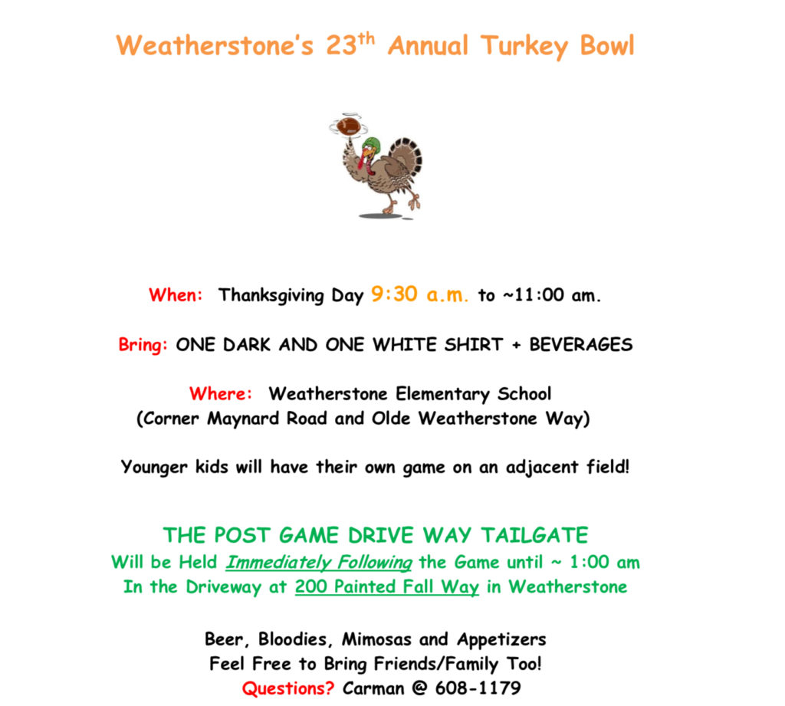

## ******22 November 2018 -- Thanksgiving Day Convergence at Bradford's Ordinary**

_**\*0600**_ – EC wave 1 launches. Banjo (not be be confused with BanGo) is run-Q.

_**0630**_ – EC wave 2 launches. Kitty is run-Q.

_**0700 (60 minutes)**_ – Thanksgiving Day Convergence at Bradford's Ordinary (all other AO's closed), Kitty on the Q.

_**0805**_ – Post beatdown 2ndF in the parking lot (2ndF Q's will provide).

_**0930**_ – Flag  Football at Weatherstone Elementary School, families welcome to attend. Prayers in advance for Yogi's rib cage. #neverforget (see below for the offish flyer)

_**1100**_ – Turkey-day tailgate for 2ndF in Burt's driveway Burt's house (200 Painted Fall Way, Cary, NC).

**\----**

_**FRIDAY 2030** \- Rolling Stone will Ruck the Maynard at an intended 15min/mi pace. Meet at Fortnight at 2030 (earlier if you want to pre-hydrate). Need a loaner ruck? You know you to holler at..._

_\*Note: You Back-in-Black boys should get real nuts and keep your AO open, post there and then come to BO. Let YHC know, and will add to the agenda._

