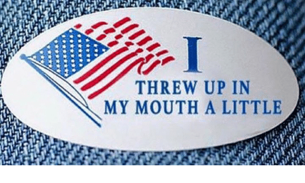

As you might imagine, it took YHC some time to locate an SFW graphic that fits with this particular title.  A-Team is the spot where YHC attended his first Carpex workout and then performed his VQ.  Just for nostalgia, we will recreate that VQ today.  No FNGs.  Pledge.  Let's go.

Warm up:

Mosey to the top parking lot to the right and circle up:

- 20 SSH IC
- 10 GM IC
- 10 Standard Merkins OMD
- Calf Stretches L/R
- 10 Wide Grip Merkins OMD
- 10 Daisy Pickers IC

Whenever I see Chipper and Francois show up to the same workout, I know that there is a significant statistical likelihood that something amusing is going to happen.  It doesn't take long today.  Chipper has spent the weekend stuffing horrible Camp Seagull cuisine into his GI tract.  The inevitable conclusion occurs during the warm up, and thankfully Francois is down wind.  The horrified shriek of "That was in my mouth" is delivered with flawless comedic timing.  Just a reminder that "modify as necessary" can also refer to breathing.   

Mosey to the back parking lot

Thang One:

Partner up for Dora: 100 Burpees, 200 Merkins, 300 Squats, partner runs the pickle

Side Note - Chipper and Francois are paired up for this one, so there has been forgiveness for the olfactory assault that occurred earlier.

Thang Two:

Mosey back towards the front of the park and stop at the foot of the speed bump hill.  10 guardrail dips at the bottom and 10 leg raises at the top on repeat. 

Mosey back to the front parking lot with carioca mixed in along the way.

Mary with 20 LBCs IC, 20 Low Slow Flutters IC and 5 more Burpees OYO / AYO.

COR and NOR

Announcements:

- Ball of Man is back.

Prayers and Praises:

- Both Prayers and Praises for Chipper's family

Chipper takes the honor of leading the first A-Team Ball of Man in over a year.
