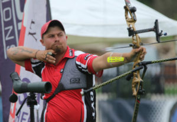

Arrive at the Bradford Ordinary Parking lot for my second Q ever at BO. See Yoga Mat returning from his Solo EC Run, others start showing up including last week's FNG Cluster. We start with a solid group of 7 HIM's.

Mosey to bank

**Warm Up:**

16 ssh

15 merkins

10 sir fazio forward

10 sir fazio backward

15 good morning

 

Mosey to Rockpile grab rock mosey to church parking lot.

Once in parking lot noticed there are cinder blocks strategically placed around the lot... will use next time...

**Thang 1:**

Partner up for Rock Dora

100 rock overhead tricep curls

150 rock bicep curls

 200 rock squats

Recovery walk to rock pile to return rocks

Mosey to library

**Thang 2:**

He what do you know some more dora...

This time with a run around the building.

100 merkins

200 LBC

300 Dips

Some groning about 300 dips, but alas we ran out of time to complete the last dora so we mosey to the flag for some short Mary

 

**Mary:**

Homer to marge

Have a Nice day

**COT:**

**Count-O-Rama:** 7

**Na****me-O-Rama:** 1 Hate 2 Respects 4 meh

 

**An****nouncements:**

11/18 for gear order

F3/FIA triple down at SNS

 

**Prayers, Praises:**

Callahan new baby

Angry Elf with a work issue

F3 Cape Fear and all deal with the aftermath of the Hurricanes

YHC took us out.

 

**NMS:** Kitty mentioned that someone from another region mentioned that we do all 3F's well. So that while we had a lower number than normal at BO, we had new AO's launching and we have more new men joining us every morning. During the discussion of this, it reminded me of one of the quotes I have always used in my life that is attributed to Saint Francis of Assisi. "Go into the world and preach the Gospel, use words when necessary." I believe this fits Carpex almost perfectly, We go in the area and preach F3, and use words when necessary. The way we welcome people who are new and old and how we try our best to include everyone, speaks loudly without any words.  Just under 6 months ago I started F3, I have now Q'd 3 times and will do it more. As someone else said on slack, my best days always start with an F3 Workout.
