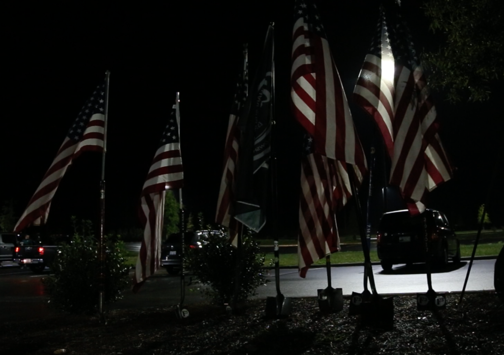

In CARPEX, we have a saying “if there’s no Back Blast then either it was a Riptide Q or it didn’t happen”. But the Odyssey did happen (I have the t-shirt to prove it) and so it must to go down into the annals of CARPEX so that someday future generations will read about it and ask themselves “What the #\*@(#\* were those morons thinking?!?!!”

So what the #\*@(#\* were we thinking?

Every morning save Sunday (and sometimes Sunday unofficially) PAX all over CARPEX fight their way out of bed and, rain or shine, sweltering heat or freezing cold, meet up in the gloom to workout, talk some trash, and more importantly, at the end they let down their guard a little to share their fears, praises and laughs and to lift each other up. A little stronger everyday—mentally, physically and spiritually. For a lot of people that would be enough and most days it is.

But sometimes a man wants to know his level of strength and resolve.

We are handed limitations everyday and if we are not careful we accept them: We ARE getting older. We are NOT kids anymore. We DO have responsibilities and commitments. We DO need to be realistic. We DO need to be careful. We probably CAN find something better to do with our time.

But sometimes a man NEEDS to know how deep the well is.

```
_________________________________________________________________________________
Each day I have to check my mind to see who put what in there.
— A. Hechiche
_________________________________________________________________________________

```

 

 

#### Chapter 1: The SaG (Support and Gear) Wagon Patrol Team Story

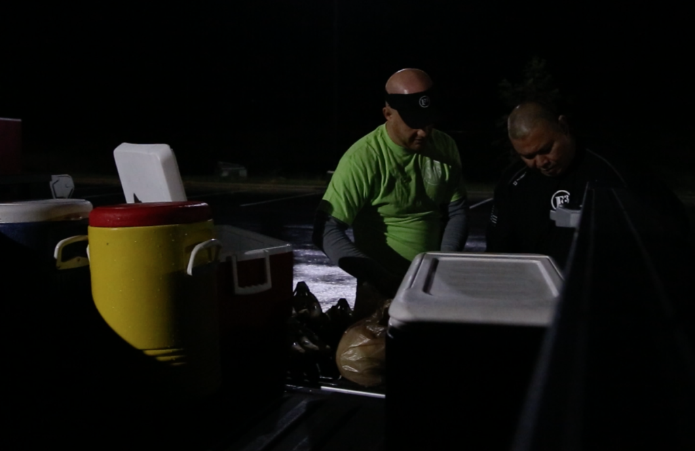

###### AO: All of Them

###### Narrator: WWW

Our journey started months in advanced.  I was told to talk to Chinese Downhill, Pet Sounds and Smokey, who were extremely successful in the first Odyssey.  I met up with each of them to get their story and what to think about. They were so gracious to share their story and personal experience.  I was so grateful! I like lists, so I asked all three HIMs if they had a list that I could add to, to my surprise they did not put anything down on paper.  Thank goodness they had a great memory and they downloaded it onto me. I soaked in up like a sponge and took a lot of notes. I realized as I was listening intently on their stories, I had three huge shoes to fill and I did not want to disappoint my mentors.  I decided to put what they told me down on Google documents and shared it with Carpex so I can get the ball rolling on volunteers, food donations and prepping the SaG Wagon Patrol Team agenda and route.

9 HIMs: Flacco, Hermes, Hello Kitty, Pet Sounds, Pickles, Smokey, myself, Dave (Crimson and Sooey’s friend), and Warren (Sooey’s Dad) (Editor’s note: Frisco unsuccessfully tried to get everyone to call Warren “Hollaback Boy” since Sooey’s hospital name is ‘Hollar’ and, well, Frisco is Frisco…).  They volunteered 5 hours of their personal time on a Saturday to provide support for 60+ Odyssey PAX. The SaG team started our morning at 0500, way before the crack of dawn!  Hermes, Pet Sounds and Hello Kitty were there as I arrived. I do not know what time they showed but it was early (true dedication). I think they did not want to over sleep, so they did not sleep.

Hermes already had his table set up, butcher knife and cutting board out hacking away on more fruit to add to the mountain of fruit we already had. The more the merrier. We definitely did not run out of anything.

Hello Kitty, our renowned commentator and photographer, got to work recording the epic story. Ma Bell showed up at 0515 with some tasty treats. A plastic bowl full of scrumptious bacon! What a glorious way to start the Odyssey morning, thank you Ma Bell!  I even heard, Pet Sounds, woke up even earlier and got breakfast at Waffle House before the Odyssey. He was the only one in Waffle House.

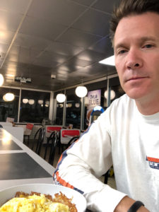

There were several main highlights during our patrol, which the SaG was on point.  We met the PAX at each AO and provided the best darn support with water, Gatorade, a smile, and encouragement especially after AO #3.  What I’m mostly proud of the team’s support was making absolutely sure the PAX were all safe especially crossing some of the busiest roads (Apex Peakway and Hwy 55).  Unfortunately, we did have one injury, Clementine, whose ankle found the mysterious pothole on the route to twist in (next year we’re going to mark them with glo-sticks). It swelled up like a baseball. 60+ PAX ran the same route and Clementine fell in it.  Smokey provided the support to get him to an urgent care to get his ankle looked at.

I made several trips shuttling some of the PAX that had to leave early due to other commitments back to St. Mary Magdalene.  The first break at Apex UMC was epic. Hermes, Hello Kitty, Pet Sounds, Flacco, Pickles and Sooey’s Dad sprung into action setting up a buffet of treats, which were anxiously awaiting the arrival of our PAX of HIMs or maybe HIDAs.  The final stop was mind-blowing. As the SaG Team started to arrive at St. Mary Magdalene, without saying anything, they got to work setting up the arrival buffet for the hungry, tired, and aching PAX. The biggest hit of the buffet was the Appleton farm Spicy Italian Dry Salami and the brewskies that were donated by Hello Kitty and Beaker.

It was amazing to have worked with such a great and helpful team.  You HIMs are AMAZING, I’d say!!! They made my job easy and I would work with them anytime, anywhere, anyday!!!  THANK YOU FOR YOUR UNWAVERING SUPPORT!!! The PAX truly appreciated everything we did! I know because of the many thank you they shared with me.  I want to give a special shout out to Hello Kitty for designing our SaG attire. The neon green t-shirts made us stand out and visible. I’m giving full credit to Disco Duck for coming up with the acronym meaning to SaG (Support and Gear).

```
_________________________________________________________________________________
Every story starts somewhere long before it begins.
— Anonymous
_________________________________________________________________________________

```

 

##### Special Thanks to Banjo

Narrator: Frisco

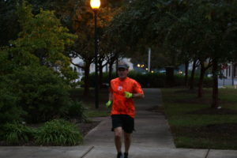

Some special thanks goes to Banjo (guy in orange above with effeminate running style) for his organization, dedication and acting as Time Czar on the day of the event.  In the planning stages he was instrumental in keeping the organizers on track.  On the day of the race he kept everyone moving so that we actually finished slightly early (no easy feat with 60+ PAX and 7-8 stops along the way).  That is big because at the end of the day even the CSAUPs we do to make ourselves stronger for the people we love.  That means getting in, getting the job done and getting back to them as soon as possible.

There is a great story out there somewhere on the Muggo about Banjo (and also I think Callahan wrote something passable, too).  It details challenges he's overcome and still faces .  If I have a choice of who stands beside me when the chips are down let it be a guy who knows how to get back on his feet from hard experience.  Let it be the one who has learned what is precious in this world and fights to stay true to that.  Let it be the man who is not perfect and will reach for my hand some day and let me be strong enough to help him stand again as well.

```
________________________________________________________________________________ 
Those who say that we're in a time when there are no heroes, they just don't know where to look.
-- Ronald Reagan, Jan 20, 1981
________________________________________________________________________________ 


```

#### Chapter 2: Intro, Disclaimer, Warm Up:

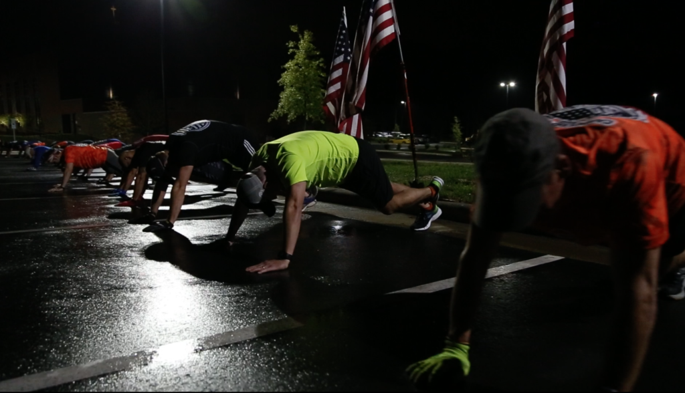

###### AO: St. Mary Magdalene Church Parking Lot

###### Q(s): Disco Duck (cameo by Nature Boy)

###### Next Run Q: Squatter

###### Narrator: Disco Duck

I pulled into the parking lot at Mary Magdalene to find the SAG Wagon crew already getting ready for the Odyssey.  So much appreciation for these guys, we could not pull this off without them.

It doesn't take long for the crowd to swell, and it's like I'm at the All Star Game, everywhere I look it's another Hall of Fame High Impact Man. I'm surrounded by men I love and respect and admire and I can't wait to do something Completely Stupid And Utterly Pointless with them.

I'm feeling nervous about leading the warm-up, there's more things to remember than my mind can handle, so for the first time ever I have a Weinke.  But Banjo convinces me I don't need it.  We'll see about that.

It's 06:00, follow me!  Take a half lap around the parking lot and circle up for five burpees OYO, just to get their attention.  Welcome to the Odyssey, give the disclaimer, explain how we'll move from AO to AO, mention the SAG Wagon, talk about safety, but now the PAX are getting restless, so let's warm up.

Side straddle hops, merkins, calf stretches, imperial walkers, squats and five more burpees just cause, and hand it off to Squatter to lead us to the first AO.

But wait!  Nature Boy reminds me that we didn't do Good Mornings.  It was on my list, and I forgot it.  So we hold up and we'll do some Good Mornings, so everyone can Have A Nice Day later.  Now let's follow Squatter.

It wasn't until after we left the parking lot that I realized there was one other thing I'd forgotten.  Handing it off to Hi-Liter for the opening prayer.  If only he'd have been as vocal as Nature Boy, or if only I had used that Weinke….

```
________________________________________________________________________________
If there's one thing I'm good at, it's gathering people together to do something fun. 
— Dave Grohl
________________________________________________________________________________
```

 

#### Chapter 3: Jaycee Park

###### 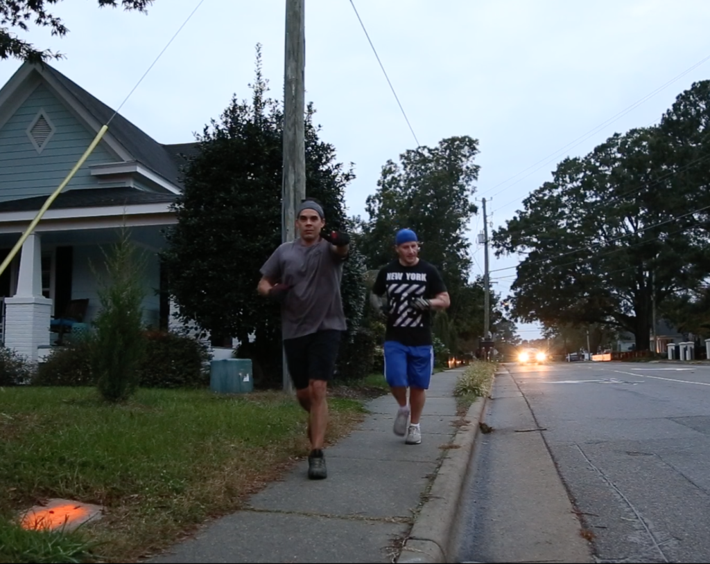

###### AO: TWSS

###### Q(s): Red Ryder / Sooey

###### Next Run Q: Snots

###### Narrators: Red Ryder / Sooey

Sooey and Red Ryder had the honor of leading the first official stop of the Odyssey. After exploring the Beaver Creek Greenway, the PAX made their way into Apex Jaycee Park. The PAX attempted to count off into 1s and 2s - however a 3 was heard so bonus burpees ensued. On attempt two, we managed to come up with 2 groups.

Group 1 went with Sooey to the upper parking lot where everyone partnered up for 100 x merkins and 100 x star jumps. Partner 1 started the exercises while Partner 2 lunge walked the pickle.

Group 2 stayed in the lower parking lot and partnered up for 100 x LBCs and 100 x Carolina Dry Docks. Partner 1 started the exercises while partner 2 bear crawled the lower pickle. Halfway through, the PAX flip flopped and did the other exercises in the opposite parking lot.

Once completed, Squatter lead us on towards Baucom Elementary School, with Sooey and Red Ryder ensuring the 6 were well accounted for.

```
_________________________________________________________________________________
I will endure…
For already have I suffered full much, 
and much have I toiled in perils of waves and war.
Let this be added to the tale of those.
— Homer, The Odyssey
_________________________________________________________________________________
```

 

#### Editors Aside:

Like a lot of PAX I slip out quietly in the mornings to post while the M and 2.0 are still asleep.  I set out everything the night before so as not to be noisily bumbling around in the dark and hearing the dreaded “Daddy, can you…” or “Honey, before you go…”.

The fun of mumble-chatter and satisfaction of a solid beatdown (after its over) aside, one of the reasons I started and continue to do F3 is that I want to be strong enough—mentally, physically, and spiritually—take care of the people I love.  My 2.0 is growing interested thanks to Carpex Dads and has taken to asking me who the morning’s Q was, or climbing on my back when I do pushups (TYFYL, Hermes) or asking when he can pelt me with water balloons again (TYFYL, Flacco).  And after posting I bring home Starbucks to the M which earns me a kiss and also wipes away any memory of me stumbling around the room for that @\*#&$&@ pair of gloves that like to jump out my pockets in the dark.

But on the whole F3 happens outside of my family’s view and that’s okay because as a husband and a father my job is to take care of them, not the other way around.  That said I have to admit I needed to wipe my eyes a little when we were traveling through one of the neighborhoods.  Crimson’s house was near our route and as we passed by, standing in the gloom by the road was Crimson’s M, cheering him on. 

Of course, we gave him a few good natured jibes and even in the dark you could tell he was blushing.  But at the same time the pride radiating off Crimson was palpable and infectious.  Maybe it wasn’t a ticker tape parade in Times Square but for a bunch of guys slogging it out in the near dawn light, getting to be a part of our brother’s moment was the 4th of July, Christmas and the Super Bowl all rolled into one.

There is a reason why the M’s are the most important relationship to a HIM.  A bunch of guys can help a man when he is down, can help him get up and get strong, can even give him some wisdom and direction; but until a man puts his heart into something he will never truly accomplish it.  And the heart is where we keep our M’s.

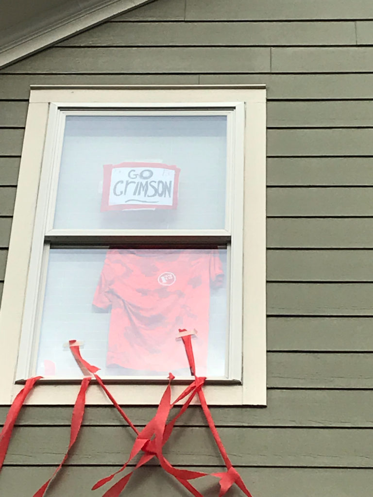

```
_________________________________________________________________________________
Her name is Aphrodite and she rides a crimson shell
And you know you cannot leave her for you touched the distant sands
With tales of brave Ulysses, how his naked ears were tortured, by the sirens sweetly singing
— Eric Clapton, Martin Sharp, Tales of Brave Ulysses
_________________________________________________________________________________
```

 

#### Chapter 4: Baucom Elementary School

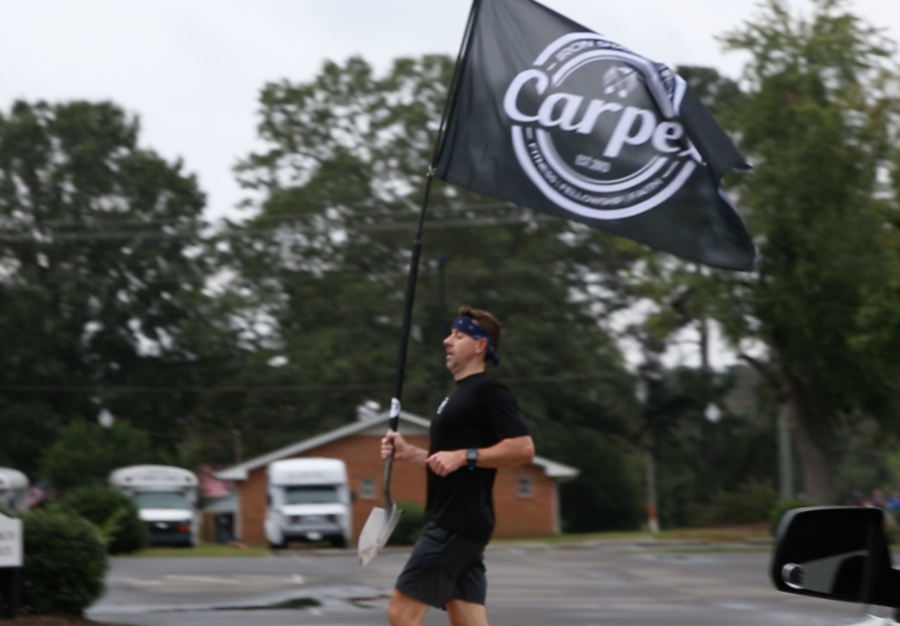

###### AO: The School of Hard Knocks

###### Q(s): Ma Bell / Squatter

###### NEXT RUN Q: SNOTS

###### Narrator: Squatter

As YHC, Ma Bell and the rest of the PAX approached Baucom Elementary we were still going strong but a bit beat down from our first stop at Jaycee Park and the co-Q of Red Ryder & Sooey. It was still dark and we already had just over 3 miles under our belt, but we were ahead of schedule. While the co-Qs set up Snots led the PAX with some Mary as they filtered in.

Once the entire PAX was accounted for, we quickly divided up into two groups.  Half went with Ma Bell for a crowd-friendly and shortened version of Doracides and the other half went with YHC for a little Field of Dreams.

Doracides: Partner Up and complete 50 Lunges; 75 Merkins; 100 Dying Cockroaches. While P1 begins the exercises, P2 runs suicides stopping at each of 3 cones for progressive burpees. Flip Flop and continue until all exercise are complete, then squats till all the pax are finished

Field of Dream: Divide group into teams of four. Each team goes to a base and does exercises until relieved by another team. PAX go from base to base with a predetermined mode of transportation. Workout is over when all four teams have been to all four bases.

Team 1- Homeplate: 5x Worst Merkins Ever then Bear Crawl to First Base

Team 2 - First Base: AMRAP Knee Tuck Jumps then Crab Walk to Second

Team 3 - Second Base: AMRAP Carolina Dry Docks then Crawl Bear to Third

Team 4 - Third Base: AMRAP Chill Cut Plank Jacks then Walk Crab to Homeplate

Using our allotted time wisely, we let the PAX finish up ahead of schedule as the SAG Wagon had some needed supplies ready for us before heading off to Bounty Hunters

```
_________________________________________________________________________________
I can hear them say
Bad company
And I won't deny
Bad, bad company
Till the day I die
— Simon Kirke, Paul Rogers, Bad Company
_____________________________________________________________________________
```

 

#### Chapter 5: Apex Community Center (Bounty Hunters)

###### 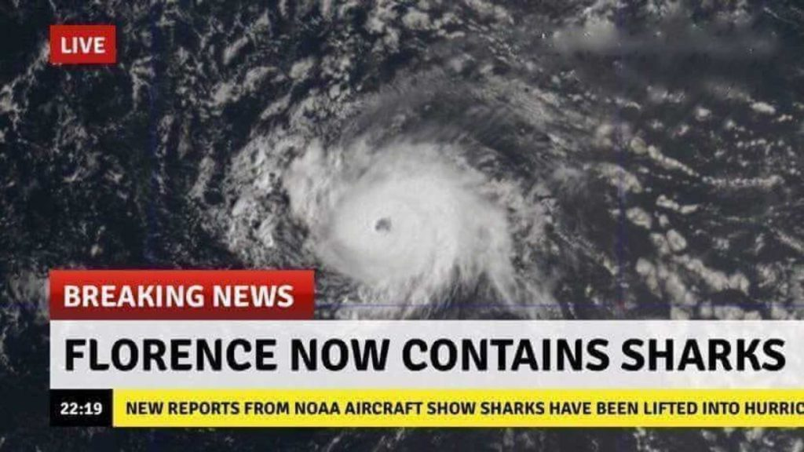

###### AO: Sharknado Alley

###### Q(s): Parker / GTL

###### Next Run Q: Beaker

###### Narrator: Parker

After finishing up at Baucom Elementary, Snots had "fast Q" duties and led the way to the Apex Community Center at the center of the Bounty Hunters AO.  He of course did not disappoint, carrying the BH shovel flag a full block ahead of the PAX by the time he reached BH.  Snots led the frontrunners through plank and squat exercises before turning the AO over to GTL and Parker.

YHC welcomed the PAX to Bounty Hunters with the safety disclaimer followed by a "warm up" (most of the PAX were already pretty warm) of 5 burpees IC (it's a six count exercise!), 10 diamond merkins, 10 WWII sit-ups, 10 standard merkins, and 10 scorpion dry docks (demonstration required).  I yielded to GTL for the MAIN EVENT.  GTL told the PAX about the Bounty Hunters AO reputation as the Home of the Sharknado Fitness Test, and explained the event, which would be shortened to 10 minutes for purposes of Odyssey timing.  The Thang: Starting at the center of the diamond, PAX are to perform 15 burpees, then run a lap around one side of the diamond (0.2 mi). Repeatoe with the four previously introduced exercises, 20 diamond merkins, 20 WWII, 20 standard merkins, and 20 scorption dry docks.  Time called promptly at 10 minutes, and a quick show of hands revealed that the majority of the PAX made it through at least one full cycle of the Sharknado!  Nice work men!

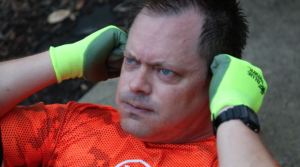

###### **Narrator: GTL**

The PAX rolled into the finest AO in downtown Apex around 7:30 a.m., it felt a bit like a typical Thursday morning...but it wasn’t.  Many of these HIMs had never posted at this location, and therefore had not had the privilege of experiencing the one and only....Sharknado.  The Sharknado has become a fitness test at Bounty Hunters, scheduled three times per year, to test the progress of the Carpex PAX as they build their endurance and drive.  How else could we welcome these 50(ish) men to our turf without giving them a proper Bounty Hunters beatdown? 

Parker proceeded to lead us through 5 “warm up” exercises...

10 Burpees

10 Diamond Merkins

10 WWII sit-ups

10 Merkins

10 Scorpion Dry Docks

GTL then informed the PAX that the next exercise is...”The Sharknado”.

The good news is that you just did every exercise that you need...the bad news is that you have to add a lap around the diamond in between each set - your instructions are:

15 Burpees and a lap

20 Diamond merkins and a lap

20 WWII sit-ups and a lap

20 Merkins and a lap

20 Scorpion Dry Docks and a lap

10 minutes on the clock...GO!

Impressive efforts by all - the Carpex PAX left it all on the field.  Now on to the next location....

```
_________________________________________________________________________________

This is the CARPEX, boys!  When something bites us, we bite back!
— Kevin Giles as “Hermes” in 
  Sharknado 23: This Shark Just Got Real Up in Here (release date TBD)
_________________________________________________________________________________
```

 

 

#### Chapter 6: Apex Middle School

###### 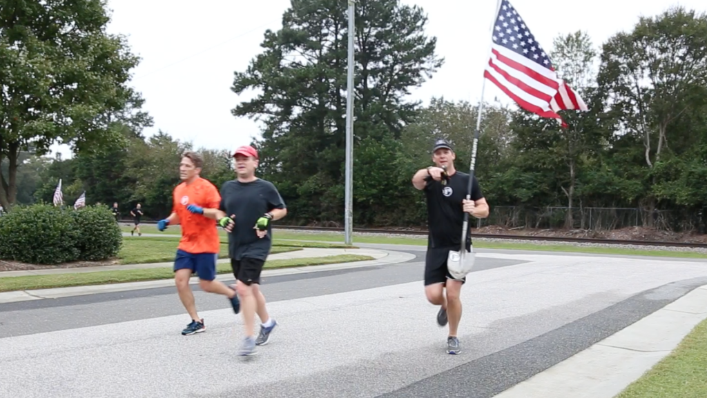

###### AO: Smokey Monkey (That Funky Monkey)

###### Q(s): Monkey Nut / Smokey

###### Next Run Q: Hi-Liter

###### Narrator(s): Frisco / Monkey Nut / Smokey

Apex Middle School was the next stop on the journey.  Exhaustion was showing on more than a few faces, but the PAX helped each other push on.  It is true that the workouts don’t get easier, you just get stronger and your mumble-chatter gets louder to tell exhaustion to piss off.  Monkey Nut and Smokey welcomed the incoming PAX with open arms and broad smiles.  Okay, okay, they welcomed us with Q love: with a two station Thang that made us look like bunnies jumping around a track and that made us hate the number 20.  I still don’t know which station was worse, but my monkey is on the rabbit track races.

Make sure all pax are there and then separate into two groups.

**The Thang**

_**Group 1**_

Go to parking lot oval

5x5 - do 5 bunny hops, 5 presses, 5 lunges

repeatoe 5 times

_**Group 2**_

Go to stairs at baseball field

Partner off Partner 1 – up stairs, then down to dug out – 20 dips

Partner 2 – 20 merkins, 20 squats, 20 LBC’s

Flip flop until we switch groups

Great group today, iron sharpens

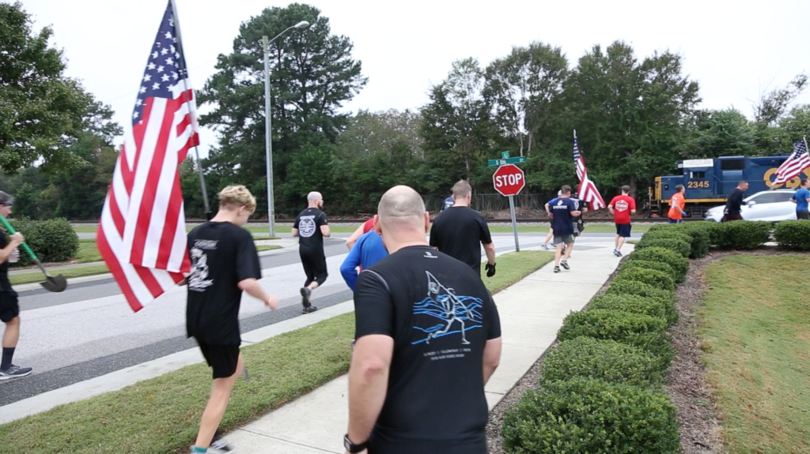

```
_________________________________________________________________________________
I used to be hell on wheels,
Back when I was a younger man
Now my body says "Oh, You can't do this boy",
But my pride says "Oh yes you can"
I still throw a few back,
Talk a little smack,
When I'm feeling bullet proof,
May not be good as I once was,
But I'm as good once, as I ever was
— Scott Emerick / Toby Keith, As Good As I Once Was (Honkytonk University)
_________________________________________________________________________________
```

 

 

#### Intermission: BREAK at Apex United Methodist Church

###### 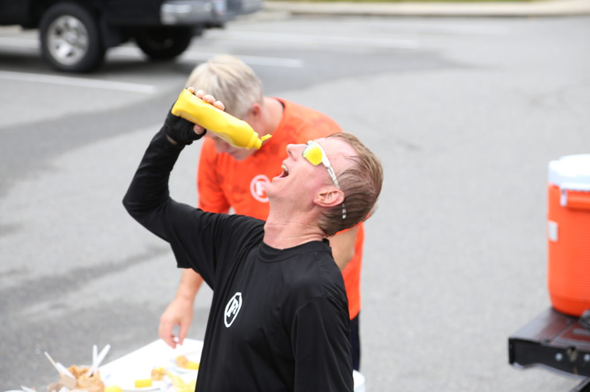

###### AO: 2nd F Station

###### Q(s): the sag team

###### Next Run Q: Hi-Liter

###### Narrator: Frisco

Right on time with Banjo’s schedule the PAX rolled up to the 1st F Refueling & 2nd F "We Made It" / "6:05AM, Boys" stop.  Some Ms and other PAX family members were lined up along the road into Apex UMC shouting encouragement.  70+ PAX milled around stretching, massaging aching joints and scarfing down bananas, peanut butter, energy drinks, water, fruit and mustard.  After the Smoking Monkey beatdown my arms were toast so I spent the first few minutes trying to get the angle right to flick food into my mouth while my arms were stuck at my side.  But the rejuvenating elixir from the swamps of my Florida homeland (i.e., Gatorade or its knock off competitor) eventually worked its magic and I focused on one of the best parts of F3—2nd F.

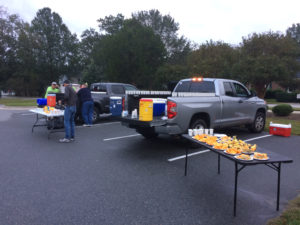

Which reminds me of a story I heard once.  There was a large table in Heaven and a replica of the same table in Hell.  The people in Hell were starving because their arms were permanently extended so that they could not bend them to bring food to their mouths to eat.  In Heaven the people were well fed and happy even though they had the same permanently straightened arms.  The difference was that in Hell the people tried everything they could think of to feed themselves, but in Heaven everyone just fed the person across from them, knowing they would get fed in return.

Term Paper’s Tour de Carpex this summer challenged us PAX to hit every CARPEX AO at least once so that we were meeting people we normally didn’t post with.  It is a good idea.  As much as we give our Nantan, Ma Bell, a hard time about how quickly he reins in any Cary vs. Apex chatter we all know that the ties that bind men together can be easily frayed--even accidentally.  It was good to see the South Wake and Raleigh guys out with us and I was glad I had done Raleigh's 9/11 stair climb.  I am glad Disco Duck and I are putting together a Clown Car in December to go to F3 JoCo.  It makes me proud when I see our guys show up to post with F3 shirts from AOs across the nation.  It makes me thankful to be a part of F3.

After a bit of fellowship and feeding the PAX tightened up the straps and headed off.  The SAG Crew rolled up the red carpet and headed onto the next stop to support us.

 

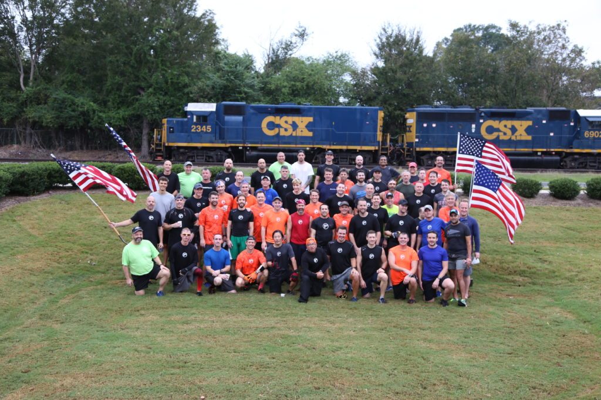

```
_________________________________________________________________________________
I think that one of our most important tasks is to convince others that there's nothing to fear in difference; that difference, in fact, is one of the healthiest and most invigorating of human characteristics without which life would become meaningless. Here lies the power of the liberal way: not in making the whole world Unitarian, but in helping ourselves and others to see some of the possibilities inherent in viewpoints other than one's own; in encouraging the free interchange of ideas; in welcoming fresh approaches to the problems of life; in urging the fullest, most vigorous use of critical self-examination.

— Adlai Stevenson
_________________________________________________________________________________
```

 

 

#### Chapter 7: Sovereign Grace Church parking lot (That’s our story and we’re sticking to it)

###### 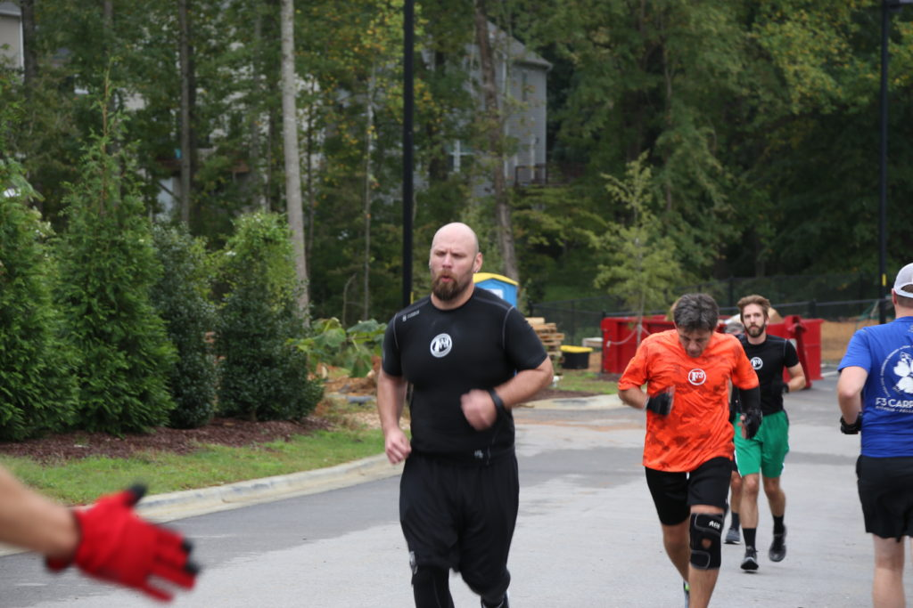

###### AO: Tortoises

###### Q(s): Crimson / WWW

###### Narrator(s): Crimson

###### Next Run Q: Hi-Liter

After a well-earned 20 minute rest break, the PAX were off again on a short run to F3 CARPEX’s premiere limited running workout in Apex, #ao-wed-tortoises (Claymore #ao-tues-claymore being the Cary one of course)

When the PAX arrived, they found two Tortoise site Q’s ready to assign a bit more running, merkins and LBCs.  The plan was simple….A couple of double 7’s \[7’s my ass. More like 11’s\] on the hills behind a row of buildings.  We have used this space many times at 5:30 am without issue.  What could go wrong??

Well, apparently the local business owners who were getting prepared for a Yoga class did not appreciate 70 sweaty, burly, muscle laden men taking over their parking lot and creating obstacles for their customers to park.  The quick 20 minute workout began right on time thanks to Banjo’s strict adherence to the schedule.  With five minutes left and the 7’s wrapping up, the business owner advised she had had enough and said we couldn’t do “this”.  We think the “this” is being all up in her parking space.  YHC checked the town records for parking space ownership and could not verify her ownership.  Nonetheless, the workout was done, no damage was done to the local business and 70 studs proceeded to party…..Correction…..proceeded to the next AO.  

See you next year Mrs. Yoga Lady.

```
_________________________________________________________________________________
Risin' up, back on the street
Did my time, took my chances
Went the distance, now I'm back on my feet
Just a man and his will to survive
So many times, it happens too fast
You trade your passion for glory
Don't lose your grip on the dreams of the past
You must fight just to keep them alive

— Survivor, Eye of the Tiger (Frank Sullivan / Jim Peterik)
_________________________________________________________________________________
```

 

 

#### Chapter 8: A Big Green Field

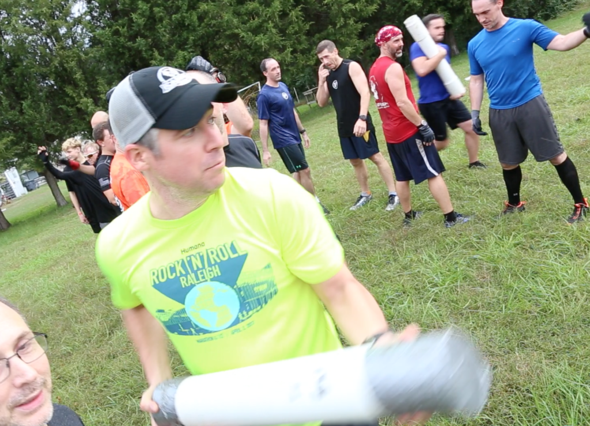

###### AO: Anthill Pain Station

###### Q(s): Beaker / Hi-Liter

###### Narrator(s): Frisco

###### Next Run Q: GTL

There was one grueling mile left for YHC (Frisco) at this point.  I was doing a Forrest Gump “limp-run” imitation (literally) and part of me was mentally yelling that I should have taken Pet Sounds’ damn Sag Wagon back to the shovel flags.  I had tried to earlier (really, I had) but only managed to ride 10 feet down the road before getting out and starting to run again.  Why?  Sitting in that truck I wondered had I done my best?  Was I spent?  I did not want to hurt myself out of stupidity or stubbornness but some part of me just wanted to see if I could finish.  I needed to see how deep the well was.  I had run 6 miles.  I had worked my body hard at multiple AOs along the way.  I wanted to see if I had that 7th mile inside me somewhere.

As proof that God does have a sense of humor a few hundred arduous steps after I watched Pet Sounds and the rest of his SAG wagon crew wave good luck and drive off I I turned a corner to find, not the shovel flags and the end of the journey, but an another AO site.  A big green grassy field filled with ant hills and pain sticks.  I realized that I had forgotten about this AO and I still had a mile to go AFTER this AO.

For you future generations that have managed to read this far it is the equivalent of discovering you’ve 1) stepped outside the airlock without putting air in your spacesuit tanks, 2) you left the keys to the airlock in your other spacesuit, and 3) small, mean green aliens are punching you in the gut to see if they can make you expel what little air you have left in your lungs. 

I somehow I survived the little green (field) aliens and their torments, pulled myself back into the airlock, and pressed on.  Here is what I remember of #BGWOF.


The PAX rolled in slowly but steadily.  The journey was coming to a close but like any good video game at the end there is always one Big Nasty to beat before you can save the princess.  In CARPEX we like symmetry so we brought in two.

The Qs led a bit of pre-Mary Mary to get the PAX familiar with where the holes the ground and anthills were hidden.  Luckily, many of the ants had recognized Pet Sounds (he is a regular stop on the ant buffet at AOs) and followed his truck like he was the Pied-Piper when he drove off.  The PAX were left with only brambles in the long grass and...wait, are those pain sticks?!?

Yes, they were pain sticks and the Qs broke the PAX into teams of 5-6.  The goal was to transfer the pain stick from PAX to PAX down the line with the last guy carrying it back to the front.  Slowly the teams would move forward like half-tracks across the field.  Or at least that was the plan.

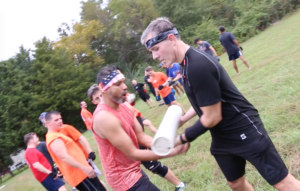

It took a few cycles of the "half-track" for the teams to figure out the rhythm but once we all did it was Game On.  On YHC's team Ollie actually got tired of waiting for the pain stick to travel down the line and just began picking up one or two PAX along with the pain stick so that he could run to the front faster.   One team figured out that they could shuffle step and squeeze a little extra length out of each cycle.  That worked until they were about to win (much to the consternation of the non-shuffling teams) and the Qs called for every team that finished to do Wolverines until all of half-tracks were in.  Suddenly, PAX everywhere forgot how to carry a walk stick and chew gum at the same time.  The team in the lead actually lost their sense of direction and somehow began moving backwards (much to the jeers of the non-shuffling teams).

But eventually wolverines were done and teams finished the field.  The Qs led most of the PAX on a cross-the-field sprint and back,  The remaining PAX (YHC included) modified-as-necessary and carried the pain sticks to the nearest SaG wagon and scoured the field for trash ("Respect the Site").

The PAX headed out to the final AO, the place where our Odyssey had begun: St. Mary Magdalene Church.

```
_________________________________________________________________________________
Two roads diverged in a wood, and I—
I took the one less traveled by,
And that has made all the difference.
— Robert Frost, The Road Not Taken (Mountain Interval, 1916)
________________________________________________________________________________
```

 

 

#### The End: Mary and COT

###### 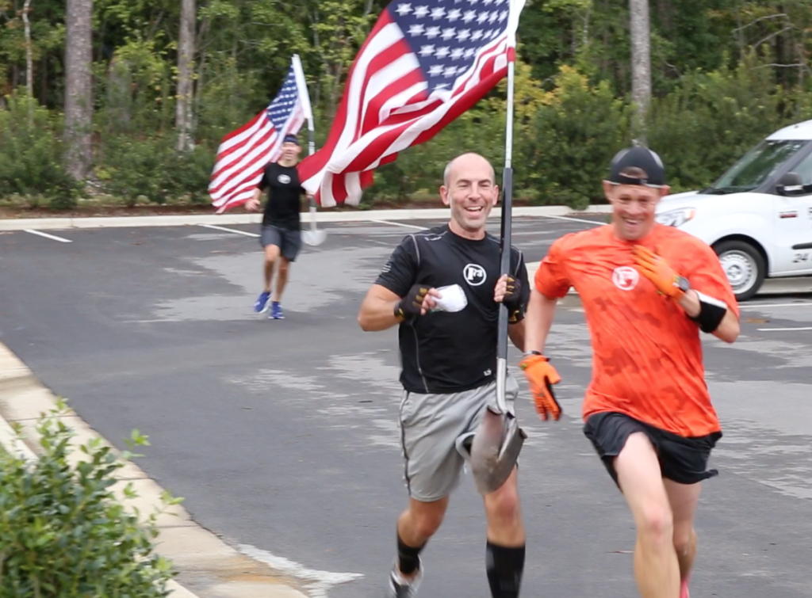

###### AO: sky fall

###### Q(s): franklin / banjo

###### Narrator: Frisco

###### cot leader: hi-liter

The PAX made it back with time to spare to wait for the 6.  Since that was actually me I can't tell you what went on only that I made it back in time for Mary and that I wasn't alone on that last leg (pun intended).  Thanks to Beaker and Disco Duck for picking up the 6.  The longer I know all of these HIMs the luckier I feel to have found this amazing group.  So here is what happened in pictures which should cover the remaining amount of words YHC was allotted to tell this epic tale.

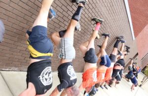

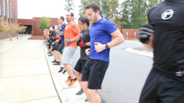

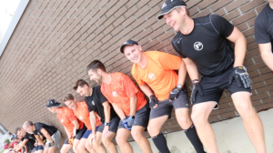

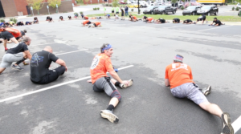

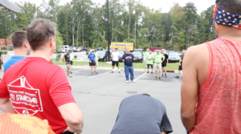

 

#### Closing

[https://www.youtube.com/watch?v=M4B9\_DPykwA&feature=youtu.be](https://www.youtube.com/watch?v=M4B9_DPykwA&feature=youtu.be)

 


```
_________________________________________________________________________________
Lokah Samastah Sukhino Bhavantu Om Shanti Shanti Shantihi
— Sanskrit Prayer

“May all beings be happy and free, and may the thoughts, words and actions of my own life contribute in some way to that happiness and freedom for all.”
_________________________________________________________________________________
```

 

#### ANNOUNCEMENTS / PRAYERS / PRAISES

1. F3 JOCO looking for a few #HIM to help grow F3 in Johnson County / Clayton / Benson.
    1. See @F3JOCO or Pickin N’ Grinnin @F3PNG for more information.
    2. Disco Duck and Frisco are organizing a Clown Car for Dec 1st.
2. Raising money and furniture for F3 South Wake’s “WOLFIE”:  [https://www.gofundme.com/7ws6v-wolfie?member=969066&fbclid=IwAR14Y1aW4PoeNwYbq-646vEvLKOCyz-Phg4FYr8Cpbwx82wUbFCaDXLZn\_c](https://www.gofundme.com/7ws6v-wolfie?member=969066&fbclid=IwAR14Y1aW4PoeNwYbq-646vEvLKOCyz-Phg4FYr8Cpbwx82wUbFCaDXLZn_c)
3. Triple Down (Ruck, F3, and then FIA workout) on Nov 17th (Quadruple if you add Carpex Dads)
4. Hurricane Florence Disaster Relief
5. Continued prayers for Dave (Crimson's & Sooey's neighbor).  There is always someone here in the gloom that will stand with you until the light returns.
6. Prayers for Navin's continued strength, health and fortitude while he is away with his military training.  Miss you, bro!  Stay strong!

 

#### NMS

What's in a name?

In F3 all you have to do is make it through your first workout.  It is not easy even with everyone encouraging you and hanging back to make sure you aren't alone.  As someone wise said to me once: people don't typically decide to treat a headache until they've got nothing left for it except to cut off their head.   When you finish that first workout, when you drag your butt back to the shovel flag, inside the Circle of Trust the guys you ran and sweated with give you an Utterly Stupid Name.  It seems like a bit of a hollow reward for what you just survived.  It might be comical, it might be irritating, and it will probably mean nothing to you at the time.  It's just a name that no one outside of that little group would ever know.

But then the next day or the next week you drag your butt back out.  And again and then slowly overtime you get a little stronger.  The 28 stairs at work that left you winded every day, now you don't even notice any more as you go up.  You can get through 5 full pushups without dropping to your knees to finish.

And then one day you do something that shows you how far you have come on your Odyssey.  Maybe an old friend comes out to post with you.  The one who was always "the athlete" in your group of friends and not only can you hang with him, but he's actually winded long before you.  Maybe you wake up along with 200+ other guys one Tuesday morning and climb 1,000 stairs to honor the 9/11 first responders.  At step 300 you realize you are well past your 28 steps limit and can still keep going--so you do.

Or maybe you hit that "line-in-the-sand" weight limit (the one you swore you would never get to ten years ago).  You blew past that line a few months later in spite of your best efforts at diet and working out at a gym or by yourself.  Then six months of F3 later, 20 lbs lighter, you run 7 miles (and do 3 miles worth of boot camp style exercises) with a bunch of other idiots all around the town you live in.

They gave you a Stupid and Utterly Pointless Name...but it's yours.  You earned it and you re-earn it everyday.  It's just a name than no one outside of the little group running or driving a SaG wagon alongside of you will ever know. 

What's in a name?  Ask Odysseus...

 

```
_________________________________________________________________________________

If they ever tell my story, let them say I walked with giants. Men rise and fall like the winter wheat, but these names will never die.   

Let them say I lived in the time of Angry Elf, Banjo, Bartman, Beaker, Biner, Bluewater, Build-A-Bear, Captain Kirk, Cataracts, Chet, Clementine, Cricket, Crimson, Disco Duck, El Duce, Emeril, Ezekiel, Farva, Fedex, Floppy Disk, Franklin ,Frisco, Goose, Grunge, GTL, Hello Kitty, Hi-Liter, Honeycomb, Horatio, Hotty Toddy, Imp, Intimidator, Kermit, Leprechaun, M4L, Ma Bell, MacGruber, Mash, Monkey Nut, Nature Boy, Norm, Ollie, Oofta, Paperboy, Parker, Pickin' N Grinnin', Pivot, R-22, Red Ryder, Rooney, Saban, Smokey, Snots, Sooey, Sosa, Squatter, Staubach, Strawberry, Texas Ranger, Traffic Cone, Trike, Water Wings, Wonderbread, WWW, Yoga Mat, Yogi, Dave (Crimson's neighbor), Mr. Hollar (Sooey's Dad), Flacco, Hello Kitty, Hermes, Pet Sounds, Pickles, Shut-In, Heisenberg, Pikachu, Skidmark, Malware, Double D, Chop Block, Lite Brite, and Sparky. 

Let them say, I lived in the time of F3.

-- Odysseus
_________________________________________________________________________________
```

 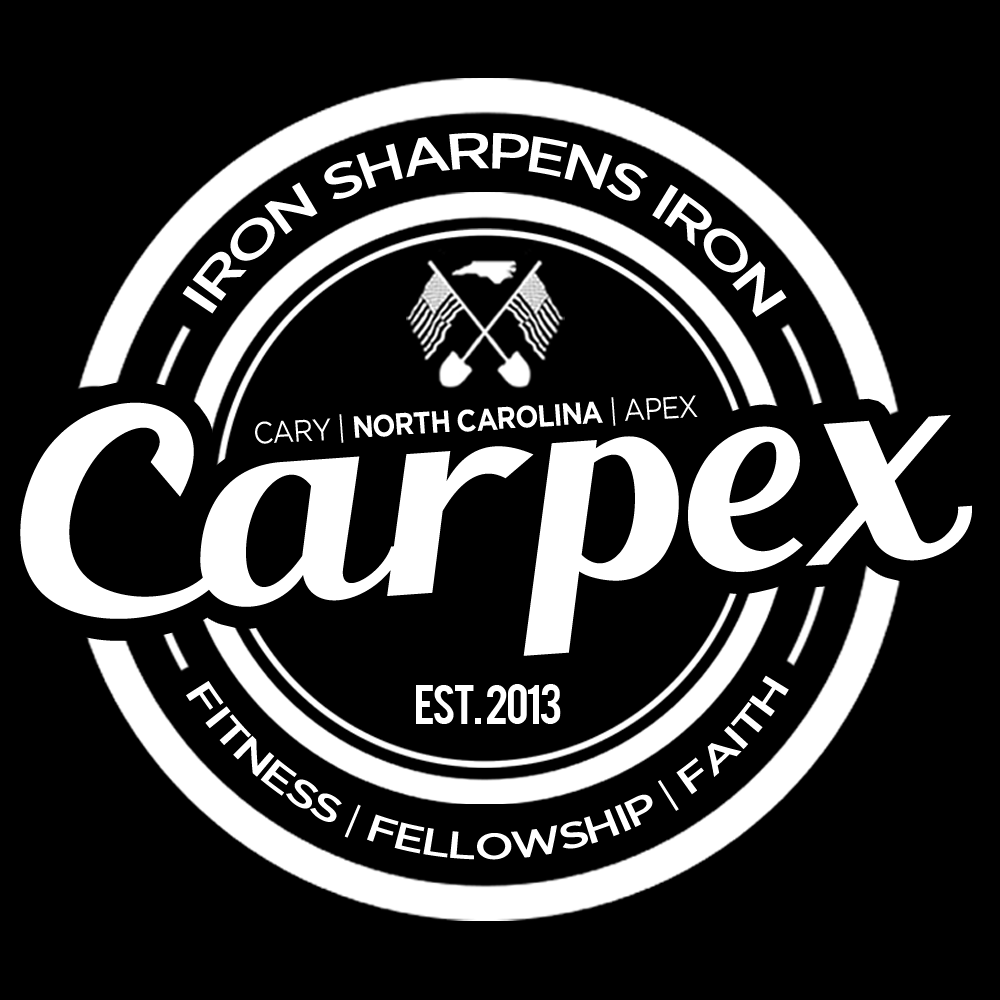
