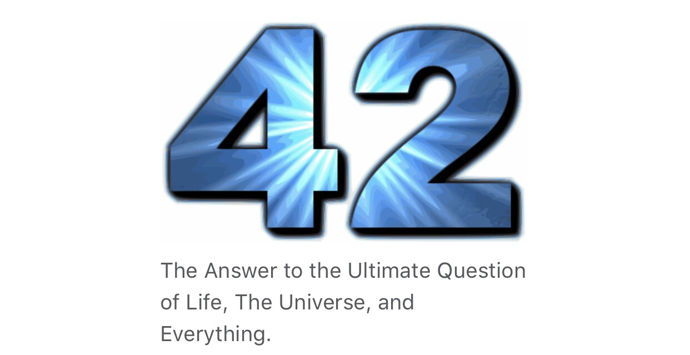

YHC didn't sleep very soundly the night before Q-ing at Phoenix, and wasn't sure why - perhaps the anticipation of clocking another year old and wiser (?) or perhaps the gnawing feeling of a half planned Q. Whatever the reason, I found myself wide awake at 5, so used the time constructively to complete the Q plan and put in a solid 45 minutes of EC around the beautiful Bond Park......by 06:25 there were only a couple of other PAX beginning to form a rather anaemic looking circle in the senior center parking lot....however by 06:27 there was a veritable traffic jam coming into the finest AO of Cary Parkway on a Saturday morning.

A hasty intro and disclaimer was given at exactly 0630 (rated "C+" by Pierogi) and we were off....following YHC on a long jog to the baseball pitch just behind the Buelher Shelter.....en route, Hi Liter assured YHC that a 45 minute warm up mosey was perfectly OK...

Warm Up: baseball field:

10 GMs

10 mountain climbers

Right leg calf stretch

10 plank jacks

Left leg calf stretch

10 sir fozzy fwd

10 seal claps (noises encouraged, but not required)

10 ohd claps (ditto)

10 sir fozzy rev

10 seal claps (noises encouraged, but not required)

10 ohd claps (ditto)

....so far so normal....and then for our last warm up:

42 SSH

After which YHC revealed today was a themed workout and the theme would be Hitchhikers guide to the galaxy....there were equal numbers of PAX nodding their appreciation as there were looking mildly bemused....undeterred we began by picking up the story of Arthur Dent. Through a series of unexpected events he manages to hitch a ride on a passing spaceship just in time to avoid the earth being demolished to make way for a new intergalactic highway.

The vogons are the creatures responsible for the demolition of earth and are really quite unpleasant - so for our first exercise we are going to be escaping the vogons.

Run 15 lamposts to the community center - minimum 2’s burpees each lamppost. Don’t leave each lamppost till all men are together & have completed their burpees. We can’t risk leaving any man behind, as the vogons may capture them.

From the community center, a quick deviation from today’s theme to accommodate YHC’s signature move - the Abbey Road Lunge Walk across the crossing to the greenway entrance at the top of the hill.

Back to the story - Our mild mannered hero, Arthur, meets FORD PREFECT a researcher for the hitchhikers guide to the galaxy, who spends his time journaling his various adventures. Ford is an alien from Betelgeuse and was so named to fit in with the highest life form on earth, assumed to be the car, hence the name.

The guide itself is remarkable containing all the info and advice on everything in the galaxy that a hitchhiker would need, but perhaps the most remarkable thing about the guide is it’s cover - which has simply the most important advice ever to any traveler...in large letters embossed on the front is the phrase “DONT PANIC”.

In the spirit of not panicking - we’re going to do our next exercise - lunge walk down to the kiosk and then backwards run up the hill. 5 times.

Return to the kiosk for the next installment of the story, where Ford and Arthur encounter a wise old sage named Slartibartfast, famous for his works designing coastlines - including his most notable works on the fjords of Norway. Anyway, Slartibartfast tells our heroes of the supercomputer named deep thought that is calculating the answer to life, the universe and everything.

Recovery run from the kiosk to the amphitheater, where we circle up on stage.

Deep thought calculated and computer for 7.5 million years to come up with the ultimate answer....in recognition of the 7.5 million years Deep Thought calculates, computes and runs its algorithms, we do:

7 merkins on stage, run to the back of the amphitheater, do 7 plank jacks and then do 1 dip at each of the rows of benches all the way back to the stage.

After all this time deep thought finally came up with the answer 42. Which perplexed everyone...and deep thought couldn’t answer why that was the answer as it didn’t know the question, but could build a computer that could work it out.

We do 42 LBCs on stage.

10 million years later that new supercomputer finally determined the ultimate answer and after an epic quest to find and extract the question,

To recognize the 10 million years of computing time needed to derive the ultimate question, we do 10 burpees OYO. (Disco was rather disappointed it wasn’t the full 10 million).

The story continues, with the much hyped, eagerly anticipated grand reveal of the ULTIMATE question to the answer to life, the universe and everything.....10 million years later the final results are in and the question was “what is 6x9”!?!

For our return to the flag each man must complete 54 merkins however and whenever he chooses, but must complete them before finishing his run at the flag.

Finally in MARY, we do 42 box cutters, and have a nice intergalactic day.

What does this all mean you might ask....well in summary in COT I said I don’t know....we may never know what the answer is, or even the question, but what we do know is the best think we can do is DONT PANIC. ;-)

Prayers - Disco's M (Kelly) who lost her Dad this week; Earhart who is still unwell; spoken and unspoken prayers.

Thanks for letting me lead you today men.
