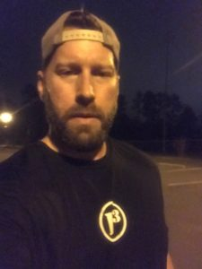

Excited and a tad nervous for VQ week and my VQ at A-Team.  Call me obsessive compulsive but I made two scouting trips to the AO, one in the daytime and one 30 minutes before go time, just to make certain that what I saw in the daylight still worked in the gloom. Good news…it did.

No FNG’s but just for practice (you talk’n ‘bout practice) gave the disclaimer speech and off we went with a goal of seeing the familiar parking lots in a little different light. Hung a right at the first stop sign to a lesser used parking lot for the warmer up. This was the first and real test to see if all my practicing in front of the mirror as per @MaBells recommendation was going to pay off.

Warm-Up

10 – Good Mornings

20 – Side Straddle Hops

10 – Cotton Pickers

20 – Sir Fazio Arm Circles (10 forward and bigger/ 10 reverse and bigger)

10 – Seal Claps

10 – Overhead Claps

10 – Standard Merkins and into calf stretch

All good and warm, we headed back to the main road and this time took a left at the stop sign into the large parking lot for Thang 1…The Beast...No No....The Cheddar Beast!

Thang 1 – The Cheddar Beast – Running in a counter clockwise direction around the parking lot we made 6 trips each with 6 stops doing 6 reps at each stop….6…6…6. In all honesty, when I was doing my prep work for The Beast, I didn’t pick up on the 666 until Term Paper mentioned it during the first lap. How VQ of me.

Lap 1 – Hand Release Merkins

Lap 2 – Star Jumps

Lap 3 – Carolina Dry Docks

Lap 4 – Wide Arm Merkins

Lap 5 – Jump Squats

Lap 6 – Diamond Merkins

After conquering The Cheddar Beast, it was time to find another parking lot so we moseyed back down the main road taking our first right into the parking lot next to the ball fields where we partnered up for Thang 2…Partner AMRAP.

Thang 2 – Partner AMRAP - While one partner took a lap around the parking lot, the other partner AMRAPed. I was only going to do 3 rounds but everyone was running so fast I added a 4th (but only I knew that). The AMRAP exercises were:

Round 1 – Lunges

Round 2 – American Hammers

Round 3 – Squats

Round 4 – Low Slow Flutter

With time dwindling we moseyed back to the main parking lot for Mary which consisted of 30 LBC’s followed by 20 LBC’s followed by 10 Freddie Mercuries and a Have A Nice Day.

Count-a-rama: 16

Name-a-rama: Ascot, Beaner, Burt, Callahan, CheddarBo, Chop Block, CompoundW, Coney, FlipFlop, Frisco, HotSpot, PBX, Pierogi, Repeato, Smokey, TermPaper

Announcements

Burt had a variety and did a great job of keeping it to 30 seconds. Carpex Picnic this Sunday. Odessey the following Saturday.

Prayers/Praises: @Frisco Travelling

I took us out right after sharing a quote from friend, Dr. Bill Brown, “You may not live what you profess but you will live what you believe.”

Men need to be called into leadership. Thank you for calling me to Q!
