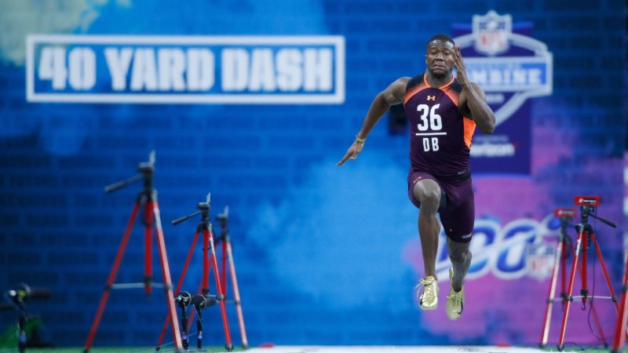

- 

The time has come for tryouts for the site co-Q at Full Metal Jacket. Simply Sub is off over the pond touring foreign countries for the next several weeks and his new job will take him away from the Carpex maiden-land. That leaves a spot open on the FMJ site co-Q.  One of the most coveted spots in the Carpex nation. This is Carpex’s Tuesday premier high tempo workout location.  

The boys seemed a little bit nervous with anticipation, and in fact, some would muse were chomping at the bit to show off their skills in this workout that was set up in the vein of the NFL combine.  Show them off boys, because you may not get another chance to shine like this.  

First exercise, the Pledge of Allegiance  

**Warm Up** 

Took off on a little mosey to explore. Using simple math and engineering skills, it was determined that the closest way to get to our destination is a straight line. That meant going up and back down the one hill that exists on the property.  Already, mumble groans start to proliferate the crowd proclaiming that it would be easy to go around the hill. Since when did "easy" ever make it into a high tempo workout?  

Toured most of the grounds of the Salem Elementary and Middle Schools looknig for dry ground given all of the rain that had fallen overnight. Slight chatter still trying to shake out the nerves knowing that performance was key today.   

Found the basketball court and worked in some solid stretching -- ankle sit, child’s pose, threading the right arm through, threading the left arm through, downward dog, walking back up to standing position, and quad stretches.  Finished off with a round of 8 good mornings and 30 side straddle hops with an accelerating cadence.  

**Thang 1**

The mosey shot out around the Middle School seeking a starting location to launch the next activity. Chatter begins that running at a high tempo workout does not always have to reaching longer distances than the last workout.  

**Thang 2**

In the combine spirit, "The Beast" was thoughtfully selected as a way for the men to showcase their skills. It required everyone to navigate the path that mirrored a squatty letter “S,” and then you turn around and repeat the path back to the start. Along the way, the same exercises were completed at each station, totaling six stations per path completed. All totaled, the goal was to complete six cycles through the path, completing the six stations of exercises.    

The Plan -- First cycle exercises of 1 Destroyer and 5 Jack Webbs; second cycle had 2  
Destroyers and 10 Jack Webbs; third cycle 3 Destroyers and 15 Jack Webbs, and so on.  

At each turn, an exercise was performed in the series of 6.  The first round went off without a hitch. Some grumbling about road conditions being a “little grainy.” The second round started to get people a little more notice of the road conditions. The road surface was not “as smooth as a baby’s butt,” as it was noted by one PAX. Of course it wasn’t.  The peak of the mountain is normally stone, and such stones make for a nice, compressed layer of pain.  

The third round finally met it’s purpose. First blood was called by a PAX, noting that his elbows “have skin like a grape.” More calls for elbow pads and long t-shirts.  

The fourth round found a little mercy on this Grapes of Wrath crowd. Audible called to take the chill cut out of the Destroyer and replace it with another merkin instead.  Howls of glory from the pack.  

At the end of the fourth cycle through the Beast, we ran out of time and needed to mosey.  While only two-thirds complete, the men vowed to carry forward their day at 100 percent.  

**Mary**

Gathered in a circle, we knocked out a few last activities to give a final push to the combine spirit -- Carolina Scorpion Dry Docks, Box Cutters, and a Scorpion stretch, followed by Have a Nice Day.  

**COT**

Prayers for two Wake County teachers who were involved in accidents.  

Praises for the F3 men providing support to others who have been through challenges and those who will be facing challenges.  

The Raleigh CSAUP convergence “The Mule” is launching from Fred Fletcher Park, 6:30, on Saturday, March 14. Special guest Qs may be making an appearance from Carpex. Sign up on Slack.  

The Carpex convergence to rebuild lives on flood-stricken Whitestocking Road launches from Healing Transitions, 6:45, on Saturday, March 21. The entire family (especially 2.0s) are welcome and will find meaningful work. Sign up to help on Slack.  

**PAX Count**

10 Total, 1 Respect, 0 Hates

**Naked Man Moleskin**  

1. Realized this was my first solo Q. Previous ones were always helping 2.0 Garfield. An exhilarating and humbling experience, particularly when you mess up the count. 
2. This group of men are quite the “forgiving bunch,” particularly when you mess up the count.
3. Sometimes the route less taken provides the most interesting perspectives, such as the view from the "Salem School Peak" looking back down at the shovel flag.
4. There are already some strong candidates for site co-Q coming out of this combine session. The early bird gets the worm, so don’t delay on getting in your applications and competing in the combine tryout sessions!
