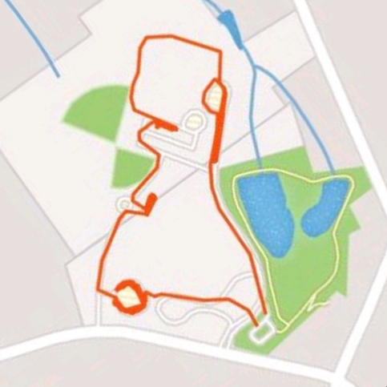

I know Burt doesn't like themed workouts so I kept my mouth quiet from the start.

**Warm Up -** Jog to the school for the SSH, Good Mornings, and Planks Jacks.

Enough of that. Large requested distance so we needed to start the Thang

**7s** - Merkins and Jump Squats to the light pole and back

Jog to recover.

**11s** \- Jump lunges and spiderman merkins

Jog to the basketball court.

**7s** - Pull ups and Donkey Kicks,

Jog to recover.

**11s** \- Hand release merkins and LBCs at the circle. Didn't quite finish these.

We did some burpees for Burt, planks, squats, and bear crawls along the way. Ended at the flag for about 3.5 miles.

Seven Eleven is a great convenience store but the challenge today is to think about what you do out of convenience. We do a lot things because they are easy but are not the best or what the Lord wants for us. I am reminded of Jeremiah 29:13 that says "You will seek me and find me when you seek me with all your heart." May we seek the Lord with all our heart and be men that lead. We do not do F3 out of convenience and it makes us better. Way to get after it this morning men!

McCants took us out in prayer.

T-Rex at the Seven Eleven!

**[Jeremiah 29:13](http://www.biblica.com/en-us/bible/online-bible/niv/jeremiah/29/)** 13You will seek me and find me when you seek me with all your heart.

<figure>

<figcaption>

T-Rex at Seven Eleven

</figcaption>

</figure>
