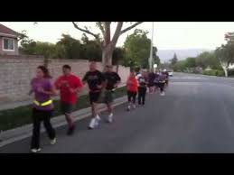
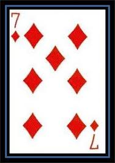

<figure>

<figcaption>

We did a warm up mile.

</figcaption>

</figure>

<figure>

<figcaption>

We stretched a little.

</figcaption>

</figure>

<figure>

<figcaption>

We did an indian run.

</figcaption>

</figure>

<figure>

<figcaption>

DORA - Merkins, presses, shoulder extensions.....

</figcaption>

</figure>

<figure>

<figcaption>

And ran around busses

</figcaption>

</figure>

<figure>

<figcaption>

We did another Indian Run

</figcaption>

</figure>

<figure>

<figcaption>

7 of Diamonds - Burpees, Aussie Snow Angels, WW2, Flutter kicks, Supermen, Crunchy Frogs.

</figcaption>

</figure>

<figure>

<figcaption>

Wake Zone

</figcaption>

</figure>
