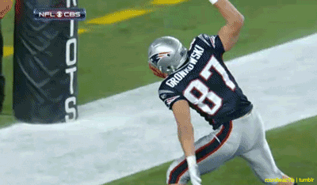
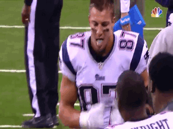

This morning, at the finest AO in Northwest Cary on a Thursday morning, 10 pax paid their respects to the Gronk.

After 9 years in the NFL, 5 Pro Bowls, 4 First-Team All-Pro seasons, 79 touchdowns (and Gronk spikes) and 3 Super Bowl wins, the Gronk (Rob Gronkowski) announced his retirement from the New England Patriots and the NFL earlier this week. Gronkowski revolutionized the tight end position. Gronk is one of the most recognizable football players in the history of the NFL, with a larger-than-life personality, on-and-off the field. With his numerous accomplishments and accolades, he is regarded by many sports analysts, writers and peers as not only one of football's finest players, but the greatest tight end to ever play the game.

While there have been, and will continue to be (yellow jacket in Canton), many tributes to Gronk (here’s a good one: [https://www.patspulpit.com/2019/3/25/18281426/watch-thank-you-rob-gronkowski-tribute-video-new-england-patriots-retirement](https://www.patspulpit.com/2019/3/25/18281426/watch-thank-you-rob-gronkowski-tribute-video-new-england-patriots-retirement)), Flying Circus was the premiere venue to celebrate #87 today.

**Warm-up**

After YHC completed bungled the disclaimers, the group quickly pledged to the flag, and made its way through the Mills Park parking lots. Along the way, good mornings, SSHs, plank jacks, Ernie Davis Heismans and cone running were done. The group then moseyed to the main intersection in the park to hop (climb / pommel-horse / fall) over the construction barrier 25 times.

**Thang 1**

Meet the Gronk. Run, stop at every second light post to perform 8 reps…2 light poles later, 7 reps…next, 8 reps, the next, 7 (#87…get it?). Exercises completed in the Gronk, included:

- Gorilla humpers
- Ranger merkins
- Overhead claps
- Nipple touchers
- Knee jumps

**Thang 2**

Mosey to the rock pile – 25 rock your bodies. For those finishing early, more construction barrier fun. Indian run back to the flag.

**Mary**

As a NY Jets fan, Badlands is used to coming in last. In that spirit, YHC asked Badlands to call the last exercise of the day. Appropriately – celebrating Mark Sanchez’s infamous butt fumble – we closed things out with monkey humpers. Have a nice day.

**COT**

No announcements or praises, just movie reviews that got a little weird at the end. YHC took us out.
