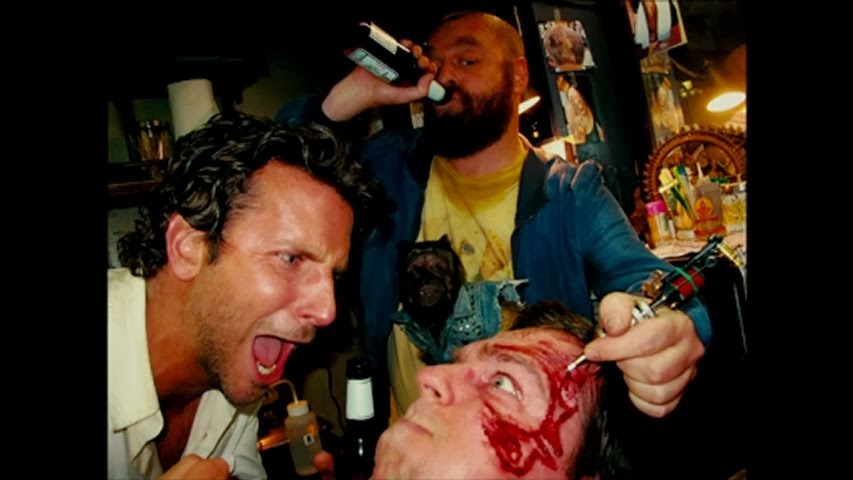

To quote Jimmy Buffett, "It's a fine line between Saturday night and Sunday morning."  Or in this case Friday night and Saturday morning.  This installment all happens to be Captain Jack's fault, but that is a story for another time.  OTR waits for no man, and the sweat will help everybody - especially YHC.  0620 and someone is already skateboarding at this place.  Contrary to popular belief, skateboarders have no chill. 

One FNG (initially) who is disclaimed upon by Sooey. Pledge.  Mosey around the outer track loop and circle up in the baseball field parking lot.

- 7 GM IC
- 27 SSH IC
- 17 Imperial Walkers IC
- 11 Sir Fazio IC
- 11 Fazio Sir IC
- 49 Merkins for the Merkin Challenge

FNG #2 wanders in during the warm-up.  Hopefully he is also being disclaimed by someone else because YHC is in the middle of this thing.  Some Dino runners also come by and Monkey Humpers are performed at each other by two groups of grown-ass men.  But that was a rogue exercise not called by YHC because I hate those things.

Next exercise is 7-11's.  7 HR Merkins on one end, 7 Jump Squats on the other end, and 11 WW2s in the middle for 7 laps.  Some LSF IC as we wait for everyone to finish up.   

Mosey over to the baseball fence and partner up for one minute exercise rotations:

- People's Chair / Chilcutt
- People's Chair / High Plank
- People's Chair / Low Plank

Mosey back towards the flag and circle up on the athletic field for LSF IC, H2M IC and a Chilcutt minute to finish.  Welcome FNGs Spike and Hook.  Prayers for holiday travel and Father's Day.  YHC took us out.
