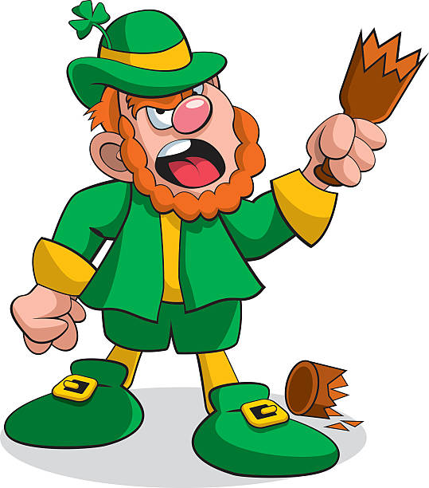

The morning after St. Patrick's Day.  YHC had some (_i.e._ too much) English gin and American beer yesterday, but it was all done for the glory of Ireland.  Time to sweat it out.

It is a foggy morning with a light mist, but temps are perfect at the Circus.  3 EC runners join 8 others for the start.  At this point I have been on Q for 3 workouts in the last 6 days, and Ma Bell has been at every one of them.  Ma Bell is a Lookout groupie.  Get at me.

Franklin suggests a name quiz for YHC, but he is ignored as we pledge and go.    

Mosey to the soccer field on the other side of campus and circle up for a warm up:

- 20 SSH IC
- 15 IW IC
- 10 Daisy Pickers IC
- 10 Sir Fazio AC IC

Four rounds of Four Corners on the soccer field.  Pass back through the center of the field after each exercise for burpees in the middle.

- Round 1 -  Merkins, Diamonds, Wide Grip, CDDS (20) / 1 Burpee
- Round 2 -  Merkins, Diamonds, Wide Grip, CDDS (15) / 5 Burpees
- Round 3 -  Prisoner Squats, WW2s, Lunges, LSF (20) / 1 Burpee
- Round 4 -  Prisoner Squats, WW2s, Lunges, LSF (15) / 5 Burpees

As soon as YHC calls Round 1, Kidney Stone leaves.  Could be due to injury limitations or he may just think this Q sucks already.  At the end of Round 1 we realize that Franklin and PBX have also disappeared.  YHC quickly does the math on the current rate of attrition and gets mentally prepared to run a solo COT.

But just as the fog taketh it also giveth back, as Kidney Stone rejoins us for Rounds 3 and 4.  We also discover Franklin as we wrap up and mosey back towards the flag.  Despite our more interesting theories, Franklin tells us that he has just done a grocery run to Harris Teeter to get PBX some water so he doesn't pass out.  I have to assume this is the result of too many SPD beverages, since the Leprechaun is undefeated.  But apparently PBX also isn't a fan of water.  Either way we are back to a group of 10 as we hit the basketball courts for:   

- Suicides
- Backpedal Suicides
- Bear Crawl / Lunge Walk Suicides with Merkins
- Suicides
- Backpedal Suicides

Circle up for PAX-led Mary. 

COT allows us to further discuss hydration - mainly the fact that none of us do it enough and that coffee isn't actually helpful.  That's science, kids.  Prayers for Crimson and his family and for the guys doing the MST on Saturday.  YHC took us out.
