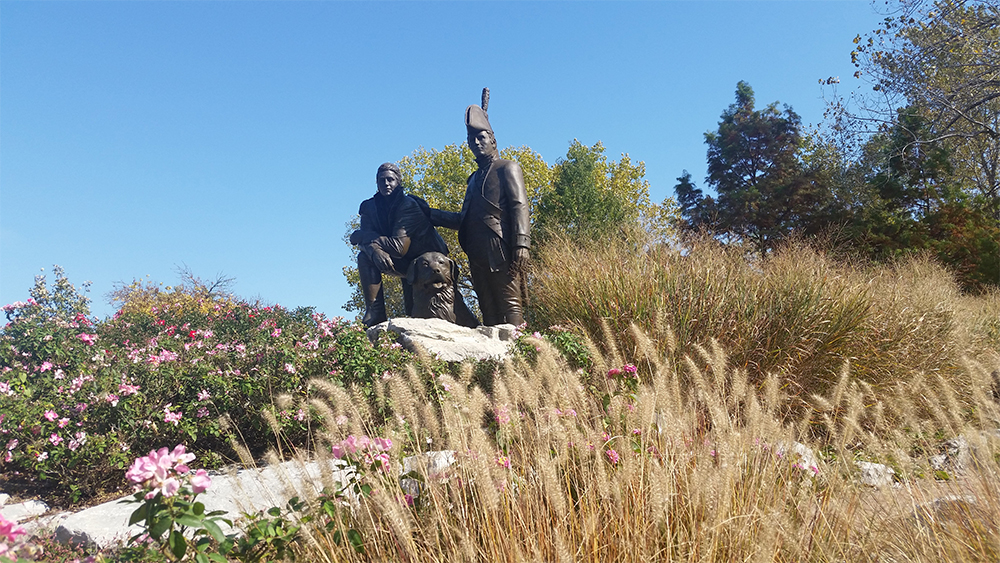

Three men met in the gloom this morning at Frontier Park in St. Charles, MO. Since F3 is starting in the St. Louis area in October YHC thought it would be good to introduce some new PAX to F3.

Warm up

- SSH x 20
- Good Morning x 10
- Imperial Walkers x 15
- Mountain Climbers x 10
- Merkins x 10

Thang 1

Catch me if you can with 5 Merkins on our way to the big parking lot at the boat house. Then Lunge to first light pole and 5 x star jumps, bear crawl to next light pole then 5 x squat jumps and backwards run to the final light pole with 5 burpees. Reverse order with 10 x of each exercise.

Scout run to shelter.

Thang 2

Three sets of 10x dips, 10 x derkins, and 10 x steps.

Mosey to the Lewis and Clark statue for some Dora.

Thang 3

Dora 1, 2, 3 - 100 merkins, 200 LBC, 300 squats while one PAX runs the circle.

Mosey back to parking lot with an all you got sprint at the end.

Mary

- 15 x LBC
- 10 x low slow flutter
- 10 x WWII sit ups

COT

Welcome FNGs Sally and Green River.

Prayers/Praises:

- Sally's new brother in law is having some challenges and he is hoping that it doesn't develop into a long term issue. Hoping his brother in law is able to change his patterns.
- Green River's 2.0s are all sick and his M is going out of town tomorrow. Prayers for speed recovery and succcess with the 2.0s.
- YHC was blessed that two men rolled out of the fartsack and met in the gloom to work our bodies and fellowship together.

NMS:

- F3 solves a problem that many of us didn't know that we had. It is truly a blessing to be part of such a great good that encourages men to be strong leaders in their communities.
- It is awesome to see the growth and YHC is so excited to see F3 expand into St. Louis.
- It was great to be on the Katy trail and exercise with Lewis and Clark (statue) this morning. Reminds me of our history and the great struggles of the United States as we expanded westard. I know that F3 can follow the same path and help all of us create strong communities.
