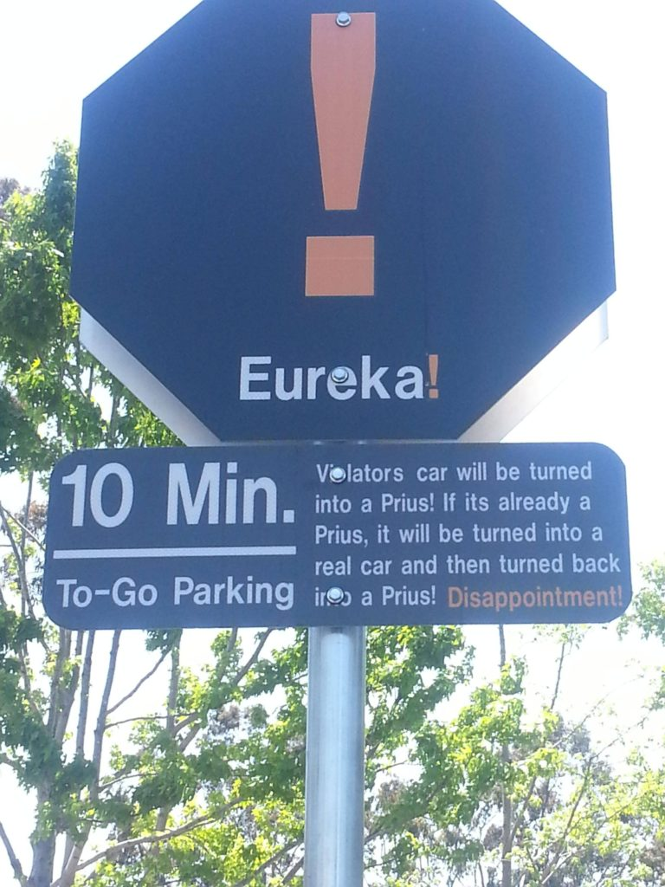

A few Southeast Cary guys agree to join me for this adventure, with Chipper and Oofda even showing up early for an EC run.  They have vastly overestimated how long it will take to get to the other side of the world and are therefore able to enjoy an extra 15 minutes of stretching before we take off.  No prior experience with an EC run here.  But Google Maps is undefeated, so we find enough greenway to make it work.  No FNGs.  A quick pledge and go. 

Mosey around the parking lot and circle up on the basketball courts for:

- 25 SSH IC
- 5 Good mornings OMD
- 10 Daisy Pickers IC
- 15 IW IC
- 15 Standard Merkins IC
- 10 Prisoner Squats IC

Mosey to the gigantic freaking parking lot at the back of the complex.  Although I tend to make a weekly appearance at Thomas Brooks Park, I am usually watching my kids' soccer games and drinking beer.  As a result, I didn't even know this magnificent piece of asphalt existed until Burt ran us through it last week.  When they built the parking lot, the engineers placed exactly 10 islands on the lengthy straightaway just so we could run this exercise:

- Start at Island 1 with 10 burpees and 1 WW2 sit-up then run to island 10
- Mosey back to Island 2 for 9 burpees and 2 WW2s, run to island 10
- Mosey back to Island 3 for 8 burpees and 3 WW2s, run to island 10
- Etc., etc.

We then put the significant width of the lot to use with a round of Chilcutt Leapfrog.  On the mosey back to the flag we passed a pile of hand-sized rocks.  Everyone grabs a couple for:

- 10 SFAC - Forward IC
- 10 SFAC - Reverse IC
- 10 Overhead Claps IC
- 10 Seal Claps IC

Discard rocks and then back to the court for LSF, LBC and H2M. No announcements.  Prayers for St. Becky, Badlands' brother and other surgery and recovery-related issues.  Franklin is nice enough to pray that the interlopers make it back safely to the Kingdom of Southeast Cary.  YHC took us out.
