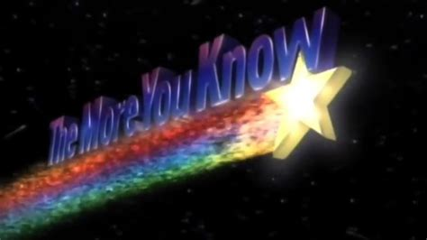

A beautiful, crisp morning.  Definitely not feeling like June.  YHC rolls into the parking lot and experiences something I have never seen before.  Every person at this workout other than myself is coming back from an EC run.  We are definitely in Beige country now.  Luckily Banjo and Pivot are in the mix so we can diversify the color palette a bit. 

No FNGs.  Obviously.  Pledge.  Mosey around the school to the bottom of the hill for a warm-up.  YHC is really the only one who needs to warm up at this point, but it is tradition and all.

- 5 GM IC
- 25 SSH IC
- 15 Imperial Walkers IC
- Calf Stretch
- 10 Merkins OMD
- Calf Stretch
- 10 Merkins OMD
- Runner's Stretch

Mosey up the hill, take a left on Upchurch Meadow and proceed to the gazebo circle.  Partner up for a made up exercise that I am calling the Circular Deconstructed Personal Dora ("CDPD™".)  Group 1 will run clockwise around the circle and Group 2 will run counter-clockwise.  Whenever you meet your partner, stop for 5 Merkins / 10 Squats / 15 LBCs.  Repeat 20 Times.   

Since this takes a while, YHC learns some things as we go.  First off, this is a Strava Local Legends segment, which means that some other people are as dumb as I am to think that this is a good thing to do.  Secondly, it is actually two separate Local Legends segments depending on which direction you are running.  Finally, when running in a group it is important to be the last person in the group to upload data to Strava if you want that LL status.  The more you know....

Mosey back to the flag, which is punctuated by a Largemouth sprint across the parking lot as he chases LL status on that particular piece of asphalt.  This is Strava's world, and we're just living in it.  Circle up for LSF IC, H2M IC and a Chilcutt minute to finish.  Announcements include Convergence on July 3, TCP Sawgrass this weekend and a Juneteenth service event in Raleigh.  There were prayers for our wives.  YHC took us out.
