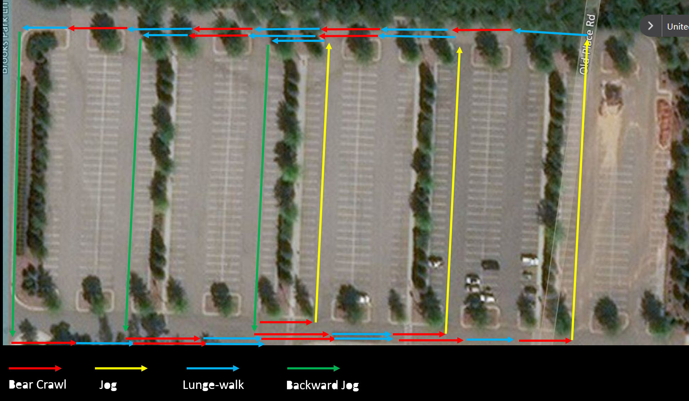

When YHC's alarm roused YHC from YHC's dream about a land where Burpees are always in perfect form and L-R counts as 2 lunges, YHC said to YHC, "YHC, it's a great day for YHC to have the Q at YHC's favorite AO at a USA Baseball Complex directly adjacent to a toll Interstate that YHC spends several of YHC's pretty pennies on.  But, what should YHC bring to the party today?  That's when YHC read Sky Blue's Octonaut BB from FC (an outstanding beatdown of which YHC partook), which put YHC in an oceanic mindset.  One of YHC's all-time favorites is the deceptively simple The Nautilus, which is a beatdown with a tendency to spiral out of control, sort of like YHC's soliloquy here.

**NOTE: The preceding paragraph is only loosely based in reality and may, or may not, be nothing more than YHC's attempt to see how many times YHC could cram YHC into an introduction.**

**The Warm-up**

Jog around the parking lot, picking up the barely-late Franklin on the way back for 5x penalty burpees.

15x SSH.

15x mountain climbers, hold, 15x plank jacks, hold, 15x merkins, recover.

15x Good mornings

15x Calf stretches

Jog to the rock pile

**The Thang 1**

As promised, there was no bacon (just like SWW!).  Also as promised, there were burpees.  1 per lamp post all the way up the road to the mailbox, then 10 at the mailbox.  6-inch hold for the six, then mosey over to the middle island of the XXXXL parking lot.

**The Thang 2**

Since Franklin still doesn't quite understand what we did today, I drew a map.  Verbally, it's like this:

Bear crawl to the end of the island dividing segments of the parking lot (there are 5 total), jog the parking lot to the other end of the island, then lunge walk to the end of the island, backward jog the parking lot.  Repeat, spiraling outward to cover more of the islands, alternating bear crawls and lunge-walks at each island.  Clear as mud, right?  Right?  Ok, see the map.

Scout run in two lines back to the rock pile for curls, rock-rows, overhead press, and skull crushers (AKA tricep extensions)

Keep the rocks for Mary: LBC, Freddy Mercury with a bench press, American Hammer, and WWII.

**The COT**

Count-o-rama: 13

Name-o-rama: 13

Announcements:  The Mule, The Bull, Kilmer's M is having total knee replacement

Prayers: Kilmer's M is having total knee replacement, Earhart and M are traveling to Mexico para un gran tiempo sin los bebinos.  Buena viaje y no haz nada que lo yo no haceria.

Hasta luego amigos.  Cada vez es un placer a trabajar con ustedes.

**NMS (Not sure how to say that en Espanol)**

Why is there a mailbox in the middle of FOD?

Franklin thoroughly threw Nature Boy under the bus for the late-ness

To be fair, I may have left 5 seconds early - and only partly because I thought the vehicle screaming into the parking lot was the law

Earhart: Franklin, it's good to see you, it's been a while.  Franklin: I've been really regular this month.  (_akward silence)_  Earhart: I'm glad you're getting your fiber

Grinch was really trying hard to fill Burt's shoes in the mumbelchatter department today.  I mean, he said at least four words, two of which were "Skull Crushers" and one was "Grinch".  It's hard to Q in the face of such a verbal onslaught

Sky Blue's tank top:  Sky's out, Thighs out.  I kind of love it.  Hmmmm......Beaker's out, ?, something.

Franklin was well on his way to a hundred rock-rows when Katniss asked if it was his birthday or something.  The ensuing laughter brought an end to the rock rows (thankfully)

Khakis drops stuff on his head.  Good times.  Good times.

The Praynouncement: When something weighs so heavily on a PAX's mind, or he is impatient to move the COT along, that he brings up a prayer request during the announcement portion of COT.  TClaps for keeping us on task, Kilmer.
