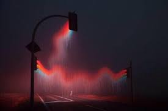

Well it was another beautiful evening gloom for a PAX of 6 at Rush Hour, and when I say another beautiful evening I mean we had a consistent rain on us the entire time. Which I had not factored in.. But it was all good, cause as we know F3 still happens rain or shine, and its always a great day to be alive, Amen? Amen!

**Warm Up**

First we jogged over to the parking lot just before Academy Street, and proceeded with following exercises:

\-Good evening x 10

\-SSH x 20

\-Windmills x 10

\-Seal Claps x 10

\-Frog Merkins x 10 (Shout out to Hi-Lighter)

\-Mtn. Climbers x 10

**Thang 1**

Following along Academy Street we did **Ascending Burpees** at each pole.  Which, after reaching 11, we recovered and Indian ran over to the fountain.

**Thang 2**

We then did some rapid fire exercises on the fountain:

\-Irkins x 10

\-Dips x 10

\-Dirkins x 10

\-WWII x 10

\-Prisoner Squats x 10

\-Bear Crawl around fountain

Repeato, except with 15 reps and a lunge walk around the fountain.  After that we went back the way we came, doing ascending **Sumo Squats** at each light pole.

**Thang 3**

We crossed the street to the lit circle area outside the federal bank and partnered up.  We then did **Power Merkins**, where one pax does merkins with their partner planking with their feet on your back. 

After that one partner stayed in the circle and did **LBC’s** AMRAP, while the other partner did 10 **Alt left right step ups**, then switch.

**Thang 4**

The time really seemed to fly, by this point it was time to mosey back toward the flag for some **Wall Jumps**, then some mary.

**Mary**

**\-**Dying Cockroaches

\-Homer to Marge

\-Freddy Mercs

\-American Hammers

\-Shakira

\-Boat/Canoe

\-Merkins

**COT**

**Count-A-Rama: 6**

**Name-A-Rama: 2 Respect, 3 Meh, 1 Hate**

Announcements:  KKC this Saturday, with the Hot Dog run thing after that.. (I don’t remember the details, Talk to Hello Kitty if interested).

Prayers: Healing for Swag’s M who has cancer, continued healing for Ausfarht

**NMS:**

So, it was definitely a wet one for sure, but it was a great time, and I had a blast with you guys!  Awesome job!

P.S.  Special thanks to Theismann for encouraging me, and getting me to Q again! Normal 0 false false false EN-US X-NONE X-NONE
