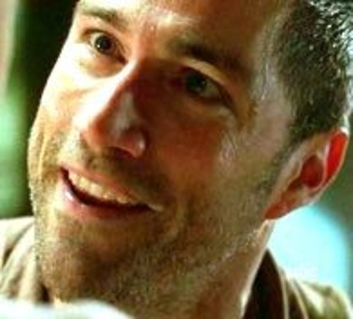
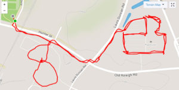
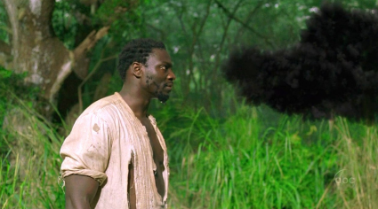

My last Q at BH was not a themed Q... so it's time to rectify that. A peek at the date pointed me in a singular direction. Add in the chance to do a little Strava artwork, and you got yourself a workout.

 

FNG Check - none - Disclaimer - LET'S GO

 

Mosey down to Town Hall for our first bit of artwork. In a large figure-8 around and through the complex, let's stop in the center twice for:

- 4 Burpees OMD // 8 Good Mornings // 15 SFAC

and then

- 16 Merkins // 23 Overhead Claps // 42 SSH

Let's continue the Mosey. OFF TO FOOD LION.

 

Solo DORA time along a course for another sweet drawing.

At each of the cones, do 5 Merkins, 10 LBCs, and 15 Squats. Follow the course around until cone #10, then return to pick up the six. Reconvene at cone #10... and WORK THE WHOLE THING BACKWARDS, this time staying together for a Jack \[Shephard\] Webb.

Mosey back to the flag, returning for the six.

 

At the skate park, 6 rounds of Mary consisting of:

4 Burpees // 8 Boat-Canoes // 15 Box Cutters

16 WW2 Sit-ups // 23 American Hammers // 42 23 Freddie Mercs (hip flexors gave out)

 

THAT'S IT

 

COR/NOR: 7 RESPECTs, 5 mehs, 2 HATEs

 

Announcements:

Frey Daddy celebrating 2 years sobriety at Arena at 2:30 tomorrow, come to celebrate, stay for the Merlot

Carpex Convergence next Friday at DZ for 5 year anniversary

Labor Day 5k/10k - Michelob has the code

9/11 Stair Climb at Carter-Finley at 5:30

 

Prayer Requests/Praises:

Parker's Dad adjusting to his move

McCants's recovery

Burgerfeet at the Camino

 

NMS

This all started when I witnessed Theismann signing the flag after his Q here. I thought aloud, dang I guess I need to Q here again! Awesome way to commemorate and encourage leadership (along with Shank's koozies). Except for the part where THE FLAG WASN'T THERE TODAY. Guess I'll have to Q here again...

**[Here's your Strava map for the morning.](https://www.strava.com/activities/1791746064)** #everythingwentbetterthanexpected

They were NOT dead the whole time, don't @ me.

Fitting that Smokey was in attendance today.

Hope to see you in 3 weeks at Flying Circus!
