Today we took a trip back to the Elementary School Library to play the classic computer game 'Oregon Trail'

 

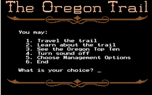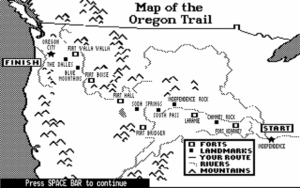

16 of us decided to take on the challenge and travel west in search of a better life.

We gathered in Independence, MO to warm up and decide if we should be a Farmer (Sprinkler and Cotton Pickers), a Banker (Good Mornings, I'm assuming a banker would say Good Morning), or a Carepenter (Merkins...there is no tie in, but merkins are always good).

After deciding we'll be bankers we went over to the General Store to pick up supplies (Rocks) and performed a really poorly led version of Rock your Bodies in Cadence/OYO/random counting (it was a cluster, but i think exercise happened).  Now it was time to head off on the trail.

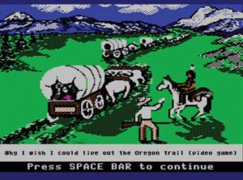

We decided to leave in March and performed a Bataan Death March (Catch me if you can Indian Run with the 6 performing 5 Burpees.  Soon we came upon the Kansas River

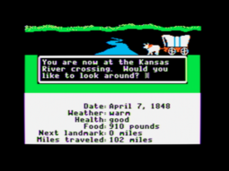

It was wide and shallow, so the wagon train decided to ford the river by Lunge Walking our wagons across it.

Soon we came across another river that was too deep to ford, so we paid the ferry 15 Burpees for the crossing

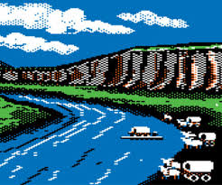

We continued on the grueling trail...food was scarce and the wagon train was starting to grumble. A third and final river needed to be crossed.  This one wasn't quite as treacherous so we caulked the wagons and used our Boat/Canoes to cross

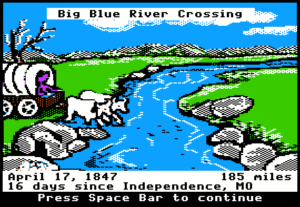

The trail then headed into the forest where we met a helpful native that informed us it was good bear hunting territory.

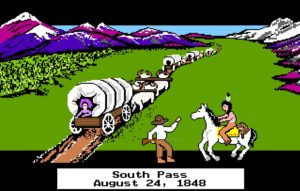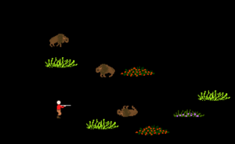

We partnered up, one partner performed Pistol Squats the other Bear Crawled up the path.  We continued on until we got the unfortunate news: 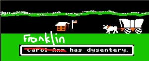

To help cure Franklin the Pax perfromed Squats to work out any intestinal track issues. Once cured we Indian Ran until we came upon the Blue Mountains

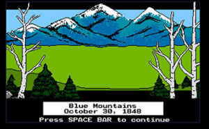

Did a bunch of Mountain Climbers in cadence to cross and finally we arrived in Oregon (on the US Map on the playground)

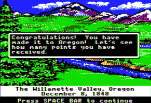

We cleaned out the Dying Cockroaches from the wagon, perfromed some Homer to Marge and ended with the O face (all to help populate the settlement).

Brisk jog back to the flag for some Plank, Downdog, Merkins, Stretching (there were some grumbles that it felt a little too much like yoga, but hey we're in Oregon now.

Finished with a circle of gratitude.
