Today the brute squad 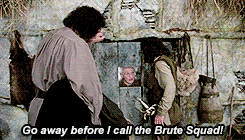 assembled early in the fields of Florin to enjoy a workout that would include Fencing, fighting, torture, revenge, giants, monsters, chases, escapes, true love, miracles.  However the pax wasn't impressed and responded. "Doesn't sound too bad. I'll try to stay awake", "Oh, well, thank you very much, very nice of you. Your vote of confidence is overwhelming" dread pirate pivot answered back....

A quick warm-up lap around the parking lot and then circle up to meet the characters

- 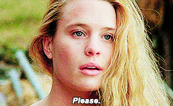10 Princess Buttercupees
- 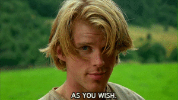Westley the farmhand (Cotton Pickers)
- 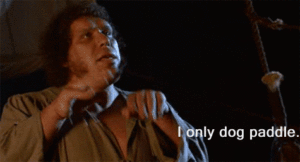Sir Fezzik Arm Circles
- 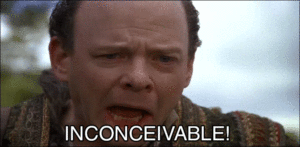Vizzini (he's short, so we did burt jacks)
- 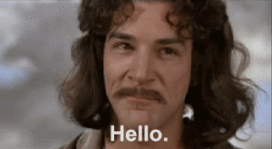Inigo Montoyas (lunge with a sword thrust)
- 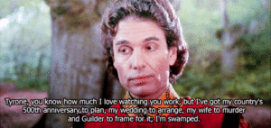 Monkey Humperdincks

We now learn that princess buttercup has been kidnapped and the evildoers are on a boat headed to the cliffs of insanity!

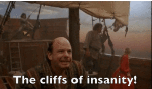

Backwards run up the hill, stop at light poles.  Alternate between 10 boat/canoes and 20 mountain climbers

After climbing the cliffs of insanity

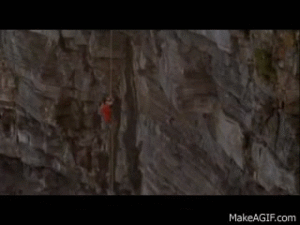

we find Inigo Montoya waiting for us and We challenge him to a sword fight that ranges all over the grounds

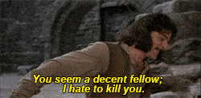

.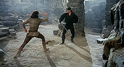

We do catch me if you can with Inigo Montoya Walks around the pickle while partner does 15 jump squats (modified to 10 halfway through)

After dispatching the great swordsman we continue our search for princess buttercup, only to find a giant waiting to smash us with a rock, but he wants to be more sportsman-like.

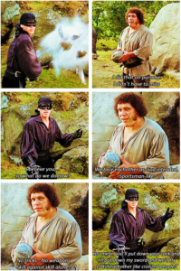

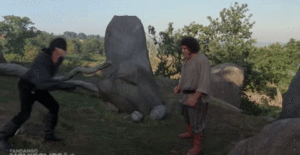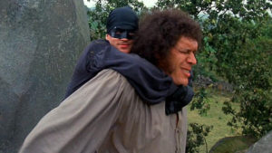

In honor of this fight, we grab some rocks that you can hold in one hand, one person performs rock throws (arms out, with elbows at 90 degress, rotate up and down) while the rest of the crew does a partner carry down the parking lot, 10 buttercupees, switch partner carry and come back (flap-jack).  We luckily are able to choke the giant out, we don't envy the headache he will have when you awake. But for now, we hope that he rests well and dreams of large women.

Still no buttercup in sight, so we head down the hill to the bottom field to find Vizzini sitting with princess buttercup and a challenge awaiting:  Iocane powder (a deadly poison originating from Austrailia mixed in two goblets)

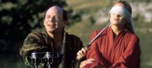

One partner does Australian Mountain Climbers, while other runs suicides across the field. Even though we fell for one of the classic blunders:

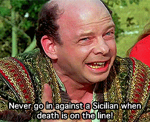

We bested Vizzini by developing an immunity to iocane powder!  But Lo...Humperdinck has been tracking us the whole time.  The only escape is to the fire swamp!

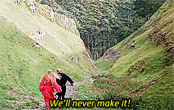

No one has ever survived the fire swamp...known for 3 deadly terrors, Fire bursts, Lightning Sand, and R.O.U.Ses...what is an R.O.U.S? you ask... A Rock Of Unusual Size

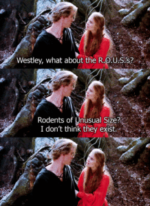

Everyone grabs a rock of unusual size and circles up.  One pax calls a rock exercise and then bear crawls half the circle...continue until everone has bear crawled.  @openout calls rock jump squats...true #HIM

After escaping the fire swamp and being revived by Miracle Max we have to storm the castle. 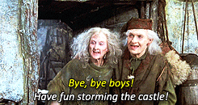

The plan is to load up Fezzik in a wheel barrow to scare the guards.  We grab our partner and wheelbarrow 5 parking spaces, do 5 merkins, then backward wheelbarrow 5 spaces.  Flapjack for other partner.

Circle up for Have a Nice day and roll the credits.
