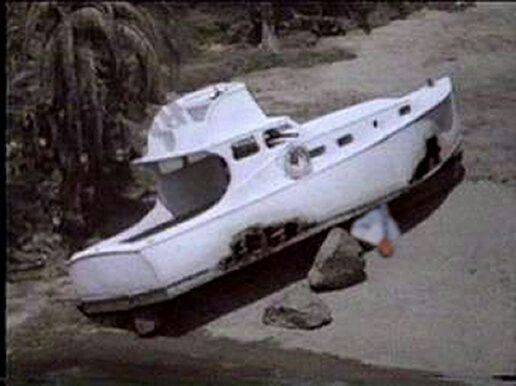

As YHC's quest to complete more of the 2020 Carpex challenge continues, it was time to take a turn at the Phoenix Q. Bond Park is such a large AO, with so many options, I wanted to take the Pax on a tour of some of the typical stops along a Phoenix/SNS beatdown. YHC and the Triplest of Lindy's for a nice, balmy 3 mile EC run. Here's what went down:

**Warmup:** One FNG at the flag, courtesy of the Greek God, Hermes. Standard disclaimers delivered along with mission statement. Pledge of Allegiance (YHC admittedly cannot spell this word) and off we go to the community center parking lot circling back around for the 6. Circle up for:  
SSH x 20 IC  
GM x 8 IC  
Sir Fazio Arm Circles Fwd x 10 IC  
Seal Claps x 10 IC  
Imperial Walkers x 10 IC  
Plank Jacks x 10 IC  
Calf Stretch L/R x 10 silent count  
That's enough warmup. Out of the parking lot and to the top of the hill.

**Quick** **Thang 1:** Starting at the top of the hill, run to the next light pole for Steve Earles x 2. Mosey to the next pole, and add 2. Continue that pattern to the Stop sign, watching for cars along the way. Pick up the six, and off we go. (Meant to do an exercise here, but realized after I had already gave the direction to mosey up the hill.)

**Thang 2:** Mosey to the small pavilion adjacent to the lake parking lot and grab a bench. Standard vanilla Derkins x 10, Dips x 10 IC, Irkins x 10, and L/R Step Ups x 20 IC. Quikstop again impressed all with his box jumps to the table top instead of step ups. Freed to Lead. Mosey around the greeway/sidewalk pickle and repeato for 3 rounds. After the 3rd round we head to the bottom corner of the lot and head toward the kiosk for some quick LBCs x 20 IC. Recover and mosey to the rock pile.

**Thang 3:** Everyone grab a non-travelling rock. More vanilla curls x 10 IC, Shoulder Press x 10 IC, and rows x 10 IC. Was going to call tricep extensions as well, but was impressed with the size of everyone's rock and decided it wasn't safe. Way to push yourselves gentlemen. Drop your rocks and mosey to the top of the dike and lineup for some monkey humpers x 10 IC. Before heading back down to our rocks we pause to take in the beauty of the day and acknowledge that we are the lucky ones to be there this morning. Another round of rock exercises and to the top again for Sumo squats x 10 IC. One more round of rocks before putting them back and moseying back towards the kiosk. Pause for Hello Dolly x 10 IC. A few odd looks from some of the other folks enjoying the morning at Bond park, but we shuffled on. Up the hill and down the road.

**Thang 4:** YHC realized we had a little more time so instead of heading back to the flag, we went to the bottom parking lot. Everyone grab a park stop on the same side of the lot. 1 Mike Tyson, bear crawl across the lot and do 4 Plank Jacks on the opposite side and Lunge Walk back. Increase MT by 1, while decreasing PJ by 1 each time to get to 4 MT and 1 PJ. Recover and everyone mosey back up to the next stop sign scooping up our bruisers along the way. AYG back to the flag in groups of 5ish. Circle up for some quick Mary.

**Mary:** E2K, L/R x 10 IC. At this point YHC was gassed, but thank you to Earhart for requesting some Freddy Mercuries, which we completed x 10 IC. Have a Nice Day!

**COT:** 19 Pax. One FNG, welcome LaLoosh.  
TCP Sawgrass Sunday at 2:00  
Prayers for Yahoo and his family as they continue their journey in adopting Oleg from the Ukraine.  
Prayers for guidance for our State and National leaders as they make difficult decisions for our community regarding school and just the overall welfare for everyone.  
YHC took us out. MIAGD!
