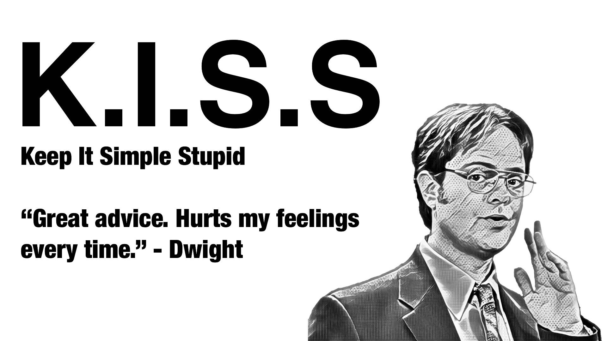

Hells Bells 6/8/2020

PAX: Wahoo, Yahoo, Red Ryder, Shipper, Bartman, Tripple Lindy, Peeping Tom, Fly Boy, Snooze, Re-entry(Honor) Earhart ,

QIC: Flenderson

The Battle of Jericho is an incident from the Book of Joshua, being the first battle fought by the Israelites in the course of the conquest of Canaan. According to Joshua 6:1–27, the walls of Jericho fell after the Israelites marched every day once for six days around the city and seven times on the seventh day then blew their trumpets.

YHC Picked up the Hells Bells Q last night when Wrench had a work commitment come up. Wanted to keep this simple as YHC has not swung a kettle bell in a few months so dailed up a routine I remember.

**Warm Up**

SSH  
WMH  
Good Morning 

Run

**Thing**

Four corners workout traveling with bells  
10 sqauts at C1

10 Iversons at C2

10 Over head Press a C3

Pax Choice at C4  

Mosey to the Wall

  
Peoples chair

BTTW  

Mary
