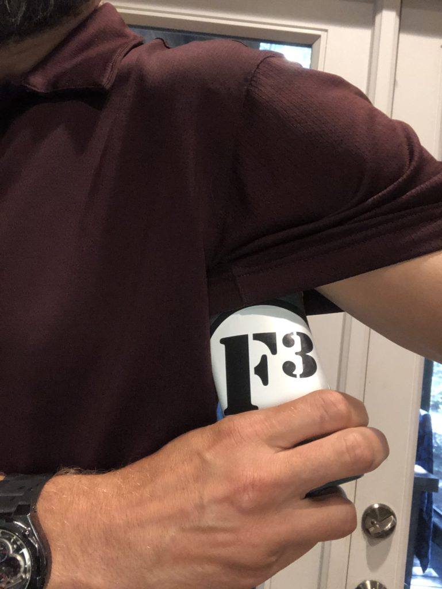

Let's get things out of the way from the start. This was as thrown together a Q as I've pulled in a while. Was there an idea going into it? Sure. Did it involve more than "we'll probably have a DORA"? Um...

It all started about 14 minutes till 5. With intentions of meeting Coxswain for EC at 5:15, I was taking my sweet time preventing a Pet Sounds. Too sweet a time. By the time I rolled out of the garage, there was nooo way Coxswain would still be around. Plan B: explore the neighborhoods around BO to see what new can be seen. This, it turns out, is where things really went wrong. Do we revisit Heater Park? What about the cemetery south of DTC? What about some shenanigans at Pure Gold? Too many choices! I drove around a bit and less decided than before, returned to FUMC to find Ollie lacing up.

20-ish minutes and more than 1.5 miles later we are back at the parking lot ready to pick up our tanks from Mr. Co-Site Q himself. YHC was graced with the special (this year only!) QIB version to differentiate myself from all the lesser beings who would merely be following my lead.

Little did they know.

**Warm-up**: started ok. Except for the lights... and the EMT on the road just as we started to cross... and the civilian trying to train her dog skills on the blocks in front of the bank. After an abbreviated warm up session which included Imperial Walkers from the plank position, we moseyed away. Unwarm.

**Thang 1**: Also ok. Partner up for a squat - lunge - LBC DORA with a loop around the bus/train station to waste time. Coney/Press-on executed the "same number" counting method exquisitely.

**Thang 2**: C- attempt here. Moseyed over to ye old gentlemans club for Cary After Dark. I threw out some nonsense about bearcrawls and star jumps and threw in a "partner-up" taboot. The PAX saw right through it and the QIB was openly and appropriately mocked. Luckily Coney saved the day with a well-timed jizm comment and the anger subsided... only to be resurfaced by the topic of UNC closing really setting everyone (especially Goose) off. Time to wrap this puppy up.

Back to the warm-up spot for a make up session. Went better this time. Sort of.

Mosey back to the flag with a bit of Billy at the end. Note: Kirk has wheels.

**Mary**: eight minutes of glorious sunrise witnessing Mary.

**COT**:

- 12
- Prayers for Coxswain's brother and family; Horatio; Parker

**NMS:**

It's hard to remember everything but today was one of those days where the workout is more 2nd F than 1st. Everyone about busted a gut when Kirk reeled Riptide in with tales of Aqueducts in Raleigh. Coney is prepping for a return trip to NYC... and it showed. Burt and Kirk auditioned for the munchkins of Oz. Great time this morning. Enjoyed every minute of it.

Especially after I covered up the stench of the Q.

