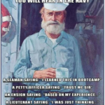

Does it feels like your knees have been beat with Mjölnir?  
Man... do we have an F3 workout for YOU?!  
  
It might feel like most F3 is running with bootcamp workouts, but there are no/low run options out there, for folks who can't take the beatings of mile upon mile. If that sounds like you, I am happy to tell you there are AO's like Tin 2 Iron and Tortoises to help get our 3 F's covered while we listen to our bodies. Remember our motto is “Leave no man behind, but leave no man where you find him.” ...and so that model was applied for those who can't / don't want to run!  
  
Yesterday, WWW threw out a need for Q on Slack for Tin 2 Iron... I am not what one would call "consistent" yet with getting to AO's. However, the host site Sovereign Grace Church in Apex is one I've been to a few times between T2I and Tortoises (shout out to Yogi - "WHAT'S UP?!"), so I knew the AO and amenities. With that being said, I felt good leading a Q as a relative green PAX who hangs toward the 6 on most runs observing the dynamics of the site and group. In fact... this would be my VQ, but there was a call to step up, and so I did - no frills, no flowers, just leaning in to get things done.  
  
So last night after work, family stuff, and dinner - I hit up the Exicon and went to work trying to put together a quality plan for good communal suffering. I failed hitting the target of climbing into bed before midnight but I ended up with what felt like a fairly good beatdown. Truth be told... I didn't sleep well being excited with a mixture of fear and anticipation; wondering if it would be good or if the suckfest would just suck. With about 3 hours reading the back of my eyelids, the alarm said "Reveille! Reveille! Reveille! All hands heave out and trice up. Reveille!"  
  
For my Q I wanted something that would challenge the hardened but have ability to scale for folks whose bodies call for mercy. The result was Gorilla Complex, but an evolved Gorilla Complex, so maybe Neanderthal Complex...?  
...any Biologists care to weigh in on that?!  
...moving along.  
  
Gorilla Complex is a great base to a high quality suckfest, but I kept it mild and threw in some things to mix it up and better work HIIT aspects. Thinking about the usual cast of characters I've seen come out to T2I and did my best to guestimate time frame for each segment and set. Keeping a few easy additions in reserve would take us to 45m should it be needed - the base workout fell about 5 minutes short, so it was an easy fix with one of my additions and a quick pickle mosey.  
  
I made sure to keep tabs on the crew to get feedback on pace, but kept it largely OYO but movements from one segment to the next were done together. I asked for critiques and feedback - and the critique points were checked off my mental list, but the group liked the workout.  
  
All in all... I'm happy with it and plan to do it again!  
  
Very respectfully,  
Mongoose  
\---------------------------------------- 
  
When: 8/20/2020  
QIC: Mongoose  
The PAX: Ausfaht, Francois, Puzzles, WWW  
  
Condition: 67 with breeze, perfect break to the sauna-worthy humid 90s.  
  
Warm up: Pickle mosey, Abe Vigodas, Side Straddle Hops  
\*Threw down the caveat of FLY OVER SALUTE (Drop for 5 burpees per plane in visible airspace. 0 planes = 0 bonus suckage)  
  
The Thang: (start point in line w/ basketball hoop AKA Center Court)  
Gorilla Complex (coupons used: 25lbs kettlebells) - 8 Curls, 8 High pulls, 8 Overhead presses, 8 Tricep extensions, 8 Merkins  
Frankenstein Mosey right to grass into up Merkin position: 10 Alternating 4 count shoulder taps (left hand - right shoulder / switch)  
FM to center court repeat GC  
FM left to parking spots into LBC position: 10 Dying cockroaches 4 count.  
FM to center court repeat GC.  
FM right to grass into up Merkin position: 10 Floyd May Weathers (plank w/ punch ahead, behind, under body at 4 count) 5 Left & 5 right - can alternate or feel the burn doing one side than the other (PAX choice)  
FM to center court repeat GC.  
FM left to parking spots into LBC position: 10 gas pumps (in hindsight, I should have made these a 4 count move)  
FM to center court repeat GC  
FM/Highknee Mosey right to grass into Plank up position: 10 plank merkins 4 count (plank to Merkin up)  
FM/HM to center court repeat GC  
FM/HM left to parking spots into LBC position: 10 WW2s  
FM/HM to center court repeat GC  
FM/HM right to grass into Merkin position: 10 plank jacks  
FM/HM to center court repeat GC  
FM/HM left to parking spots into LBC position: 10 LBCs  
  
10 Apolo Anton Oh No's! w/ coupon  
Pickle lap / hard chargers got in 2  
Curl or high pull AMRAP while walking back your coupon.  
  
Mosey back to the flag to stretch out.  
  
CountORama and NameORama:  
5 PAX > 0 FNGs  
Ausfaht, Francois, Puzzles, WWW, Mongoose  
  
COT:  
Prayers for teachers and students, first responders, and a friend battle cancer.  
  
PARKING LOT COFFEETERIA provided by WWW
