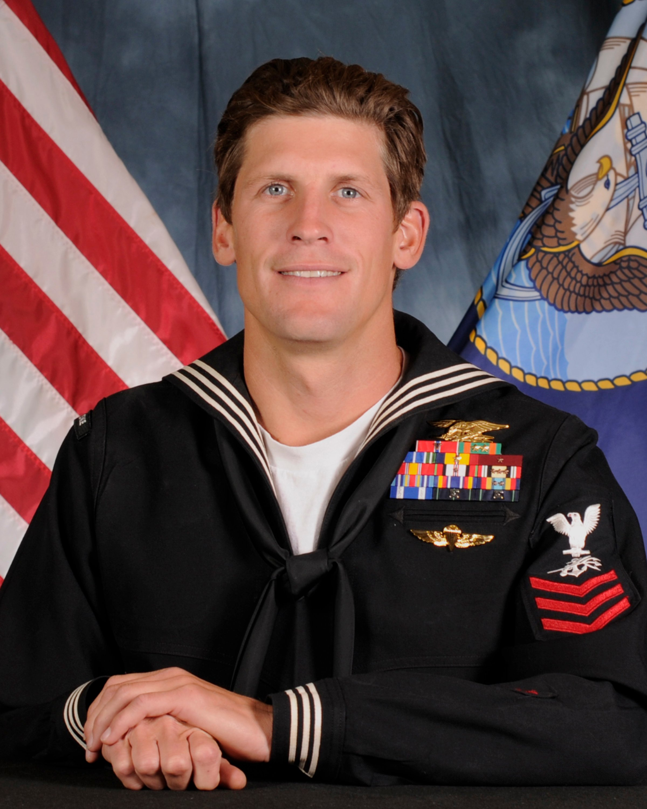
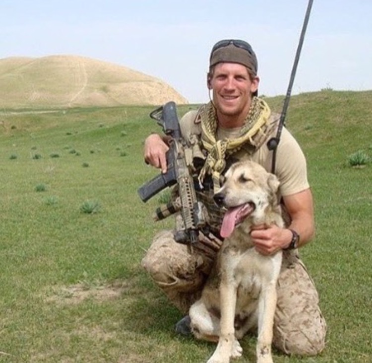
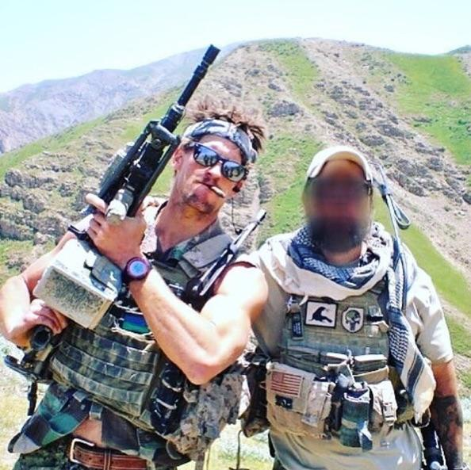
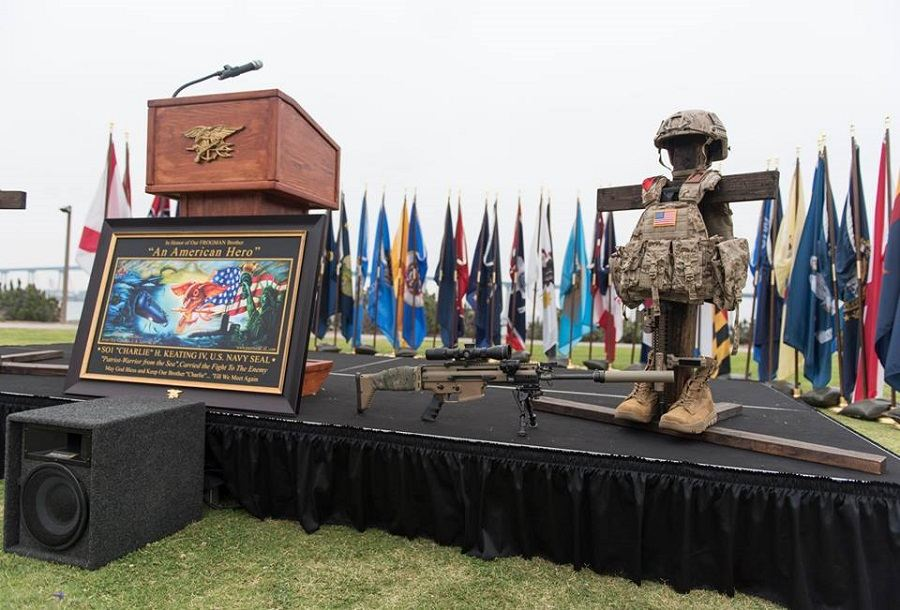

By chance, the Q for Rolling Stone this week was vacant when Hello Kitty sent out the Sunday night lineup for the week. By even better chance, Friday was May 3rd, the third anniversary of the death of Naval Special Warfare Operator 1st Class Charles H. Keating IV (SEAL). See, I did not know Charlie. He grew up in Arizona and was an elite runner who ended up at Indiana University on scholarship. After two years, he joined the Navy and eventually found himself assigned to a SEAL team out of Coronado, CA soon deploying multiple times overseas in support OIF and OEF.

My connection to Charlie is through a true HIM name Jon Ehret. I met Jon as we entered on duty together at FBI intelligence school at Quantico, VA in September of 2009. We met in the parking lot actually. Our time in the FBI is for another back blast, most likely bourbon-fueled. Jon grew up with Charlie in Arizona and was also an elite athlete, though Jon's prowess was in the pool and it took him to Northwestern. A number of the Carpex pax met Jon on a glorious Saturday morning last fall at Phoenix. We aptly named him Molder. Jon now lives in Albuquerque with his beautiful wife and daughter still protecting the homeland with the FBI. He was also recently commissioned in the United States Navy. He'll be headed to OCS and additional training soon. In the weeks after Charlie's death, Jon wrote an inspiring article for the [Federalist](https://thefederalist.com/2016/05/30/when-charles-keating-iv-was-killed-in-iraq-america-lost-more-than-a-navy-seal/). Please read it. It is incredibly well written and conveys true empathetic emotion I'm unable to convey in my rambling.

Before Charlie was KIA, I didn't know of Charlie. In the days, weeks, months, and now years after Charlie passed, I learned of the bond they shared and the true stories of character and heroism Charlie exuded all the way until his last breath. Charlie was a big time surfer, rode a skateboard -- often in his breaching kit, and helped found a company called [Urt Urt.](https://urturt.com/) Charlie's 'Aloha Warrior' spirit continues to embody and drive the company forward in all they do.

I wanted the Q because I wanted, in the smallest of parts, to be able to honor Charlie on the anniversary of his death and to tell his story. At least to the best I could with attempting to piece together bits of information gleaned from around the web and other sources. The day before, I picked up a few rebar reinforced concrete filled pain sticks, asked Bartman to bring a few of his favorite coupons, and we'd have more than enough weight to put the boys under that morning in the gloom no matter who or how many showed up. I was more than pleased when 9 HIMs showed up to put in some work for the next 45 minutes.

<figure>

<figcaption>

  

</figcaption>

</figure>

I briefed the boys on our plan to honor Charlie and what the next 45 minutes would hopefully accomplish. The 4 pain sticks, the 40 and 60 pound sandbags, the 20 pounds of bricks, a 30 pound ruck plate, and shovel flag all found shoulders and we were off.

A History Lesson and the Thang:

Mosey about a mile to the grassy round-about in the neighborhood behind the school, plant the flag at the bottom of the slop away from the gazebo, and drop the extra weight but keep rucks on. Due to a flag mishap, 10 burpees OYO.

Charlie was part of a Quick Reaction Force (QRF) in Northern Iraq in May 2016 supporting small teams of military advisers who were assisting the Kurds and Peshmerga in the fight against Da'esh/ISIS. His QRF team was called in when 150+ ISIS fighters breached a nearby Peshmerga front line with suicide truck bombs, a reinforced bulldozer, and several dozen technicals. The QRF team arrived to support the Peshmerga and were soon engaged with Da'esh in an intense firefight.

Pick up a weight and do 30 reps each of curls for girls, overhead presses, and triceps extensions. Then bear crawl up the hill to the gazebo or until failure then lunge walk. Once in the gazebo, 10 rucks swings and bear crawl/lunge walk back down hill. Repeato and everyone hold in the gazebo. Squat hold and squats.

Depending on which Reddit thread, Instagram, Twitter handle, or blog you dive down, at a point in the firefight Charlie's modified SAW jammed or he ran out of ammo. Charlie left his fighting position to get to a humvee for a sniper rifle and ammo and then made his way to a rooftop to continue to engage Da'esh. Ultimately a sniper's round struck Charlie and although he was med-evaced within the golden hour, his wound was fatal. Many sources have indicated Charlie saved dozens of lives that morning to include his teammates, the military advisers, and many Peshmerga. It is also suggested that he was personally responsible for killing dozens of Da'esh fighters that day. Respect.

Lunge back down the hill, grab the weight, and mosey back to the flag for COT with the high-tempo bros of Gran Torino being led by Grunge from Churam. 20 men in total put in work that morning. A little bit of sweat and weight to honor a lifetime of sacrifice by Charlie. Many like Charlie have given their lives on faraway battlefields to preserve of way of life here at home. We remember these men and women on Memorial Day, but specific reverance and reflection can take place anywhere with little effort, even in the gloom of an elementary school on a Friday morning. Thank you to the Carpex rucking contingent for the opportunity to grab the Q and let a few folks know about Charlie.

<figure>

<figcaption>

A [foundation](https://c4foundation.org) in his name continues Charlie's memory and legacy.  
  

</figcaption>

</figure>

<figure>

<figcaption>

Til Valhalla, Charlie. Aloha -

</figcaption>

</figure>
