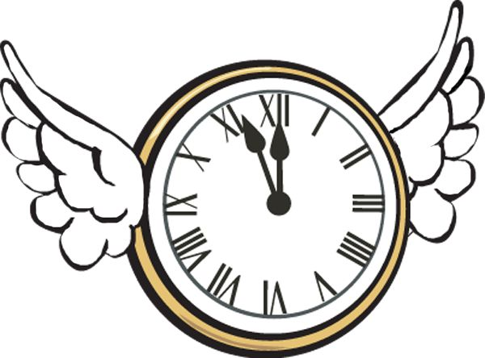

Fresh out of Q School was feeling ready to run a clean workout. Hit the snooze a few too many times today causing site Q's Imp and Rooney begin formulating a backup plan. Thankfully traffic was light (imagine that) and YHC arrived in time to give the one minute warning. No FNGs, give a disclaimer-ish and we're off..

Warm-up

- Mosey 3/4 of the way around the soccer field track to the parking lot
- SSH, Merkins, Runners Stretch, Merkins, Imperial Walkers

The Thang - Tour de Apex

Run to Town Hall - Circle up for Hands of Time x5, LBCs

Run to Chamber of Commerce - Dips, Irkins, Dirkins

Run to Apex Baptist - Partner 1 does WW2's while Partner 2 traces the parking spaces with side steps

Run to Apex UM - Circle up for Wave of Merkins x5

Run back to the skate park

Mary - American Hammers, Freddie Mercury, Dying Cockroaches, H2M, Box Cutter

COT - 13 pax

Announcements

July 4th Convergence - Bond Park 0700

Freebird (?) - Anyone want to join him for the F3 Greenville's csaup "The Sasquatch" - Saturday July 27th - [http://www.f3enc.com/backblasts/csaup/2019-sasquatch-pre-blast/](http://www.f3enc.com/backblasts/csaup/2019-sasquatch-pre-blast/)

Prayers/Praises -

Disco Duck's M with the loss of her father

Gilligan - recovery

Freebird's uncle passed - healing and peace for the family
