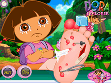

<figure>

<figcaption>

This was just the most interesting picture of Miss Dora I found on the Googles.  

</figcaption>

</figure>

23 PAX showed up on a brisk Monday morning to shake off the rust from the weekend and perhaps sweat out a few toxins. YHC, along with Two Factor and Sooey, took a little 2 mile EC jaunt prior to the ME. No FNGs, somewhat of a disclaimer and mission statement, recited the pledge and we were off.

**Warmup**:

A swift jog up the hill to the parking lot at the top of the greenway hill for:

SSH x 15 IC

Good Mornings x 10 IC

Plank Jacks x 15 IC

Mountain Climbers x 15 IC

Calf Stretch L & R x silent 10 count

**Thang 1**:

Mosey over to the road and into 4 lines for a little indigenous people run to the pavilion at the far end of the park. Partner up for a little Triple D Dora. One partner runs the pickle while the other partner works on:

Derkins x 100

Dying Cockroaches x 200

Dips x 300

Flip flop.

**Thang 2**:

Mosey out the backside to the greenway, admiring the view of the lake along the way, to the bottom of the hill that leads back up to where we warmed up for some 14s.

2 LBCs at the bottom of the hill- increasing by 2 reps per round

12 Supermans at the top- decreasing by 2 reps each round

Finish at the top, squat hold for the 6

**Mary**:

Once the 6 has arrived, we head over to the front parking lot and circle up.

Freddie Mercury x 15 IC

Low Slow Flutter x 15 IC

Box Cutter x 15 IC

Hello Kitty was kind enough to call Hello Dolly x 10 IC

American Hammer x 15 IC

100s

Homer to Marge x 15 IC

Have a Nice Day!

**Announcements**:

Smokey made a motion to refer to all PAX that are at least 60 years of age should be referred to as "Honor."

Hello Kitty announced Thanksgiving Day convergence 0700 at BO. EC run options at 0600 and 0630. 2nd F to follow. Bring your own water, protein shakes or whatever else you'd care to enjoy beverage wise.

**Prayers/Praises:**

Red Baron asked for prayers for two pilots that lost their lives serving our great country during a training exercise 3 days ago. Lt. Col. John "Matt" Kincade and Lt. Travis B. Wilkie paid the ultimate price for our freedom. Let us not forgot them or their families as well as all the men and women serving our great country this week as we celebrate with our family and friends.

**NMS**:

As always, it was a pleasure leading these men this morning. Thank you all for coming out and may everyone enjoy some time with their family and friends this Holiday season. SYITG.
