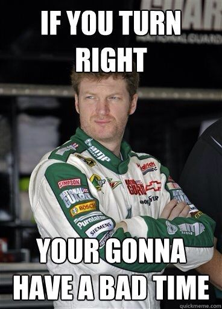

With all of the Maynarding happening these days, YHC isn't sure of the crowd that might show up for the all-run first Thursday edition of El Capitan.  So it is a pleasant surprise to see Lucky Charms, Flip Flop (TS), and Trident roll in to form a fast group.  Options for low and middle mileage are scrapped, and we focus in on the long loop.

On a side note, Burt didn't perform the customary drive-by beer drop for the El Cap Q, which is disappointing.  But I digress. 

Pledge with Team Taygetos.  Start running.      

- Right on Olde Weatherstone Way
- Right on Cary Parkway
- Right on James Jackson
- Right on Maynard
- Right on Castalia
- Right on Olde Weatherstone Way

Things we learned:

- This route has a lot of hills.
- Lucky Charms is a mutant cyborg who can basically run whatever speed he wants.

Back with 15 seconds to spare before combined COT.  VHS Sparta 300 and TCP Sawgrass on deck.  Disco Duck took us out.
