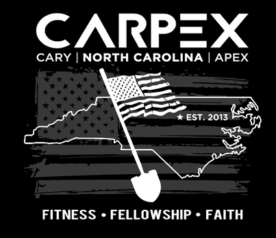

How long's FWD been in action?  How long has it been since I've been there? (last time I posted, Fluoride almost killed me...he's a BEAST)  You mean I've never had a chance to Q there?  What, it's Sunday and there's an open Q slot there (and at Vesper AND at Dante's Peak)?  Fantastic, time to pay a visit to Hermes' homeland.

Spent Sunday evening drawing up my plans, had my Weinke all ready to roll.  And-promptly left it on my desk Monday afternoon.  So had to revise and improve it Monday night for Tuesday.  Hope y'all didn't mind that we covered some ground today.  Late night preblast to bring a headlamp if you had it...if you know Old Maid, you know we're going to be mobile.

**Bonus:**  YHC rolled in early to scout out the AO and see what was on the other side of the bridge.  Just as I planted the Insomnia/Vesper invading shovelflag, Term Paper came rolling in for his own EC.  We discussed and he agreed to join me for my recon run.  We preran the planned route looking for issues.  None found, proceed with caution.  Many thanks for the prerun company TP!

We made it back in plenty of time to greet the PAX, and YHC attempted to set the mood with some Pandora Molly Hatchet...but that park is in a bit of a Verizon data hole (even with the huge cell tower 500 feet away...guess we're too close to it).  Standard disclaimer as we had 2 FNG's (one a Bartman EH).  0545 and we gathered at the flag for the Pledge of Allegiance.  Crowdpleaser.

**Warmup**

SSH x 20

GM x 10

IW x 10

Std Merkin x 20 OMD

Plank Jack x 10

**Thang1**

Form up into 4 Indian Run groups based on headlamp availability.  Follow Largemouth's group up to the start of the bridge, squat hold when you get there.

10 Widegrip Merkins OMD, then lunge walk 1/4 of the way across

10 Monkey humpers to greet the northbound US1 traffic, then 10 diamond merkins OMD

Bearcrawl to the halfway point, then BTTW on 10 count down one side, 5 count coming back

Walk lunge to the 3/4 mark, then 10 burpees OYO

Crawlbear to the end then low plank (6") hold for 5 count around the group

Find out that Chanticleer's headlamp has petered out, so need to consolidate to 3 groups.  Math ain't our strong suit today, so after a #charliefoxtrot down the ess-curves, stop to regroup.  Count off by 3's, and go with either Large, YHC, or Bartman.  Ah, much better.  Unlike at Whiplash Saturday, no one hit the deck in the dark (lookin' at you Michelob :))

Indian Run along the Hinshaw Greenway until we hit Seabrook, then a right (your other right!) turn up to the first Glengarry.  Term Paper wanted to take us up to the 2nd Glengarry...we'll save that for another time.  Stop, squat hold, and then on your six.  Safety first, the PAX were on the lookout for inbound traffic.  _Q note: maybe the sidewalk would've been a good option there..._

WWII x 10ish

Boat/Canoe x 10 (after YHC remembered which was which)

Back on the run to go pick up the greenway entrance.  No PAX hit poles, that's a win!

Back to the bridge, where we squat hold again for a few.

**Thang 2**

Bearcrawl to the 1/4 mark

10 jump squats

Crab crawl (backwards or forwards your choice) to 1/2 way

10 crab jacks IC (thanks Bartman for reminding YHC how to count)

Crab crawl the opposite of what you just did to 3/4

_can't remember what we did here..._

Imperial march to the end with a squat hold recover

Form back into your Indian Run teams (man you guys were eager to get back to the lot!)

Wormburner of an IR back to the circle where we held up for a squat hold

MC in the PAX was that this seemed to be uphill both ways.  Indeed it was, 100 ft of gain for the route, with 3 big hills climbed (clumb?)

**Thang 3**

All back in, so time for some step drills.

Karaoke right for a bit, Karaoke left for a bit, backwards run, forwards run with high knees...whoa, Old Maid you missed the lot!  Ah, no lads, we have more work to do.

All ready, we had another hill yet to climb.  Fellowship run up to that green box there, then All You Got to the top.  It was a 3-4 man race to the top with Chanti, Large, and Kyrie at the front.  May, or may not, have been some merlot spilled on the way up.  We'll have to look at the replay.

Once at the top, pause for a few seconds, get your breath, and reflect on what you've accomplished so far today, and prepare for the day to come.

Recovery jog back down to the lot for a circle up and some Mary.

**Mary**

Some core work.  Checked around for sleeves, all wearing.  Good

Makhtar Ndiaye x 10

Bird Dog 10 count each side (love it Ollie)

Some more merkins, then on your six

Freddy Mercury x 10

Box cutter x 5 one direction, pause for 6" hold w/10 count, continue 5 the other direction

Next exercise is...Have a Nice Day

\-finis-

**COT**

Announcements:

F3Dads Saturday, Christmas Party signups, something about a GoRuck event (Bartman and Banjo in the know), South Wake turkey purchase for Healing Transitions (check the twitters and the facebooks).  Welcome #hate FNG SpongeBob (a PhD marine biologist studying sea anemones, about to move to Oregon to follow his fiancee).  He's 26 24 (was almost Abacus until we heard of his profession).  Also welcome FNG Theismann, recently relocated to the area from the DFW area, a self-professed Cowboys fan.  Easy fodder, Theismann.

Prayer concerns:

Largemouth's grandmother Ruth with a recent stroke, Largemouth's upcoming family upgrade, and FNG Theismann's house hunt (new to the area).  He's looking somewhere around Cary Christian if y'all know of anything good on the market.  Others I may have missed, and still others unspoken.  YHC's own unspoken prayer is that it's nice to be back in the saddle after a while away.  Your energy is what inspires and propels the Q.

**NMS**

Having never Q'd at FWD, I didn't know what to expect.  Last time I was there I think we had 8 PAX, nice small group.  18 is a lot to manage on the bridge.  That and the darkness made things a little dicey up there.  Fortunately the F3 gang is a trusting bunch.  I didn't hear a lot of mumblechatter, which either means you were bored, or you were enjoying it.  I'll hope for the latter.  My unofficial goal at a Q is to try to eke out 2 miles of running.  Even with all our bearcrawling, crabcrawling, and such, we got about 2.1.  Oh, and you're welcome for the audible on the way back across the bridge...the first 1/4 of the way was going to be burpee broad jump.
