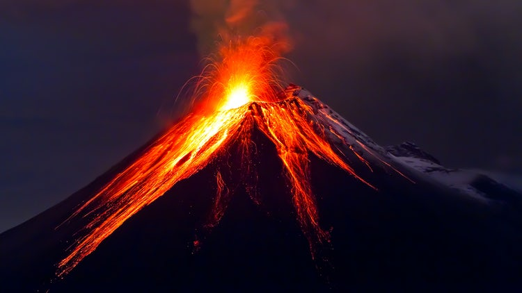

First off, let me just say how great its been dragging my sorry, out-of-shape 6 out of bed most mornings to go hang out and sweat with a bunch of crazy guys like those reading this right now. The last 3-4 months have been amazing, not only physically, but mentally, emotionally and even dare I say spiritually? (That's weird) Seriously, thank you all for your leadership every day when I post, not just from the QIC, but also the guys that stick out their hand for a high five when they're running by or say, "Good work!" The #2ndF ain’t half bad either. And a HUGE thank you to the 35 HIMs that showed to support (and mumblechatter) YHC on his VQ today!

36 PAX circle up near the flag (man there are a lot of PAX out here today), one FNG so struggle through a disclaimer and start with pledge of allegiance and off we go to the far end of the park.

**Warm-up**

Circle up for: SSH x 15, GM x 10, Sir Fazio arm circles both ways x 10, Hillbillies x 10, Plank Jacks x 10, Calf stretch.

Mozy back towards the other side of the park, mixing in some CARIOCA (not karaoke, which is something else completely different) both ways and some backpedaling mixed in for good measure as well. Respect bear crawl bridge accordingly. Stop at the pond for some planks while we wait for the 6. Run up the hill to the pavilion and everyone grabs a bench for a quick Thang 1.

**Thang 1**

L-R Step ups x 10, Derkins x 10, Dips x 10, Irkins x 10.

Partner up for some catch me if you can to the park entrance where we do some Dying Cockroaches while waiting for the 6. Then resume CMIYC to the corner of Evans and Apex BBQ for Thang 2.

**Thang 2**

7's starting with 1 burpee at the top of the hill and 6 squat jumps at the bottom. We ran short on time so had to recover before everyone was able to finish. Wait for the 6 with some squat holds lead by Sub.

Mozy back towards the flag, but with so many PAX we had to stop short where there was more space available to circle up for some Mary.

**Mary**

Freddie Mercuries x 15 (TYFYL Hello Kitty while I rean to get my phone), Low Slow Flutters x 15, Box Cutters x 15, American Hammers x 15, LBCs x 15, 100s

**Announcements**

Liverpool and his M will be at their church to tell their story on the 18th.

Skipper- Ruck event, Sunday morning 0530, 7+ miles, launching from Rush Hour AO.

Speed for Need 5k/10k on 9/2. Sign-up/donation sheet link on Slack in #1stF channel.

9/11 Stair Climb

New PUT6 intro

**Prayers/Praises**

Al Wallace
