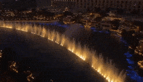
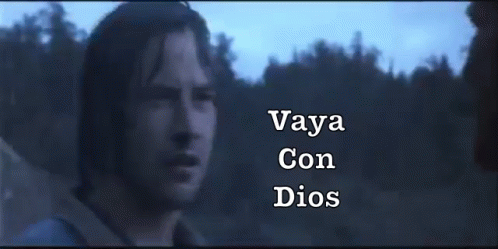

AO Launch Day.  YHC was a bit nervous about attendance because there had been zero Slack hype for this event during the lead up.  Despite that fact, a lot of folks somehow showed up to be part of the emergence from stealth mode.  YHC knew something major was afoot when Ma Bell decided to again venture into "the eastern regions of his former kingdom" for not only the ME but an EC run taboot.

A quick inquiry identified an FNG in our midst.  He was properly disclaimed upon, and allegiance was pledged.  Then a mosey over to the most well lit parking garage in the Western Hemisphere for some warmup exercises.

Warmup:

- 5 GM IC
- 10 Sir Fazio IC
- 15 Merkins OMD
- 20 SSH IC
- 15 Prisoner Squats OMD
- 10 Sir Fazio in Reverse IC
- 5 Burpees OYO

Thang One:

Partner up in the adjacent parking lot and perform the following in a flapjack fashion:

- Round 1 - Bear crawl from one island to the next and run back / Flutter Kicks
- Round 2 - Bear crawl from one island to the next and run back / Merkins
- Round 3 - Bear crawl from one island to the next and run back / CDDs

Thang Two:

While YHC kept the group in the gritty outskirts of the AO, Augmented took control and immediately moseyed to the high end retail area.  As the group found its destination, a number of Pax remarked that the lighted fountains are reminiscent of the Bellagio.  It should be noted that AO Point Break is basically the Bellagio without the gambling, coke and hookers.  But we do have a Dora 1-2-3 with Dirkins, Bonnie Blairs and LBCs that was efficiently knocked out by the group.

Thang Three:

A very short mosey across the grassy knoll brought us to the starting point for a courtyard triangle route with Dips, Squats and Merkins at the respective vertices (there is your geometry review for the day) and a run in between.     

After two rounds we mosey back to the flag for 20 WW2s and 10 Burpees to close us out.

COR and NOR

Welcome to FNG Strikeout

Announcements - Krispy Kreme Challenge is almost here.  Point Break Q slots are available but going fast.  The Shield Lock Challenge is a very real thing and you will hear more about it shortly.

Prayers and Praises. - Our Troops.  Yahoo as he travels back from overseas.

Augmented called for the ball of man and took us out.  YHC was secretly hoping that he would channel his inner Johnny Utah and just say "Vaya Con Dios," but a proper and more fitting prayer was said.  Definitely the proper choice in retrospect.

NMS:  A fantastic crew for the launch.  Augmented and YHC are still relatively new to F3, so we are humbled and honored to be allowed to serve as Site Qs.  We will do our best to make Carpex proud. Or at least not embarrass you.
