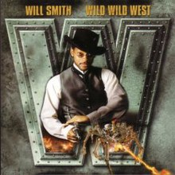

So today was FINALLY the official soft launch for Carpex's newest AO, Wile Wild West at Apex Friendship High School! Sir Chicken Little and I are fortunate enough to be your site Qs for this AO. SCL was just coming back from a week of drinking at the beach so I told him I'd take the reigns this morning for the beat down. He'll have the Q next Monday for the official hard launch.

If you're not familiar with the Apex Friendship campus, you really should make the trek out sometime. This is a huge AO. 2 schools, a track, practice field, the longest bus slalom course you've ever seen. Options abound for sure! Q sheet is open so jump on board and we look forward to seeing all the Pax in the Wild Wild West!  
  
Anyway, 6 at the flag when the clock struck 0530 and all familiar faces so a little pledge of allegiance (got it right today!) and off we go!

**Warmup:** Mosey to the middle school courtyard and circle up for:  
SSH x 15 IC  
GM x 8 or so IC  
Moroccan Night Clubs (for Red Ryder) x 10 IC  
Seal Claps x 10 IC  
Imperial Walkers x 10 IC  
Plank Jacks x 10 IC  
Calf Stretch L/R x 10 silent count

**Thang 1:** After the warmup, we moseyed back over to one of the many adjacent parking lots to partner up for some Dora action.  
Partner 1 works on:  
100 Merkins  
200 Squats  
300 LBCs  
While partner 2 runs the longer pickle. Flip flop until reps are achieved.

**Thang 2:** Mosey back to the entrance to the courtyard. Everyone grab some wall for balls to the while. Each Pax counts to 10, then bear crawl to the other side. Peoples Chair for another round of 10 counts. Lunge walk back and repeato everything for one more round. The degree of difficulty was increased due to the broken glass all over the sidewalk. People without gloves were thrilled.

**Thang 3:** Mosey back to the front of the high school to THE Hill (what the AO has in size, it lacks in elevation) for a quick round of 7s. 1 star jump at the top, 6 Steve Earles at the bottom. Increase by 1 each round at the top while decreasing by 1 at the bottom.

**COT:** Made it back to the flag at pretty much 0615 on the dot. Ryder was running circles to get to 3 miles, but we decided to count off anyway.  
Announcements- Wild Wild West Hard Launch next Monday.  
Prayers- Teachers and students going back to school ? Ryder's M as she goes through what her professional future looks like.  
YHC took us out. Thanks again to all those that came out and I look forward to seeing more Pax come check out the new spot in the coming weeks. MIAGD!
