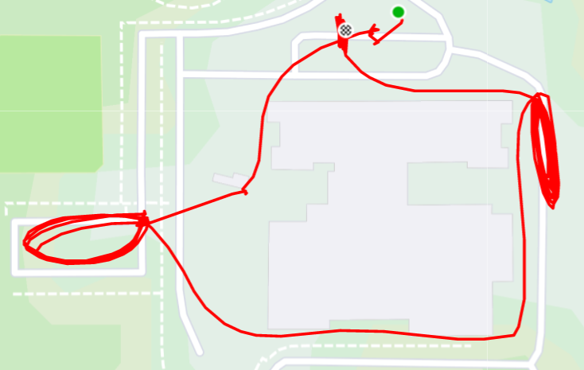

**AO:** Winterfell  
**Workout Date:** 05/24/21  
  
The Wake County geography doesn’t quite overlay with fictional Westeros for me to claim I am going over the proverbial wall between Raleigh and Carpex. I do recall Winterfell being on the west side of Westeros, so I’ll go with that. It was a bit of a drive for me this morning, but not too bad (22 minutes or so). After The Farm on Saturday, I didn’t even think about it. We had a couple of PAX rolling in hot but we got mostly started on time. YHC was a little tired this morning and had a brain fart trying to remember the AO name when we started. D’oh!

**Warm Up:**  
Give the mission statement, (I did not check for FNGs as I could tell even the PAX I didn’t know were vets), give the disclaimer, and warm up:  
Side Straddle Hop x20 In Cadence (IC)  
Pledge of Allegiance  
Good Morning x10 IC  
Imperial Walker x20 IC  
Sir Fazio Arm Circles x10 IC Forward x10 IC Reverse  
Monkey Humpers x10 IC  
Standard Merkins x10 On My Down (OMD)  
Mountain Climbers x10 IC  
Downward Dog with calf isolation stretches  
World’s Greatest Stretch

**Main Event**  
**1)** Mosey around the side of the school for **10 reps of Left-Right step ups, Irkins, Dips, Elevated Crunches, and Derkins**. Skip my typical 10-15-10 pyramid for variety and to take it easy on my shoulder that’s been unhappy lately. I again told the anecdote of the Danger Zone guys naming elevated crunches Little Gyno Crunches and the response was almost as dead as that at The Farm. Someone did say that sounded typical of DZ.  
**2)** Mosey to small parking lot and partner up for one round of **BALLS**: Burpees x10, American Hammer x20, Lunge x30, LBC x40, Squat x50 while partner runs the loop.  
**3)** Mosey around back of school. No exercises in the bus lot (I learned my lesson about that at Schoolhouse). Mosey around to the side and once we confirmed one gate was closed, we did **Elevens** (Squats and Star Jumps)  
**4)** Mosey back to start for Bear Crawl/Lunge Walk **Sevens** between the curbs. Exercises were Hand Release Merkins and Carolina Dry Docks (audible after mumble chatter about burpees)

<figure>

<figcaption>

[https://www.strava.com/activities/5349513854](https://www.strava.com/activities/5349513854)

</figcaption>

</figure>

**Mary:**  
Dolly x10 IC  
Rosalita x10 IC  
Mumble chatter from Trike for an even higher (90 degrees) version dubbed Hello Lolita, but I’m pretty sure there’s already a name for that. We did Freddy Mercury x20 IC instead  
Homer to Marge x20 IC

**COT:**  
8 PAX  
Announcements: Iliad is OVER, you missed it. Raleigh official Memorial Day Convergence 5/31 0530 Garner Station. Carpex Memorial Day Murph at 0700 at Hot For Teacher. Axe Throwing CSAUP in Eastern NC on 6/5. El Duce’s Recovery on the Run 6/12 at Dorothea Dix. F3 Raleigh Day of Service 6/19 starting at Vatican City.  
I am missing one Carpex announcement for 6/3, I think, can’t remember what it was.  
Prayers unspoken.  
YHC took us out (BOM!)

**Naked Moleskin:**  
Lots of mumble chatter, T-claps to the PAX who helped count during the warm ups so I didn’t totally lose my place.  
Great coffeeteria at Lowe’s Foods afterwards, even though the barista fartsacked. T-claps Trike for starfishing that cold brew coffee off the grocery shelf.  
I definitely only scratched the surface of this AO, I hope to be back soon.  
This was my forty-ninth #F3Q21 #2021Challenge Q. Next Q is Tuesday (tomorrow) at Black Sheep in JoCoGa.  
\-Pigpen

**QIC:** Pigpen  
**PAX:** Clementine, Doggy Paddle, Kidney Stone, One Direction, Pigpen, Pom Pom, Rooney, Trike  
**Workout Date:** 05/24/21
