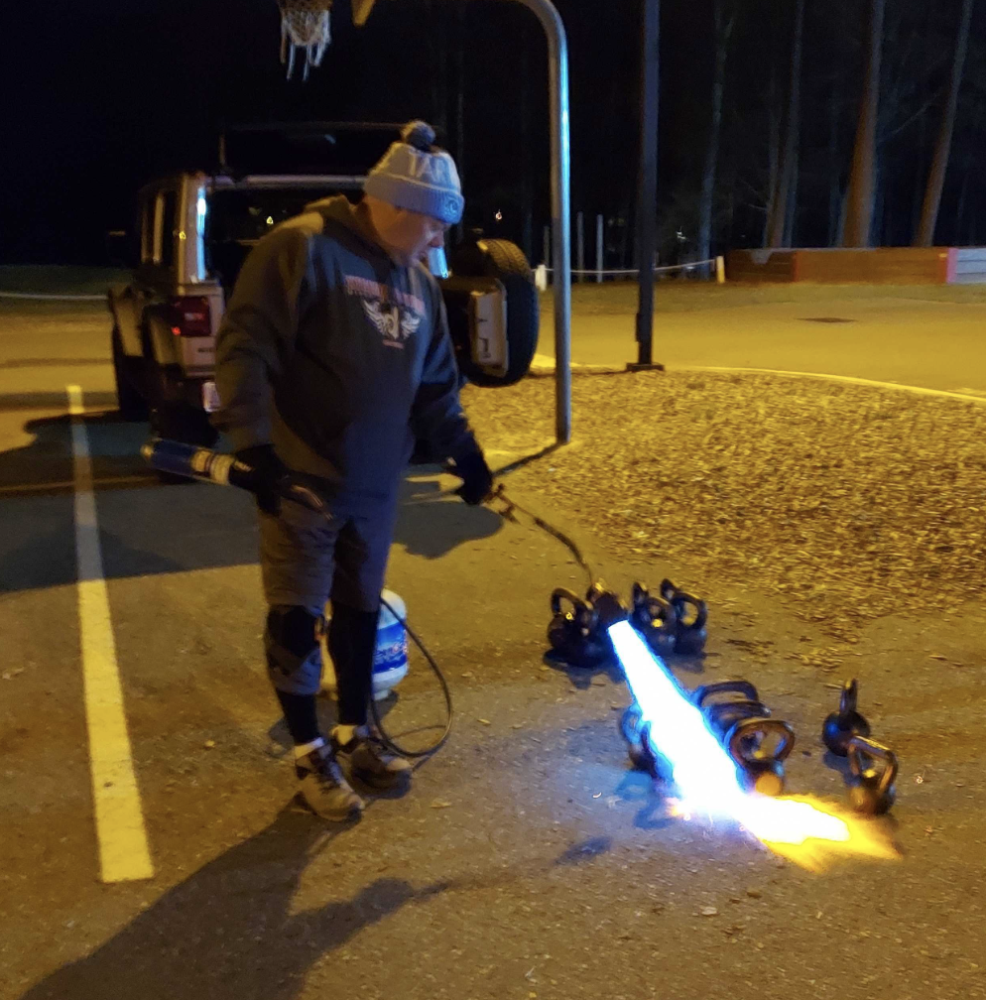

It was a chilly 31 degrees at 5:15 when I rolled up to Hells Bells today. The first thing I’m notice is Kwik Stop (sans shirt of course) in what can only be described as VIOLENTLY flipping a tractor tire across the parking lot while listening to heavy metal music on his ear phones that it hurt my teeth!

Then Roasters and Left Cheek come strolling in from their 4 mile EC run at full friggin’ gallop.

OK, so I had a pretty rigorous Kettlebell workout planned but I was concerned we would have a limited turn out due to the cold weather and I was also concerned that I planned on having a 25lb chunk of iron, that just spent the night outside in the freezing cold, in everyone’s hands for 40 minutes. So I did what any of us would do - I brought a flame thrower to the party to warm the bells up!

Onto the workout:

Setup I recommend 25lb bells for most people  
Put bells in a line, warm up handles

**Launch**  
1 min Intro  
1 min 1st Excercise is the Pledge of Allegience  
5 min Warm Up

**Warmup**  
5 Good Mornings with Karate Chop Hip Hinges to start (extra credit for yelling Hiya!)  
5 Judo Pushups to engage Back, Lats, and Core  
10 Mashj Squats loosen up Hips  
5 Inch Worm, Plank, Reach Under/Ups - Work Core (ground was too cold to stay on hands)

**5 mins Instruction / Demonstration**  
BREATHING - helps stablize core and enable movement  
KBS its is not an arm excercise, its an explosive hip movement  
KB High Pull Pull w/Lat and Shoulder Push with same  
KB Clean Handle across wrist. Sneak hand around arm. Elbow close to body, hand near center of chest  
KB Snatch same grip as Rack momentum of bell swing allows you to punch thru/up

**Thing 1**  
4 Rounds 1 Minute Working / 20 Seconds Recovery  
1 Hand KB Swings  
Recover  
4 Rounds 1 Minute Working / 20 Seconds Recovery  
High Pull  
Recover  
4 Rounds 1 Minute Working / 20 Seconds Recovery  
Clean / Press - handle across wrist, wrist straight  
Recover  
4 Rounds 1 Minute Working / 20 Seconds Recovery  
Snatch

Mosey

**Thing 2** Let's put all these excercises together  
5 Rounds 1 Minute Working / 20 Seconds Recovery  
3 1 Hand KB Swing  
3 High Pull  
3 Rack  
3 Snatch  
10 Sec Rest Switch Hands  
3 1 Hand KB Swing  
3 High Pull  
3 Rack  
3 Snatch  
Recover 30 Seconds

Mary Roll the Big Die and multiply value by 5  
Can't remember all that was done, but ReEntry did a mic drop by not rolling the die  
but putting it down with 6 facing up and then calling WWII's  
13 of us attempted to do 30 WW II's w/the 25lb bell, but I think it was  
only ReEntry who did them all!

**COT**  
Announcements SCARY CSAUP, Highland Games

Prayers ReEntry’s M (Ginger) has been fighting cancer for 4 years and has been informed there is nothing more doctors can do. She is now in hospice. They have been together 48 years and I get the sense, as tough as he is, she’s tougher than him.

Bootlegger took us out with an inspirational prayer.

AO: Hells Bells  
PAX: @Cauliflower, @PVC, @Bootlegger, @Meat Loaf, @Earhart, @eHarmony, @Left Cheek, @Kwik Stop, @Zamboni, @Roasters, @Reentry, @Ashbury (@Bronx Bomber Q)
