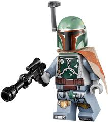

A few weeks back I got the notion that it was time to Q at Bounty Hunters and take advantage of Site Q IPTF's fantastic swag offer, the coveted Bounty Hunter decal. I looked out, synced up calendars, and found a June 3rd opening (May 4th was already snagged :( ). This was right after @Flenderson and @Hotspot's fantastic May Hill Climb Challenge had finished, and after the Maynard 100 earlier in the month. I had high hopes that fitness would be good enough to live up to the challenge of a BH Q.

Boy, was I wrong...

Site Q stated to thread EC options. I decided, late Wednesday night, to go for a 3-mile warmup run in advance of the Q. Should be nice and cool, dry (according to Weatherbug), and will help shake out the nerves (always get nervous for this Q, as I want to make it "special" (read: themed). Spent the few days prior putting together (what I thought was) a nice workout that would hit all the marks, that I could handle, and that didn't have too much or too little distance. However, I was awakened about 0200 by lightning/thunder, and pouring rain. The rain let up before I rolled toward the AO around 0445, but the humidity was already oppressive. I did a little scouting of the site, found the baseball fields locked shut, but the activity field wide open. Slight alteration to "the plan" and I set about for my EC run with no takers. Got one mile away, and the rain started in earnest. So, soaked by the time I returned to the flag. Oh well.

0543, no apparent FNGs, 2 minute warning

0544, one minute

0545, seeing no FNGs, welcome, then...

**Pledge of Allegiance**

followed by a follow-me (for the 11 bootcampers) for...

**Warmup:**

Run the long way around the athletic fields, saying hey to FiA along the way, mixing in...

- **Regular run**
- **High knees**
- **Butt kickers**
- **carioca left**
- **carioca right**

...then told the pax to step on it, FiA was gaining on us!

Got to the end, squat hold, instruct the pax that they are to lunge walk across all (marked) crosswalks. Q fail #1 coming up shortly (foreshadowing)

We made it over to Thales and gathered up for some:

- **SSH x12**
- **Daisy Pickers x12**
- **Imperial Walkers x12**
- **Good Mornings x 6**
- **Bat Wings (aka Earharts) x 12**

Then off we go on our journey to Mandalo(r)e.

**Start of The Main Thang**

Remember those lunge(cross)walks? Well, YHC thought it'd be a good idea to try that across Apex Peakway. Looked clear for half of us then OHMYGOSHHERECOMESACAR! Audible to protect the PAX, which I did a HORRIBLE JOB of. So sorry guys. Regrouped on the other side, heard "Q Fail" from most of the pax, and we moseyed on over to the start of the VoA lake loop.

First Exercise: half of the...

**Mucho Chesto** (look it up, it's a LOTTA merkins)

Run to the far end of the lake, for the second half of the Mucho Chesto

Run back to the near end, regroup in a squat hold, then mosey over to the clubhouse parking lot for some...

**Australian Snow Angels** x 12

Mosey back across the Peakway towards the flag, in that nice big field on the right for some...

**Never Surrender**s x 12 each side. This was a pax favorite.

Continue our mosey to the storage unit parking lot for some...

**Dying Cock-a-Roaches** x 12

On the move again for some...

**Alligator Merkins**, initially planned for about 50 feet, quickly realizing that 15 feet was far e-darn-nough

Head to the big ole flagpole (where I screwed up again by not keeping us all together) for some...

**Lt. Dans** up to 6 (or was it 12?). MC was getting light by now. Or not, actually I think I was starting to black out a little.

Mosey to the athletic field for what would've been a nice finale, but my sight was fading, hearing was shutting down, pulse was about 180...red zone for YHC fellas. Kept moving for some...

**One legged burpees** (3 each side, x 2, for 12 total), with sweat just POURING off of me at this point

Here's where my train completely "derailed". Next exercise should've been...

\***Railroad Tracks.**..which we did NOT do. Another Q fail. Crap. But we did get in...

**Elevens** of gorilla humpers and star jumps, doing both exercises in place before moving. I was GASSED and the pax knew it, and thankfully had mercy on me and accommodated my audible. I figured they didn't want to have to fill out the paperwork if I died on the field.

With time expiring, we headed for the skate bowl, got on our six (13 back at the flag, with a perfectly timed rucker return), and had some pax-led speed mary, 10 reps of called exercises, including...

- Merkins (shockingly!)
- Dying Cock-a-roaches
- LBCs
- TrampStampRemover (Pivot's signature move)
- 50s
- American Hammers
- plus some other crowd favorites I've forgotten

**Countarama:** still 13

**Namearama:** see tags

**Announcements:**

- TCP this Sunday; sign up if you are able, see the appropriate Slack channel.
- FreedToFeed is also Sunday; sign up if you are able, see the appropriate Slack channel.
- As summer heads our way, make sure to stay hydrated. Hydration starts in advance of the workout, not right before or during.

**Prayer concerns:**

- Ramsay's sister traveling back to Germany after coming over to receive Covid vaccines
- Commish's mother-in-law with recent health scares, but on the mend
- All our families going through change of some sort; graduations, health issues, end of life planning

**NMS**

- \*So, today was to be the day of the Mandalore. As it was, I blew it, and we were just a bunch of Mandaloes. Better than being a bunch of Manilows.
- Stacked the deck today with a few pax that had to ask directions to get to the POGL, and I'm very thankful they came to see me at my worst.
- Not sure if it was Egon or MIA (or someone else), sorry guys, but I got a "STRONG" fist bump from one of y'all after each of the mucho chesto sets. I felt good about that. Those Mucho Chestos suck.
- The crosswalk lunge walks is a nod to my pal Sky Blue. For some reason, I just can not see a crosswalk and not want to do some Abbey Road kind of thing with it. It's silly, but, so am I.
- Seriously, it was like 1 zillion % humidity out this morning. It was less humid WHILE it was raining, and I was toast. I was not my best self for you all this morning, and you did not get the Q you deserved. I did not deliver on safety (crosswalk), on form, on content, or on punctuality (we ended the workout at 6:30:30, with COT still to come). All I can say is, I'll try better next time. Don't Q it if you can't do it. I got in over my head on this one, biting off more than I could chew given my conditioning, the weather conditions (I KNOW I don't do well in high-humidity situations), and such.
- I thank I Pity The Fool for the coveted Bounty Hunter decal; my dilemma is deciding where to put it! I have several cars to choose from...
- And I thank you brave souls for coming out and spending your morning with me. You had choices (most of you did, anyway), and I'm glad you chose to get out and get moving with us all. Hope you've Made it a Great Day so far.
