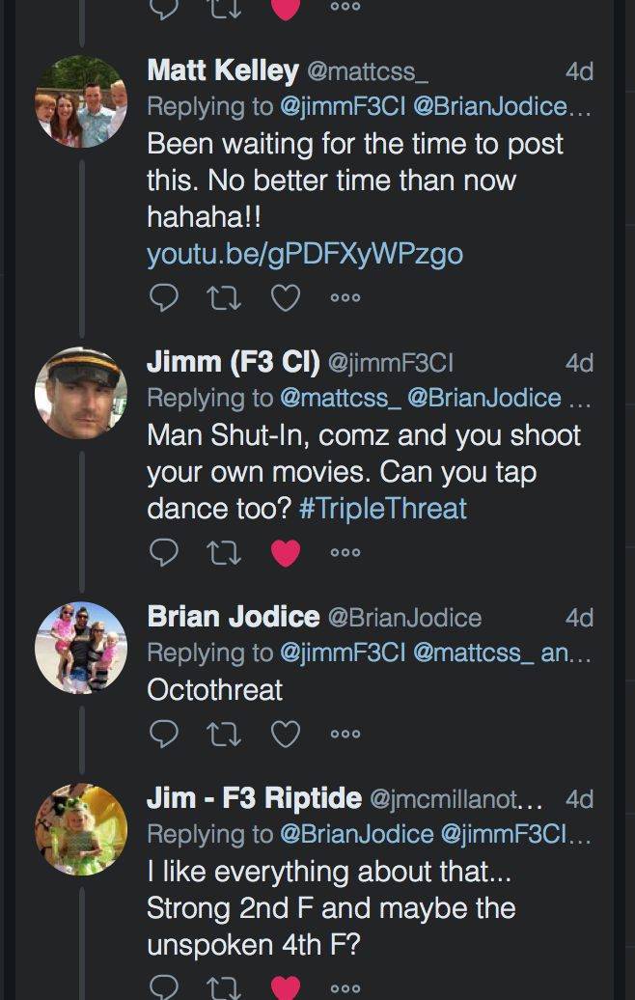

As the Twitterserve would have it, [YHC and some of the fellas including Captain Insano got into a deep-cut thread over the weekend and thus was born the “Octothreat.”](https://twitter.com/BrianJodice/status/958670220247359488) With the pressure of the entire F3 Nation, YHC set out to embark the PAX on the first-ever Octothreat.

But first, another solid showing at Insomnia. YHC was looking for the easy way out before the Q on this morn, but the peer pressure pushed YHC into the 0505 start time (sorry to Angry Elf who showed up like a HIM at 0520 for recon). Great run, boys!

Post-insomnia, a sizeable group of PAX formed in the lot; the Vesper boys roll out, the Rolling Stone boys get the ruck on with it, and YHC lead the SNS PAX out.

**Warm-up:**

- Butt kickers, high knees and karaoke over to the community center lot for:
    - Good morning x8
    - Sir Fazio front x8
    - Sir Fazio back x8
    - SSH (Nature Boy style) x8
    - To the curb for quick feet x8 and merkin x8 – 3 rounds

**Thang 1:**

- Down to the kiosk at Carpex Stadium. With Burt and Nature Boy here this morning, YHC was inclined to roll the DICE:
    - Donkey Kicks x8
    - Imperial Walkers x8
    - Carolina Dry Docks x8
    - Engligh Get Ups (Turkish with the pinky out) x8
    - A pair of DICE needs 2, so Repeato
- At the Kiosk the real Octothreat goes down. 8 laps up and down the hill.
    - Merkins at the bottom and Prison Jump Squat Burpees at the top, from 1 up to 8, for the total of 8 laps.
- The blue moon (no fruit) had Carpex Stadium well-lit so it’s out to the middle for a round of Bull in the Burpee Ring. Winners stay in the circle and losers take a lap.
- Bear crawl the hill because some PAX said “we’re not supposed to run on the hill,” and mosey to the rock pile at the community center.

**Thang 2: Grab a rock:**

- Curls x 10
- 1 Prison Jump Squat Burpee (PSJB)
- Tricep x 10
- 2 PJSB
- Press x 10
- 3 PJSB
- Rock row x10
- 4 PJSB… repeato to get the PAX to 8 PJSB

**Finale/Mary:**

- Indian run back to the top of the street and an all you got to meet the Vesper/Ruck PAX at the flag
- On your six for a high tempo:
    - LBC x8
    - WWII x8
    - Freddy Murcs x8
    - Dying Cockroach x8
    - Brady to Gissell x8
    - Plank hold to finish up

**NMS:**

- I almost bailed on Insomnia thinking some lame excuse about making sure I had enough for the fellas on the Q. Bump that! Thanks Callie for the EH.
- Tclaps to a pair of HIM, Saban and (cough cough) Angy Elf for pushing through a few tight spots and injuries. Great work men.
- Tclaps to Hermes for making sure our brother Tubeless crushed Insomnia and got home safe. HIM stuff, for sure.
- Krispey Kreme guys, hope the donuts at the end were a nice teaser for what's to come...
- Prayers for Kelly Deese (Duck’s M) and Missy (Grease Monkey’s Mom), healing hands for both.
- God Bless, men. You make me stronger, daily, and I’m grateful.
- **Go attack the day with an enthusiasm unknown to man.**

